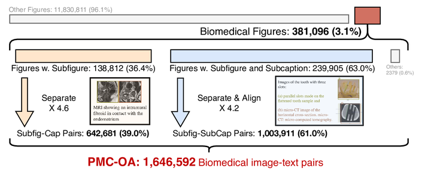
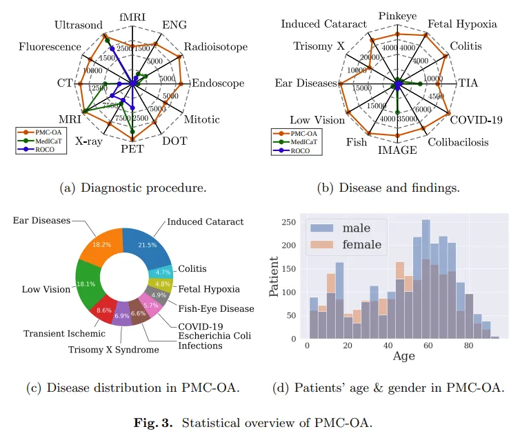
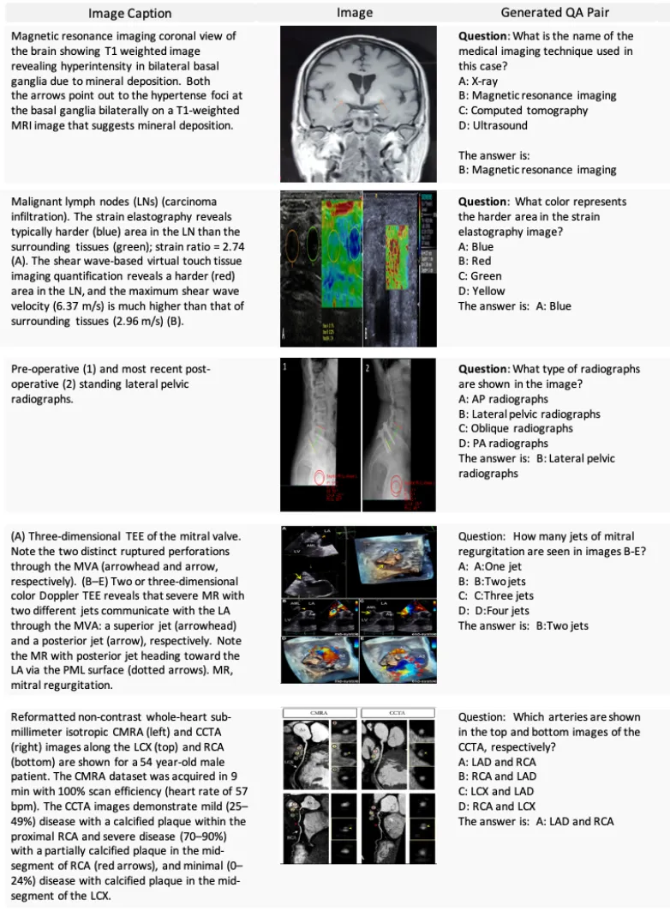

# PMC-OA

<div align="center">
    <a href="https://github.com/openmedlab/"></a>
</div>
<p style="text-align:center;font-size:10px;"><em></em></p>

## Dataset Information

PMC-OA is a large-scale dataset that contains 1.65 million image-text pairs. It covers graphics and their descriptive text from 2,478,267 available articles in PubMed Central, from which 12,211,907 image-caption pairs have been extracted. As a large dataset focused on the biomedical field, it aims to address the issue of data scarcity in this domain and to advance the development of Computer Vision (CV) and Natural Language Processing (NLP). It includes 1.6 million image-caption pairs collected from the Open Access subset of PubMedCentral, which is 8 times the size of previous datasets. The PMC-OA dataset encompasses a wide variety of modalities and disease types, with most image-caption samples aligned at a finer level, i.e., sub-figures to sub-captions.

A CLIP-style model pre-trained on the PMC-OA dataset, named PMC-CLIP, has achieved unprecedented results on several downstream tasks. These tasks include image-text retrieval for ROCO, image classification for MedMNIST, and Medical Visual Question Answering (Medical VQA). Specifically, it has shown an 8.1% increase in R@10 (recall at 10) for image-text retrieval, and a 3.9% increase in image classification accuracy. Overall, the PMC-OA dataset not only provides a wealth of resources for research in the biomedical field but also strongly supports the development and optimization of related machine learning models, particularly demonstrating great potential in improving the precision of image and text analysis.

## Dataset Meta Information

| Task Type | Language       | Train | Val | Test | File Format | Size   |
|-----------|----------------|-------|-----|------|-------------|--------|
| VQA       | English | 1.6M  | -   | -    | .jpg, .json   | 24.63G |

## Dataset Information Statistics

<div align="center">
    <a href="https://github.com/openmedlab/"></a>
</div>
<p style="text-align:center;font-size:10px;"><em></em></p>

<div align="center">
    <a href="https://github.com/openmedlab/"></a>
</div>
<p style="text-align:center;font-size:10px;"><em></em></p>


## Dataset Example

<div align="center">
    <a href="https://github.com/openmedlab/"></a>
</div>
<p style="text-align:center;font-size:10px;"><em></em></p>

## File Structure

The file structure of the PMC-OA dataset is as follows: it includes an "images" folder, as well as three files: "train.jsonl", "valid.jsonl", and "test.jsonl", which contain the dialogues.

``` 
.
|
├── images
│   ├── xxx.jpg
│   └── ...
│
│── train.jsonl
│── valid.jsonl
└── test.jsonl
```

## Authors and Institutions

Weixiong Lin (Shanghai Jiao Tong University)

Ziheng Zhao (Shanghai Jiao Tong University)

Xiaoman Zhang (Shanghai Jiao Tong University, Shanghai AI Lab)

Chaoyi Wu (Shanghai Jiao Tong University, Shanghai AI Lab)

Ya Zhang (Shanghai Jiao Tong University, Shanghai AI Lab)

Yanfeng Wang (Shanghai Jiao Tong University, Shanghai AI Lab)

Weidi Xie (Shanghai Jiao Tong University, Shanghai AI Lab)

## Source Information

Official Website: https://weixionglin.github.io/PMC-CLIP/

Download Link: https://pan.baidu.com/s/1mD51oOYbIOqDJSeiPNaCCg (pw=3iqf)

Article Address: https://arxiv.org/abs/2303.07240

Publication Date: 2023.3

## Citation

``` 
@article{lin2023pmc,
  title={Pmc-clip: Contrastive language-image pre-training using biomedical documents},
  author={Lin, Weixiong and Zhao, Ziheng and Zhang, Xiaoman and Wu, Chaoyi and Zhang, Ya and Wang, Yanfeng and Xie, Weidi},
  journal={arXiv preprint arXiv:2303.07240},
  year={2023}
}
```

Original introduction article is [here](https://zhuanlan.zhihu.com/p/680038927).