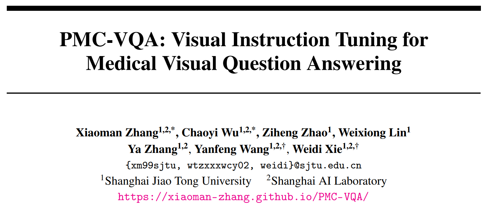
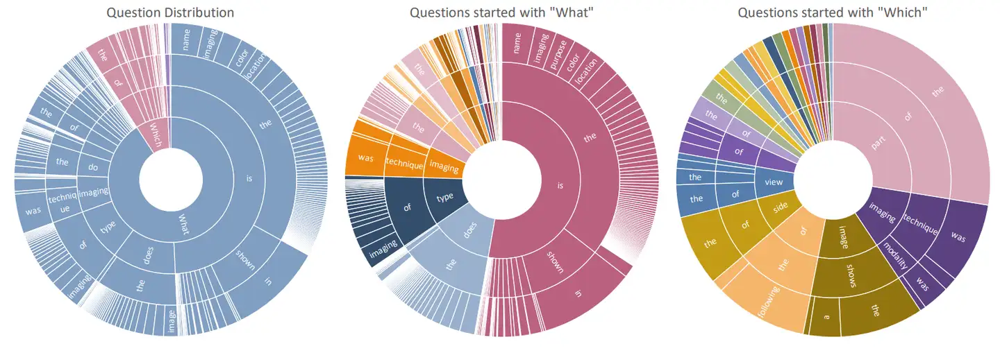
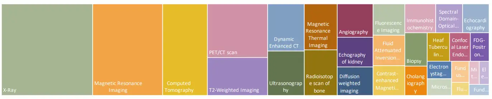
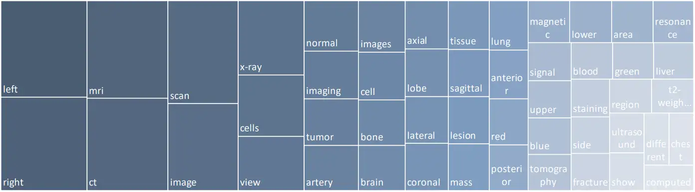
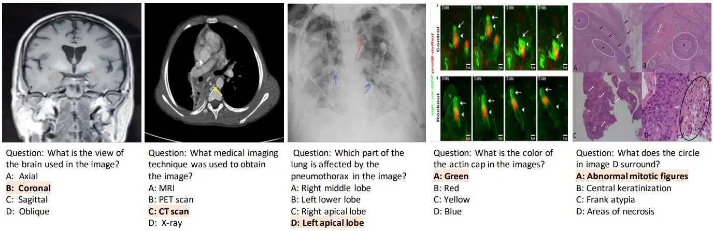

# PMC-VQA

<div align="center">
    <a href="https://github.com/openmedlab/"></a>
</div>
<p style="text-align:center;font-size:10px;"><em></em></p>

## Dataset Information

The PMC-VQA dataset is a large-scale multimodal dataset for Medical Visual Question Answering (MedVQA) tasks. It contains 227k VQA questions associated with 149k medical images covering a variety of medical modalities or diseases. Its test set includes 50k image-text pairs, known as PMC-VQA-test; additionally, the dataset provides a high-quality, manually-curated small-scale test set of 2,000 pairs, known as PMC-VQA-test-clean, retaining over 80% of the data from PMC-VQA-test. PMC-VQA encompasses over 20 types of imaging data, including modalities ranging from radiology and pathology to microscopy. The answer options primarily include location descriptions, imaging modalities, and specific anatomical areas to comprehensively evaluate a model’s ability to recognize medical data.

Addressing the lack of question-related datasets for medical visual question answering tasks, the PMC-VQA dataset offers a large-scale VQA dataset covering multiple imaging modalities. Such a large dataset facilitates training higher-performance medical visual question answering models capable of handling complex medical visual concepts, thus supporting a broader range of clinical practices. By evaluating on the newly proposed test sets, the PMC-VQA dataset helps to more comprehensively assess the performance of existing large models in medical visual question answering. In summary, the PMC-VQA dataset plays a key role in enhancing model performance, promoting research and development, and expanding the application scope of medical visual question answering.

## Dataset Meta Information

| Task Type | Language | Train                               | Test                               | Test-clean                        | File Format | Size  |
|-----------|----------|-------------------------------------|------------------------------------|-----------------------------------|-------------|-------|
| VQA       | English  | 176,946 Image Question-Answer Pairs | 50,000 Image Question-Answer Pairs | 2,000 Image Question-Answer Pairs | .csv, .jpg	 | 21GB  |


## Dataset Information Statistics

The PMC-VQA dataset includes a variety of question types and options. Figure 1 illustrates the distribution of questions in the dataset, where each sector of the pie chart displays the first four words of a question, arranged from the center outwards towards the arc. Additionally, Figure 2 shows the distribution of the top 20 imaging modalities in the dataset, encompassing imaging data required in various clinical scenarios. Figure 3 displays the distribution of the top 50 words appearing in the answers within the dataset.

<div align="center">
    <a href="https://github.com/openmedlab/"></a>
</div>
<p style="text-align:center;font-size:10px;"><em>Figure 1, from left to right, shows the distribution of all questions, the distribution of questions starting with "what," and the distribution of questions starting with "which."</em></p>

<div align="center">
    <a href="https://github.com/openmedlab/"></a>
</div>
<p style="text-align:center;font-size:10px;"><em>Figure 2, the top 20% of imaging modality types by quantity in the dataset.</em></p>

<div align="center">
    <a href="https://github.com/openmedlab/"></a>
</div>
<p style="text-align:center;font-size:10px;"><em>Figure 3, the distribution of the top 50 words appearing in the answers within the dataset.</em></p>

## Visualization

<div align="center">
    <a href="https://github.com/openmedlab/"></a>
</div>
<p style="text-align:center;font-size:10px;"><em></em></p>

## File Structure

``` 
PMC-VQA
│
├── images
│   └── figures
│       ├── PMC479042_pbio-0020244-g007_164.jpg
│       ├── PMC509297_pbio-0020225-g003_255.jpg
│       └── ...
├── images_2
│   └── figures
│       ├── PMC1065321_F6.jpg
│       ├── PMC1079854_F10.jpg
│       └── ...
├── test.csv
│
├── test_2.csv
│
├── test_clean.csv
│
├── train.csv
│
└── train_2.csv
```

## Authors and Institutions

Xiaoman Zhang (Shanghai Jiao Tong University, Shanghai AI Laboratory, China)

Chaoyi Wu (Shanghai Jiao Tong University, Shanghai AI Laboratory, China)

Ziheng Zhao (Shanghai Jiao Tong University, China)

Weixiong Lin (Shanghai Jiao Tong University, China)

Ya Zhang (Shanghai Jiao Tong University, Shanghai AI Laboratory, China)

Yanfeng Wang (Shanghai Jiao Tong University, Shanghai AI Laboratory, China)

Weidi Xie (Shanghai Jiao Tong University, Shanghai AI Laboratory, China)

## Source Information

Official Website: https://github.com/xiaoman-zhang/PMC-VQA

Download Link: https://huggingface.co/datasets/xmcmic/PMC-VQA

Article Address: https://arxiv.org/pdf/2305.10415.pdf

Publication Date: 2023-05

## Citation

``` 
@article{zhang2023pmc,
  title={Pmc-vqa: Visual instruction tuning for medical visual question answering},
  author={Zhang, Xiaoman and Wu, Chaoyi and Zhao, Ziheng and Lin, Weixiong and Zhang, Ya and Wang, Yanfeng and Xie, Weidi},
  journal={arXiv preprint arXiv:2305.10415},
  year={2023}
}
```

Original introduction article is [here](https://zhuanlan.zhihu.com/p/692453470).