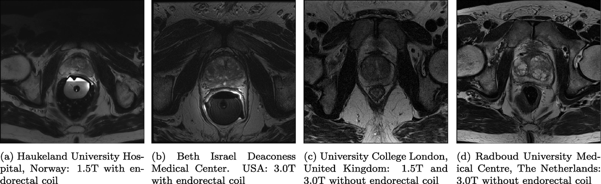
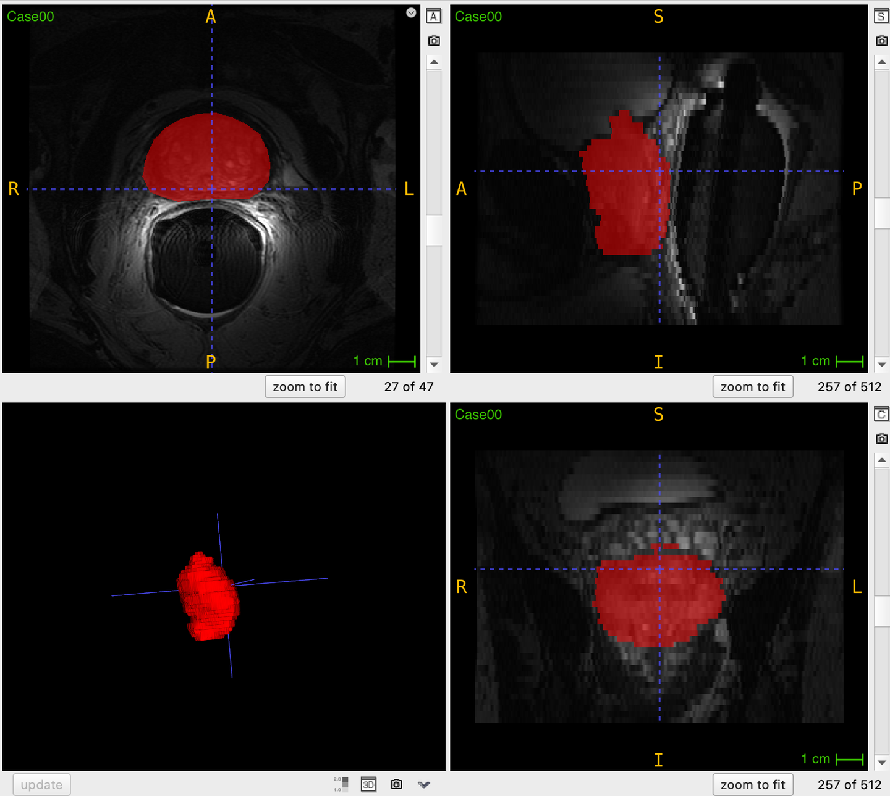

# PROMISE12

<div align="center">
    <a href="https://github.com/openmedlab/"></a>
</div>
<p style="text-align:center;font-size:10px;"><em></em></p>

## Dataset Information

**PROMISE12 (Prostate MRI Image Segmentation)** is a classic dataset in the field of medical image segmentation. As part of the MICCAI 2012 challenge, it provides 50 prostate MRI images along with their corresponding segmentation annotations. With the increasing application of MRI in clinical prostate cancer examinations, prostate MRI image segmentation has become a research hotspot. Accurate segmentation is crucial for various tasks, such as precisely delineating prostate boundaries for radiotherapy or initializing multimodal registration algorithms. However, evaluating prostate segmentation algorithms across multicenter, multi-vendor, and multi-protocol data has been challenging in the past, particularly due to variations in image appearance, resolution, and artifacts caused by different scanners and protocols, which impact algorithm accuracy. The PROMISE12 challenge was established to facilitate fair and meaningful comparisons of segmentation methods based on performance and robustness.

Determining the prostate volume (PV) is essential for assessing prostate diseases. For prostate cancer, PV, when combined with other parameters, can help predict pathological staging, provide prognostic information, and assist in predicting treatment responses. The prostate-specific antigen (PSA) level, combined with PV, has led to the derivation of PSA density, which aids in clinical decision-making. However, the clinical value of PSA density depends on the quality of PV estimation. The accuracy and variability of PV determination limit its practical use in clinical settings. The size/volume, shape, and spatial relationship of the prostate relative to adjacent organs are also critical components for surgical planning in prostatectomy, radiotherapy, and emerging minimally invasive therapies such as cryotherapy and high-intensity focused ultrasound (HIFU). 

In recent years, MRI has become the most accurate method for obtaining this information due to its high spatial resolution and soft tissue contrast. This, combined with MRI's potential for prostate cancer localization and grading, has rapidly expanded its clinical application and spurred research interest.

**Note**: The PROMISE12 dataset complements the **Promise09** dataset, which has been introduced in another [article](./resources/Promise09.md).

## Dataset Meta Information

| Dimensions | Modality | Task Type      | Anatomical Structures | Anatomical Area | Number of Categories | Data Volume | File Format |
|------------|----------|----------------|-----------------------|-----------------|----------------------|-------------|-------------|
| 3D         | MR       | Segmentation   | Prostate              | Abdomen         | 1                    | 50          | .mhd        |


### Resolution Details

| Dataset Statistics | spacing (mm)       | size            |
|--------------------|--------------------|-----------------|
| min                | (0.27, 0.27, 2.2)  | (256, 256, 15)  |
| median             | (0.61, 0.61, 3.6)  | (320, 320, 24)  |
| max                | (0.75, 0.75, 4.0)  | (512, 512, 54)  |

Number of 2D slices in the dataset: 1377.

## Label Information Statistics

| Metric              | Prostate |
|---------------------|----------|
| Case Count          | 50       |
| Coverage            | 100%     |
| Min Volume (cm³)    | 14.93    |
| Median Volume (cm³) | 43.27    |
| Max Volume (cm³)    | 315.39   |

## Visualization

<div align="center">
    <a href="https://github.com/openmedlab/"></a>
</div>
<p style="text-align:center;font-size:10px;"><em>Visualization from the original paper. Slices from different centers in the dataset to show the difference in appearance.</em></p>

<div align="center">
    <a href="https://github.com/openmedlab/"></a>
</div>
<p style="text-align:center;font-size:10px;"><em>Native itk-snap visualization. Red: prostate.</em></p>

## File Structure

``` 
PROMISE12/
│
├── LICENSE.TXT
├── livechallenge_test_data.zip
├── test_data.zip
└── training_data/
    ├── Case00.mhd
    ├── Case00.raw
    ├── Case00_segmentation.mhd
    ├── Case00_segmentation.raw
    └── ...
```

## Authors and Institutions

Bram van Ginneken, Radboud University Medical Center, Nijmegen, The Netherlands

Sjoerd Kerkstra, Radboud University Medical Center, Nijmegen, The Netherlands

Geert Litjens, Radboud University Medical Center, Nijmegen, The Netherlands

Rob Toth, Rutgers University, New Jersey, USA

## Source Information

Official Website: https://promise12.grand-challenge.org/

Download Link: https://zenodo.org/records/8026660

Article Address: https://www.sciencedirect.com/science/article/pii/S1361841513001734

Publication Date: 2012

## Citation

``` 
@article{Litjens2014,
  title={Evaluation of prostate segmentation algorithms for MRI: The PROMISE12 challenge},
  author={Litjens, Geert and Toth, Robert and van de Ven, Wendy J. M. and Hoeks, Caroline M. A. and Kerkstra, Sjoerd and van Ginneken, Bram and Vincent, Graham and Guillard, Gwenael and Birbeck, Neil and Zhang, Jindang and Strand, Robin and Malmberg, Filip and Ou, Yangming and Davatzikos, Christos and Kirschner, Matthias and Jung, Florian and Yuan, Jing and Qiu, Wu and Gao, Qinquan and Edwards, Philip E. and Maan, Bianca and van der Heijden, Ferdinand and Ghose, Soumya and Mitra, Jhimli and Dowling, Jason and Barratt, Dean and Huisman, Henkjan and Madabhushi, Anant},
  journal={Medical Image Analysis},
  volume={18},
  number={2},
  pages={359--373},
  year={2014},
  publisher={Elsevier}
}
```

Original introduction article is [here](https://zhuanlan.zhihu.com/p/5737787290).