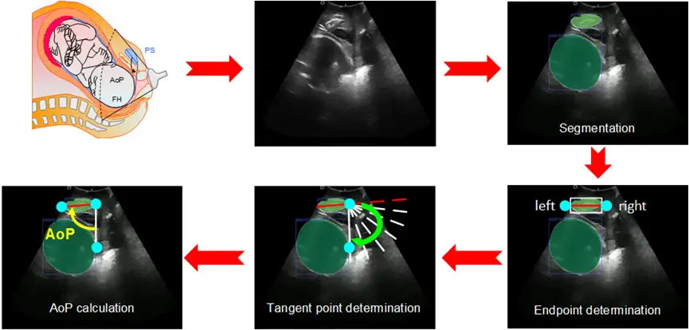

# MICCAI 2023 PSFHS

    

<em></em>

## Dataset Information

The current practice in obstetrics strives to avoid difficult vaginal deliveries, with clinicians' expertise largely revolving around accurately identifying the positions for using forceps or vacuum extractors. Digital vaginal examination remains the "gold standard" for obtaining this information, but it is a subjective assessment and has some limitations.

Recent studies suggest that performing perineal ultrasonography in the mid-sagittal plane may objectively quantify the degree of fetal head descent within the birth canal by measuring the Angle of Progression (AOP). The Angle of Progression (AOP) is the angle between a line drawn along the pubic symphysis (PS) longitudinal axis and another line drawn from the lower edge of the PS to the anterior edge of the fetal head. Segmenting the fetal head and the pubic symphysis (FH-PS) is a prerequisite for automatically estimating these parameters.

### Competition Content

**Task 1: Segmentation of the Fetal Head and Pubic Symphysis:** Participants are required to segment the fetal head and pubic symphysis. Accurate segmentation of these areas is crucial for precise fetal biometry.

**Task 2: Measurement of Ultrasound Parameters:** The task for participants is to measure ultrasound parameters using the segmented areas obtained in Task 1, especially the Angle of Progression (AoP).

PSFHS 2023 will evaluate the final competition results in two aspects, and the winners will have the opportunity to publish papers in related journals. This challenge will provide an open platform for participants from various backgrounds to compare their algorithms in a fair manner.

## Dataset Meta Information

| Dimensions | Modality   | Task Type    | Anatomical Structures  | Number of Categories | Data Volume | File Format |
|------------|------------|--------------|------------------------|----------------------|-------------|-------------|
| 2D         | Ultrasound | Segmentation | Abdomen                | 2                    | 5101 (4000)        | .mha        |

### Resolution Details

| Dataset Statistics | size       |
|--------------------|------------|
| min                | (256, 256) |
| median             | (256, 256) |
| max                | (256, 256) |

## Visualization

    

<em></em>

## File Structure

**Training Set:** The 'train' folder contains 4000 ultrasound image folders (`image_mha`) and label files (`label_mha`).

## Authors and Institutions

Jieyun Bai (College of Information Science and Technology, Jinan University, Guangzhou 510632, China)

Zhanhong Ou (College of Information Science and Technology, Jinan University, Guangzhou 510632, China)

Yaosheng Lu (College of Information Science and Technology, Jinan University, Guangzhou 510632, China)

## Source Information

Official Website: https://ps-fh-aop-2023.grand-challenge.org/

Download Link: https://zenodo.org/records/7861699

Article Address: TBD

Publication Date: 2023.04.15

## Reference

Zhou M, Wang C, Lu Y, et al. The segmentation effect of style transfer on fetal head ultrasound image: a study of multi-source data. Med Biol Eng Comput. 2023;61(5):1017-1031. doi:10.1007/s11517-022-02747-1

Ou, Z., Bai, J., Chen, Z., Lu, Y., Wang, H., Long, S., Chen, G., RTSeg-Net: A Lightweight Network for Real-time Segmentation of Fetal Head and Pubic Symphysis from Intrapartum Ultrasound Images. Computers in biology and medicine, 2024; 108501. doi:10.1016/j.compbiomed.2024.108501

Qiu, R., Zhou M, Bai, J., Lu, Y., Wang, H. PSFHSP-Net: An Efficient Lightweight Network for Identifying Pubic Symphysis-Fetal Head Standard Plane from Intrapartum Ultrasound Images. Med Biol Eng Comput. 2024. https://doi.org/10.1007/s11517-024-03111-1

Chen, Z. Ou, Y. Lu, J. Bai, Direction-guided and multi-scale feature screening for fetal head–pubic symphysis segmentation and angle of progression calculation, Expert Systems with Applications, 245 (2024) 123096. doi:10.1016/j.eswa.2023.123096

Lu Y, Zhou M, Zhi D, et al. The JNU-IFM dataset for segmenting pubic symphysis-fetal head [published correction appears in Data Brief. 2022 Apr 01;42:108128]. Data Brief. 2022;41:107904. Published 2022 Feb 2. doi:10.1016/j.dib.2022.107904

Lu Y, Zhi D, Zhou M, et al. Multitask Deep Neural Network for the Fully Automatic Measurement of the Angle of Progression. Comput Math Methods Med. 2022;2022:5192338. Published 2022 Sep 2. doi:10.1155/2022/5192338

Bai J, Sun Z, Yu S, et al. A framework for computing angle of progression from transperineal ultrasound images for evaluating fetal head descent using a novel double branch network. Front Physiol. 2022;13:940150. Published 2022 Dec 2. doi:10.3389/fphys.2022.940150

Chen G, Bai J, Ou Z, Lu Y, Wang H. PSFHS: Intrapartum ultrasound image dataset for AI-based segmentation of pubic symphysis and fetal head. Scientific Data. 2024. doi:10.1038/s41597-024-03266-4

Chen, Y. Lu, S, Long, V, et al. Fetal Head and Pubic Symphysis Segmentation in Intrapartum Ultrasound Image Using a Dual-Path Boundary-Guided Residual Network. IEEE Journal of Biomedical and Health Informatics. 2024

Original introduction article is [here](https://zhuanlan.zhihu.com/p/705451086).