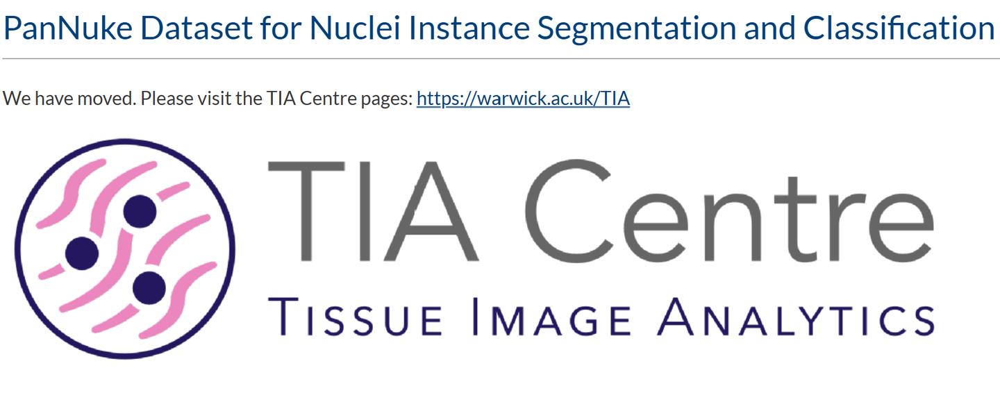
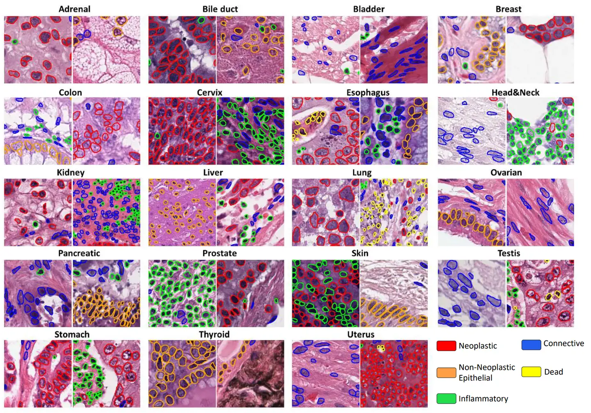

# PanNuke

<div align="center">
    <a href="https://github.com/openmedlab/"></a>
</div>
<p style="text-align:center;font-size:10px;"><em></em></p>

## Dataset Information

The PanNuke dataset is a semi-automatically generated pathology dataset for nuclear instance segmentation, comprehensively covering nuclear labels of 19 different tissue types. The dataset contains a total of 7,904 images and 205,343 annotated nuclei, each with an instance segmentation mask and corresponding cell type labels (tumor epithelial cells, inflammatory cells, connective tissue cells). These images are sourced from the TCGA and GTEx projects.

The significance of the PanNuke dataset lies in its provision of a large-scale, diverse benchmark for training and evaluating machine learning models for nuclear detection, segmentation, and classification. This is crucial for the development of automated digital pathology tools that can help pathologists diagnose cancer and other diseases more accurately and efficiently, thereby improving patient outcomes. Additionally, the PanNuke dataset provides researchers with a valuable resource for studying the morphology and distribution characteristics of nuclei in different tissues and disease states. This can lead to a deeper understanding of disease mechanisms and provide clues for discovering new therapeutic targets and biomarkers.


## Dataset Meta Information

| Dimensions | Modality  | Task Type    | Anatomical Structures                        | Number of Categories | Data Volume | File Format |
|------------|-----------|--------------|----------------------------------------------|----------------------|-------------|-------------|
| 2D         | Pathology | Segmentation | 19 structures including Kidneys, Liver, etc. | 6                    | 7904        | .npy        |


### Resolution Details

| Dataset Statistics | size        |
|--------------------|-------------|
| min                | (224, 224)  |
| median             | (224, 224)  |
| max                | (224, 224)  |

## Label Information Statistics

The dataset contains 47,055 labeled nucleus images with instance segmentation masks, mainly including 5 categories of nuclei and 1 image without nuclei.

| Category                  | Count | Percentage |
|---------------------------|-------|------------|
| Neoplastic                | 20,414 | 43.38%     |
| Non-Neoplastic Epithelial | 8,380  | 17.81%     |
| Inflammatory              | 9,840  | 20.69%     |
| Connective                | 5,374  | 11.42%     |
| Dead                      | 2,547  | 5.41%      |
| Non-Nuclei                | 500    | 1.06%      |


## Visualization

<div align="center">
    <a href="https://github.com/openmedlab/"></a>
</div>
<p style="text-align:center;font-size:10px;"><em>Real annotation examples.</em></p>

## File Structure

The official dataset consists of three parts: fold 1, fold 2, and fold 3. The file structure of each part is as follows. The `images` folder contains image data, and the `masks` folder contains segmentation annotations.

``` 
Dataset
│
├── fold 1
│   ├── images
│   │   ├── fold 1
│   │   │  ├── images.npy
│   │   │  ├── types.npy
│   │   ├── GTVnd.nii.gz
│   │   ├── GTVp.nii.gz
│   └── masks
│   │   ├── fold 1
│   │   │  ├── masks.npy
│   │   ├── by-nc-sa.md
│   │   ├── README.md
│   └── README.md
├── fold2
│   ...
├── fold3
│   ...
```

## Authors and Institutions

Jevgenij Gamper (Department of Computer Science, University of Warwick, UK)

Navid Alemi Koohbanani (Department of Computer Science, University of Warwick, UK)

Ksenija Benes (Department of Pathology, The Royal Wolverhampton NHS Trust, UK)

Simon Graham (Department of Computer Science, University of Warwick, UK)

Mostafa Jahanifar (R&D Department, NRP Co., Tehran, Iran)

Seyyed Ali Khurram (Department of Clinical Dentistry, University of Sheffield, UK)

Ayesha Azam (Department of Pathology, University Hospitals Coventry and Warwickshire, UK)

Katherine Hewitt (Department of Pathology, University Hospitals Coventry and Warwickshire, UK)

Nasir Rajpoot (Department of Computer Science, University of Warwick, UK)

## Source Information

Official Website: https://warwick.ac.uk/fac/sci/dcs/research/tia/data/pannuke

Download Link: https://warwick.ac.uk/fac/sci/dcs/research/tia/data/pannuke

Article Address: https://arxiv.org/pdf/2003.10778v7

Publication Date: 2020-03

## Citation

``` 
@article{gamper2020pannuke,
  title={Pannuke dataset extension, insights and baselines},
  author={Gamper, Jevgenij and Koohbanani, Navid Alemi and Benes, Ksenija and Graham, Simon and Jahanifar, Mostafa and Khurram, Syed Ali and Azam, Ayesha and Hewitt, Katherine and Rajpoot, Nasir},
  journal={arXiv preprint arXiv:2003.10778},
  year={2020}
}
```

Original introduction article is [here](https://zhuanlan.zhihu.com/p/700798520).