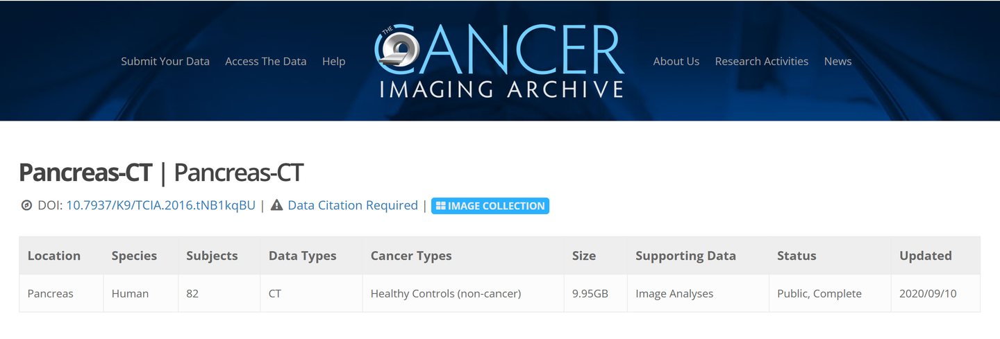
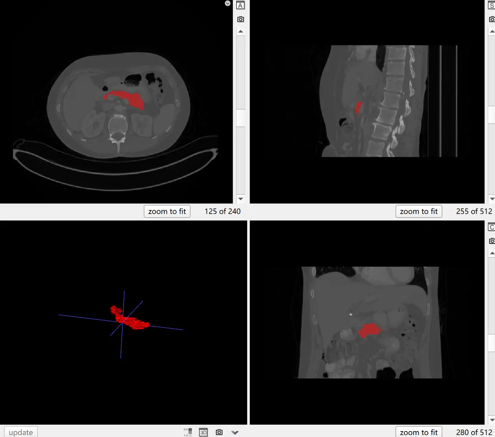

# Pancreas-CT

<div align="center">
    <a href="https://github.com/openmedlab/"></a>
</div>
<p style="text-align:center;font-size:10px;"><em></em></p>

## Dataset Information

The **Pancreas-CT** dataset contains 80 cases (53 males, 27 females) of contrast-enhanced 3D CT scans (performed approximately 70 seconds after intravenous contrast injection during the portal venous phase) with manual annotations of the pancreas. The dataset is provided by the National Institutes of Health Clinical Center in the United States. Among the subjects, 17 are healthy kidney donors who were scanned before nephrectomy. The remaining 65 patients were selected by radiologists from those without major abdominal diseases and **without pancreatic cancer lesions**. Therefore, it is confirmed that all images in the dataset do not contain pancreatic tumors. The subjects' ages range from 18 to 76 years, with an average age of 46.8 ± 16.7 years. The original CT images were acquired using Philips and Siemens MDCT scanners (120 kVp tube voltage). Annotations were manually segmented layer by layer by a medical student as ground truth (GT) and verified/modified by an experienced radiologist.

It is worth noting that the original version of the dataset had 82 cases, but in the latest version (Version 2: Updated 2020/09/10), cases #25 and #70 were removed because they were from the same scan as case #2, only with slightly different cropping. Therefore, the Pancreas-CT dataset contains a total of 80 cases. Data from Pancreas-CT is also included in several larger public datasets, such as [AbdomenCT-1K](./AbdomenCT-1K.md) and [AbdomenAtlas](./AbdomenAtlas_Mini.md), so care should be taken when using it. The Pancreas-CT dataset can be used to evaluate and develop computer-aided detection and diagnosis (CAD) systems, particularly in the detection and diagnosis of pancreatic diseases.

## Dataset Meta Information

| Dimensions | Modality | Task Type | Anatomical Structures | Anatomical Area | Number of Categories | Data Volume | File Format |
|------------|----------|-----------|-----------------------|-----------------|----------------------|-------------|-------------|
| 3D         | CT       | Segmentation | pancreas              | abdomen       | 1                    | 80          | .dcm, .nii.gz     |


### Resolution Details

| Dataset Statistics | spacing (mm)       | size             |
|--------------------|--------------------|------------------|
| min                | (0.66, 0.66, 0.5)  | (512, 512, 181)  |
| median             | (0.86, 0.86, 1.0)  | (512, 512, 218)  |
| max                | (0.98, 0.98, 1.0)  | (512, 512, 466)  |

Number of 2D slices in the dataset: 18,942

## Label Information Statistics

| Metric              | Pancreas |
|---------------------|----------|
| Case Count          | 80       |
| Coverage            | 100%     |
| Min Volume (cm³)    | 42       |
| Median Volume (cm³) | 70       |
| Max Volume (cm³)    | 150      |

## Visualization


<div align="center">
    <a href="https://github.com/openmedlab/"></a>
</div>
<p style="text-align:center;font-size:10px;"><em> ITK-SNAP Visualization. Red area: pancreas.</em></p>

## File Structure

Each subfolder in the Pancreas-CT folder represents a patient and contains all their CT slice images. Each file in the TCIA_pancreas_labels-02-05-2017 folder corresponds to the annotation data for a patient.

``` 
Pancreas-CT/
├── PANCREAS_0001/
│   ├── 1-001.dcm
│   ├── 1-002.dcm
│   ├── ...
├── PANCREAS_0002/
│   ├── 1-001.dcm
│   ├── 1-002.dcm
│   ├── ...
...

TCIA_pancreas_labels-02-05-2017/
├── label0001.nii.gz
├── label0002.nii.gz
├── ...
```

## Authors and Institutions

Holger Roth (National Institutes of Health, NIH)

Le Lu (National Institutes of Health, NIH)

Ayman Farag (National Institutes of Health, NIH)

Enzo B. Turkbey (National Institutes of Health, NIH)

Jianhua Yao (National Institutes of Health, NIH)

Ronald M. Summers (National Institutes of Health, NIH)

## Source Information

Official Website: https://www.cancerimagingarchive.net/collection/pancreas-ct/

Download Link: https://www.cancerimagingarchive.net/collection/pancreas-ct/

Article Address: -

Publication Date: 2020

## Citation

``` 
@misc{Roth2016,
  author = {Holger R. Roth and Amal Farag and Evrim B. Turkbey and Le Lu and Jiamin Liu and Ronald M. Summers},
  title = {Data From Pancreas-CT},
  year = {2016},
  howpublished = {\url{https://doi.org/10.7937/K9/TCIA.2016.tNB1kqBU}},
  note = {The Cancer Imaging Archive}
}
```

Original introduction article is [here](https://zhuanlan.zhihu.com/p/699701013).