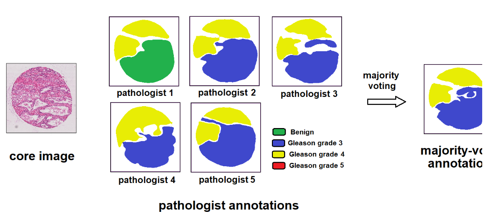
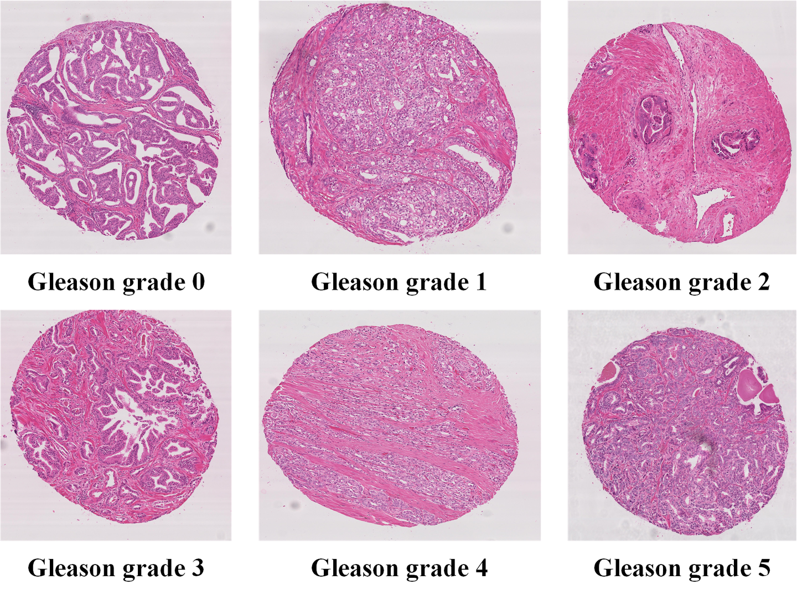

# PANDA

## Dataset Information

The **PANDA dataset** focuses on classifying the severity of prostate cancer from microscopic scanned images of prostate biopsy samples. Unlike most competitions, this challenge has two unique aspects:

1. **Large image size**: Each individual image is exceptionally large, requiring participants to devise efficient strategies to identify and zoom in on areas of interest to enhance processing efficiency.
   
2. **Imperfect labels**: Due to the challenges in the field of pathology, even experienced pathologists may not reach a consensus on interpreting the slides. This makes training models more difficult but also increases the potential medical value of building robust models that can provide consistent ratings.

All private test set images and most public test set images were rated by multiple pathologists. However, due to cost constraints, this multi-expert scoring approach was not applied to the training set.

## Dataset Meta Information

| Dimensions | Modality  | Task Type      | Anatomical Structures | Anatomical Area | Number of Categories | Data Volume | File Format |
|------------|-----------|----------------|-----------------------|-----------------|----------------------|-------------|-------------|
| 2D         | Pathology | Classification | Prostate              | Prostate        | 5                    | 331         | .JPG        |


### Resolution Details

| Dataset Statistics | size          |
|--------------------|---------------|
| min                | (4608, 4608)  |
| median             | (5096, 5004)  |
| max                | (5632, 5632)  |

## Label Information Statistics


| Level           | Number |
|-----------------|--------|
| Gleason grade 0 | 64     |
| Gleason grade 1 | 56     |
| Gleason grade 2 | 45     |
| Gleason grade 3 | 63     |
| Gleason grade 4 | 66     |
| Gleason grade 5 | 37     |

## Visualization

<div align="center">
    <a href="https://github.com/openmedlab/"></a>
</div>
<p style="text-align:center;font-size:10px;"><em>Official Visualization.</em></p>

<div align="center">
    <a href="https://github.com/openmedlab/"></a>
</div>
<p style="text-align:center;font-size:10px;"><em>Local Visualization.</em></p>

## File Structure

``` 
Gleason
├── image
│   ├── train
│   │   ├── xxx.jpg
│   │   ├── xxx.jpg
│   │   ├── xxx.jpg
│   │   ├── xxx.jpg
│   │   └── ...
│   └── val
│   │   ├── xxx.jpg
│   │   ├── xxx.jpg
│   │   ├── xxx.jpg
│   │   ├── xxx.jpg
│   │   └── ...
    ├── train.txt
    └── val.txt
```

## Authors and Institutions

Guy Nir (Department of Urologic Sciences, University of British Columbia, Vancouver, BC, Canada)

Soheil Hor (Department of Electrical Engineering, Stanford University, Stanford, CA, USA)

Davood Karimi (Department of Electrical and Computer Engineering, University of British Columbia, Vancouver, BC, Canada)

Ladan Fazli (Department of Urologic Sciences, University of British Columbia, Vancouver, BC, Canada)

Brian F. Skinnider (BC Cancer Agency, Vancouver, BC, Canada)

Peyman Tavassoli (Department of Pathology, Richmond Hospital, Richmond, BC, Canada)

## Source Information

Official Website: https://gleason2019.grand-challenge.org/Home/

Download Link: https://gleason2019.grand-challenge.org/Home/

Article Address: https://doi.org/10.1016/j.media.2018.09.005

Publication Date: 2019

## Citation

``` 
@article{nir2018automatic,
  title={Automatic grading of prostate cancer in digitized histopathology images: Learning from multiple experts},
  author={Nir, Guy and Hor, Soheil and Karimi, Davood and Fazli, Ladan and Skinnider, Brian F and Tavassoli, Peyman and Turbin, Dmitry and Villamil, Carlos F and Wang, Gang and Wilson, R Storey and others},
  journal={Medical image analysis},
  volume={50},
  pages={167--180},
  year={2018},
  publisher={Elsevier}
}
```

Original introduction article is [here](https://zhuanlan.zhihu.com/p/7193897923).