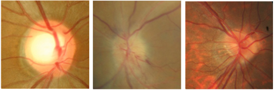

# Papilledema fundus image papilledema classification dataset

<div align="center">
    <a href="https://github.com/openmedlab/"></a>
</div>
<p style="text-align:center;font-size:10px;"><em></em></p>

## Dataset Information

The Papilledema dataset contains 1,369 PNG format images, categorized into three classes: normal, papilledema, and pseudo_papilledema. Papilledema is characterized by optic disc swelling due to elevated intracranial pressure, which can lead to vision loss, neurological dysfunction, and even death, requiring urgent intervention to reduce intracranial pressure. In contrast, pseudo_papilledema presents as an abnormally elevated optic disc without accompanying retinal nerve fiber layer swelling, and its management differs significantly from true papilledema, typically involving observation and regular check-ups.

In fundus image analysis, distinguishing between these two conditions is crucial. True papilledema in fundus photography appears as blurred optic disc margins, elevation, and retinal nerve fiber layer swelling. Pseudo_papilledema, although also showing elevated optic disc, has clear disc margins without swelling. Accurate identification of these subtle differences is essential, as it can enhance diagnostic accuracy and optimize patient treatment plans.

## Dataset Meta Information

| Dimensions | Modality | Task Type      | Anatomical Structures | Anatomical Area | Number of Categories | Data Volume | File Format |
|------------|----------|----------------|-----------------------|-----------------|----------------------|-------------|-------------|
| 2D         | Fundus       | Classification | Eye                   | Eye             | 3                    | 1369        | PNG         |


### Resolution Details

| Dataset Statistics | size        |
|--------------------|-------------|
| min                | (208, 240)  |
| medium             | (239, 240)  |
| max                | (240, 240)  |

## Label Information Statistics

The statistical results are based on the actual data collected by the author:

| Categories            | Number |
|-----------------------|--------|
| 0 - Normal            | 779    |
| 1 - Papilledema       | 295    |
| 2 - Pseudopapilledema | 295    |

## Visualization

<div align="center">
    <a href="https://github.com/openmedlab/"></a>
</div>
<p style="text-align:center;font-size:10px;"><em>Examples of normal, papilledema, and pseudopapilledema.</em></p>

## File Structure

The file structure of the dataset is shown below, with images of the three categories divided into three different folders.

``` 
data
├── Normal
│   ├── 1.jpg
│   ├── 2.jpg
│   └── ...
├── Papilledema
│   ├── 1.jpg
│   ├── 2.jpg
│   └── ...
└── Pseudopapilledema
    ├── 1.jpg
    ├── 2.jpg
    └── ...
```

## Authors and Institutions

Ungsoo Kim


## Source Information

Official Website: https://osf.io/2w5ce/

Download Link: https://osf.io/2w5ce/

Article Address: TBD

Publication Date: 2018

## Citation

``` 
TBD
```

Original introduction article is [here](https://zhuanlan.zhihu.com/p/697060367).
