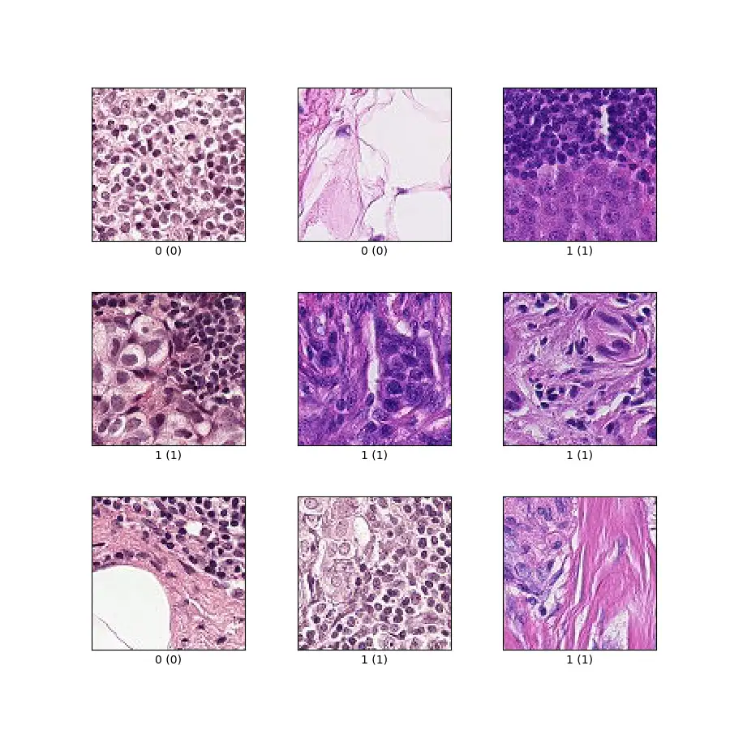

# PatchCamelyon

<div align="center">
    <a href="https://github.com/openmedlab/"></a>
</div>
<p style="text-align:center;font-size:10px;"><em></em></p>

## Dataset Information

The PatchCamelyon dataset is an image classification challenge focusing on the detection of breast cancer metastases, originating from the histopathological images of the CAMELYON16 challenge. This dataset includes 327,680 color images (each 96x96 pixels), each with a binary label indicating the presence or absence of metastatic tissue. The goal of this dataset is to detect breast cancer metastases in lymph node sections.

The clinical significance of the PatchCamelyon dataset lies in its detection of breast cancer metastases, a critical factor in the treatment and prognosis of breast cancer. Automated image analysis can help pathologists identify metastatic tissue more quickly, thus accelerating the diagnostic process. This dataset provides a new benchmark for machine learning models: larger than CIFAR10 and smaller than ImageNet, it can be trained on a single GPU. This allows researchers to develop and test advanced image classification algorithms without the need for large-scale computational resources. Moreover, the challenging nature and clinical relevance of PatchCamelyon have propelled research progress in the field of digital pathology.

## Dataset Meta Information

| Dimensions | Modality | Task Type                    | Anatomical Structures | Anatomical Area | Number of Categories | Data Volume | File Format |
|------------|----------|------------------------------|-----------------------|-----------------|----------------------|-------------|-------------|
| 2D         | Pathology Image      | Classification               | Lymph Nodes           | Mammary Gland   | 2                    | 327,680 	   | JPG         |


### Resolution Details

| Dataset Statistics | size      |
|--------------------|-----------|
| min                | [96, 96]  |
| median             | [96, 96]  |
| max                | [96, 96]  |

## Label Information Statistics

| Categories | train  | val    | test   |
|------------|--------|--------|--------|
| normal     | 131,072| 16,384 | 16,384 |
| tumor      | 131,072| 16,384 | 16,384 |

Positive and Negative Labels: Each image has a binary label indicating whether metastatic tissue is present in the central region of the image (32x32 pixels). If the central area contains at least one pixel of tumor tissue, it is marked with a positive label.

Label Impact Area: Only the tumor tissue in the central area affects the label. Tumor tissue in the peripheral areas of the image does not affect the label.

Balance: The dataset maintains a 50/50 balance between positive and negative samples.

## Visualization


<div align="center">
    <a href="https://github.com/openmedlab/"></a>
</div>
<p style="text-align:center;font-size:10px;"><em> 0 represents normal, 1 represents tumor</em></p>

## File Structure

In the official dataset provided: `camelyonpatch_level_2_split_test_meta.csv` is a CSV file containing metadata for the test set. The metadata may include information such as the image source, label, and the location of the image within the original WSI (Whole Slide Image); `camelyonpatch_level_2_split_test_x.h5` is an HDF5 file containing image data for the test set, where 'x' typically represents the input images; `camelyonpatch_level_2_split_test_y.h5` is an HDF5 file containing label data for the test set, where 'y' typically represents the target labels.

The training and validation sets follow the same convention.

``` 
    ├── camelyonpatch_level_2_split_test_meta.csv
    ├── camelyonpatch_level_2_split_test_x.h5
    ├── camelyonpatch_level_2_split_test_y.h5
    ├── camelyonpatch_level_2_split_train_mask.h5
    ├── camelyonpatch_level_2_split_train_meta.csv
    ├── camelyonpatch_level_2_split_train_x.h5
    ├── camelyonpatch_level_2_split_train_y.h5
    ├── camelyonpatch_level_2_split_train_y.h5.gz
    ├── camelyonpatch_level_2_split_valid_x.h5
    ├── camelyonpatch_level_2_split_valid_x.h5.gz
    └── camelyonpatch_level_2_split_valid_y.h5
```

## Authors and Institutions

Bastiaan S. Veeling (University of Amsterdam)

Jasper Linmans (University of Amsterdam)

Jim Winkens (University of Amsterdam)

Taco Cohen (University of Amsterdam)

Max Welling (University of Amsterdam)

## Source Information

Official Website: https://patchcamelyon.grand-challenge.org/

Download Link: https://github.com/basveeling/pcam

Article Address: https://arxiv.org/abs/1806.03962

Publication Date: 2018-06

## Citation

``` 
@inproceedings{veeling2018rotation,
  title={Rotation equivariant CNNs for digital pathology},
  author={Veeling, Bastiaan S and Linmans, Jasper and Winkens, Jim and Cohen, Taco and Welling, Max},
  booktitle={Medical Image Computing and Computer Assisted Intervention--MICCAI 2018: 21st International Conference, Granada, Spain, September 16-20, 2018, Proceedings, Part II 11},
  pages={210--218},
  year={2018},
  organization={Springer}
}
```

Original introduction article is [here](https://zhuanlan.zhihu.com/p/688795787).