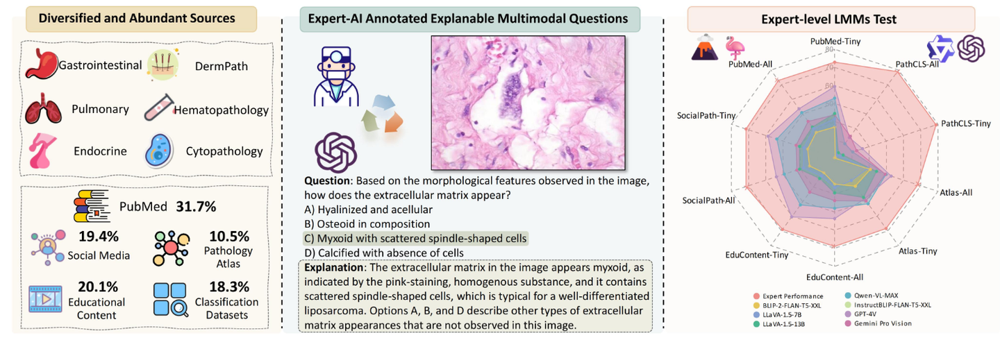
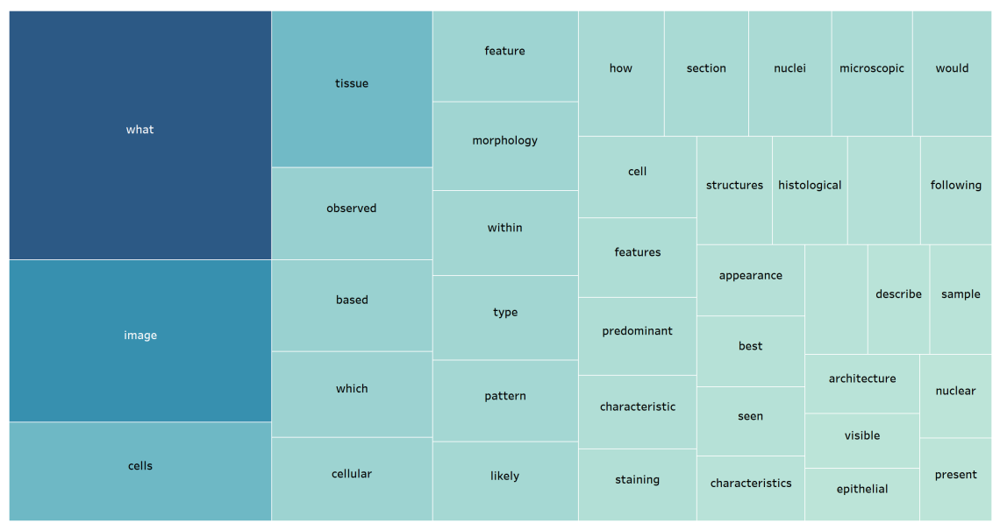
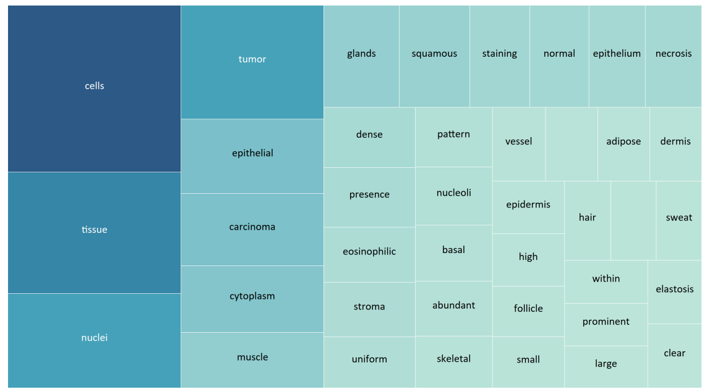
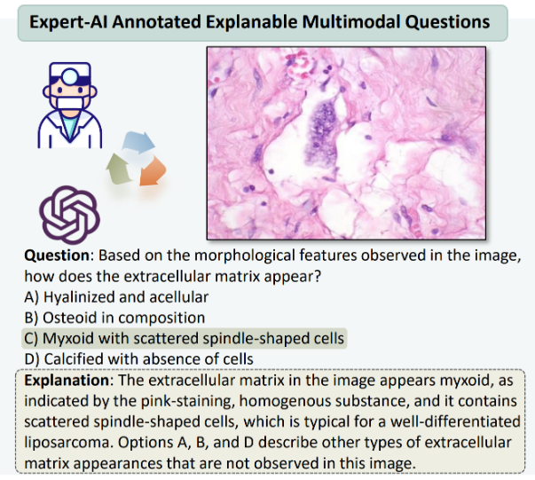

# PathMMU

<div align="center">
    <a href="https://github.com/openmedlab/"></a>
</div>
<p style="text-align:center;font-size:10px;"><em></em></p>

## Dataset Information

PathMMU is a specialist-level benchmark dataset designed to evaluate the understanding and reasoning abilities of large multimodal models (LMMs) in pathology image interpretation. This dataset consists of 33,428 question-answer pairs and 24,067 pathology images, sourced from high-quality domains such as PubMed scientific literature, atlases and guidelines in pathology textbooks, posts by pathology experts on Twitter, common pathology classification datasets, and educational content from YouTube tutorial videos.

The content of the PathMMU dataset covers multiple organ systems (such as the digestive, respiratory, and endocrine systems) and various pathology subjects (such as dermatopathology, hematopathology, and cytopathology). During its development, researchers adopted a carefully designed stepwise approach. Initially, they collected images and caption pairs, utilizing the GPT-4V model to optimize the descriptions of the original images, enhancing detail and highlighting key morphological features. Subsequently, these optimized descriptions and images were used to generate professional multiple-choice pathology questions with detailed answer explanations using GPT-4V again. To ensure these questions were specifically designed for multimodal pathology understanding, they were sifted through collaboration with multiple large language models to eliminate those that could be easily solved or guessed through text alone. Additionally, seven pathology experts were invited to manually review about 12,000 question-answer pairs in the test and validation sets of the PathMMU dataset, ensuring the generated questions are professional, logical, and of high quality.

## Dataset Meta Information

| Task Type | Language | Training Data | Test Data | Total Questions | Format | File Size |
|-----------|----------|---------------|-----------|-----------------|--------|-----------|
| VQA       | Chinese  | 23,041        | 9,677     | 33,428          | .json  | ~2GB      |


## Dataset Information Statistics

Statistics of each subset in the PathMMU training set:

| Source     | Avg. Question Length | Avg. Option Length | # Questions / # Images | Avg. Image Resolution |
|------------|----------------------|--------------------|-----------------------|-----------------------|
| PubMed     | 16.7                 | 4.5                | 6064 / 4342           | 702 x 558             |
| SocialPath | 16.2                 | 4.7                | 7381 / 4606           | 1084 x 861            |
| EduContent | 16.1                 | 4.7                | 5214 / 3250           | 1573 x 888            |
| Atlas      | 16.5                 | 4.2                | 622 / 386             | 589 x 451             |
| PathCLS    | 20.1                 | 3.2                | 3760 / 3760           | 526 x 494             |
| Overall    | 17.0                 | 4.4                | 23041 / 16344         | 940 x 692             |

Statistics of each subset in the PathMMU test set:

| Source     | Avg. Question Length | Avg. Option Length | # Questions / # Images | Avg. Image Resolution |
|------------|----------------------|--------------------|-----------------------|-----------------------|
| PubMed     | 16.5                 | 4.4                | 3068 / 2098           | 704 x 558             |
| SocialPath | 16.3                 | 4.3                | 1855 / 1218           | 1074 x 852            |
| EduContent | 16.2                 | 4.5                | 1938 / 1447           | 1451 x 844            |
| Atlas      | 16.3                 | 4.3                | 1007 / 641            | 585 x 465             |
| PathCLS    | 20.4                 | 3.1                | 1809 / 1809           | 560 x 517             |
| Overall    | 17.1                 | 4.2                | 9677 / 7213           | 874 x 650             |

<div align="center">
    <a href="https://github.com/openmedlab/"></a>
</div>
<p style="text-align:center;font-size:10px;"><em>Visualization of the top 40 most common words in questions in the PathMMU test set.</em></p>

<div align="center">
    <a href="https://github.com/openmedlab/"></a>
</div>
<p style="text-align:center;font-size:10px;"><em>Visualization of the top 40 most common words in the options in the PathMMU test set.</em></p>

## Dataset Example

<div align="center">
    <a href="https://github.com/openmedlab/"></a>
</div>
<p style="text-align:center;font-size:10px;"><em></em></p>

## File Structure

The author uploaded PathMMU on Huggingface and provided the json file corresponding to the image and its vqa. After submitting the application, you can obtain access permission.

``` 
.               
├── data.json
├── images.zip
```

## Authors and Institutions

Yuxuan Sun (Zhejiang University, Westlake University)

Hao Wu (Macau University of Science and Technology)

Chenglu Zhu (Westlake University)

Sunyi Zheng (Westlake University)

Qizi Chen (Jiangnan University)

Kai Zhang (The Ohio State University)

Yunlong Zhang (Zhejiang University, Westlake University)

Dan Wan (Fujian University of Traditional Chinese Medicine)

Xiaoxiao Lan (Zhejiang University)

Mengyue Zheng (Westlake University)

Jingxiong Li (Zhejiang University, Westlake University)

Xinheng Lyu (Westlake University)

Tao Lin (Westlake University)

Lin Yang (Westlake University)

## Source Information

Official Website: https://pathmmu-benchmark.github.io/#/

Download Link: https://huggingface.co/datasets/jamessyx/PathMMU

Article Address: https://arxiv.org/pdf/2401.16355

Publication Date: 2024-08

## Citation

``` 
@misc{chen2024wsivqainterpretingslideimages,
      title={WSI-VQA: Interpreting Whole Slide Images by Generative Visual Question Answering}, 
      author={Pingyi Chen and Chenglu Zhu and Sunyi Zheng and Honglin Li and Lin Yang},
      year={2024},
      eprint={2407.05603},
      archivePrefix={arXiv},
      primaryClass={cs.CV},
      url={https://arxiv.org/abs/2407.05603}, 
}
```

Original introduction article is [here](https://zhuanlan.zhihu.com/p/717697676).