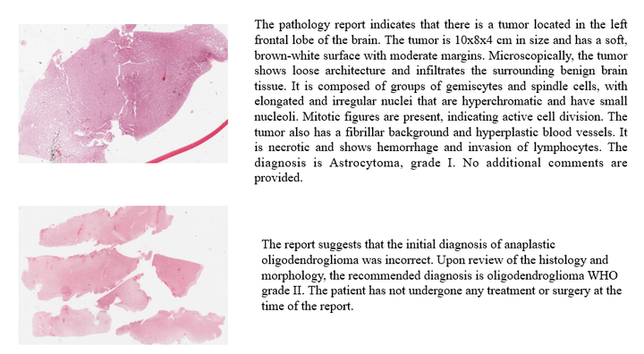
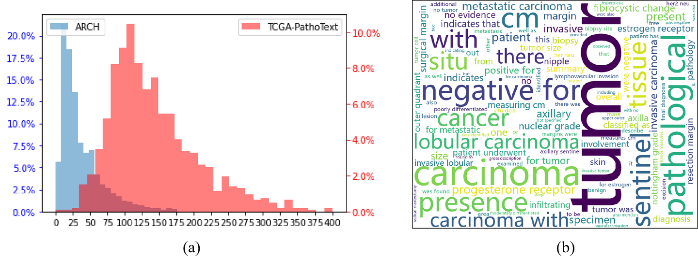
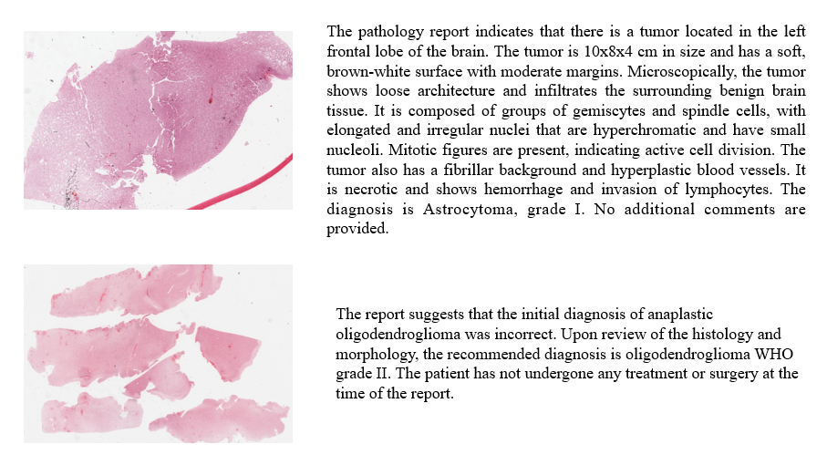

# PathText

<div align="center">
    <a href="https://github.com/openmedlab/"></a>
</div>
<p style="text-align:center;font-size:10px;"><em></em></p>

## Dataset Information

**PathText** is a dataset specifically designed for the **Whole Slide Image (WSI) Captioning** task in pathology. It efficiently extracts and cleans pathology-related textual information from **The Cancer Genome Atlas (TCGA)** through an automated process. PathText identifies diagnostic slides in TCGA and their corresponding pathology reports, providing researchers with a comprehensive source of pathology information. Since these reports are often in complex and redundant PDF formats, extracting meaningful information is highly challenging. To address this, OCR technology is employed to convert the PDF files into editable text, though the resulting text often contains noise and errors. To mitigate this, PathText incorporates **large language models (LLMs)** with specifically designed prompts, enabling automatic filtering and refinement to extract useful pathology information.

The final **PathText dataset** consists of **9,009 WSI-text pairs**, where the textual content has undergone multiple layers of cleaning and filtering, ensuring strict alignment with the pathology images. This dataset not only provides an accurate and efficient tool for generating pathology-related text but also establishes a strong foundation for the **WSI Captioning task**, advancing pathology research.

## Dataset Meta Information

| Task Type | Language       | Number | File Format | Size  |
|-----------|----------------|--------|-------------|-------|
| Caption   | English        | 9009   | json        | 5.6GB |

## Dataset Information Statistics

<div align="center">
    <a href="https://github.com/openmedlab/"></a>
</div>
<p style="text-align:center;font-size:10px;"><em>(a) The histogram of text length shows that PathText contains longer pathology reports, whereas ARCH only describes small tissue blocks. (b) The word cloud displays the 100 most frequently used words.</em></p>

## Dataset Example

<div align="center">
    <a href="https://github.com/openmedlab/"></a>
</div>
<p style="text-align:center;font-size:10px;"><em>WSI and its Caption example.</em></p>

## File Structure

Due to the high resolution and preprocessing requirements of WSIs, the authors only provide the **PathText.json** file, which contains ID and caption information. The raw WSI images need to be downloaded and processed from the TCGA database (https://portal.gdc.cancer.gov/) independently.

``` 
PathText.json
```

## Authors and Institutions

Pingyi Chen (College of Computer Science and Technology, Zhejiang University & Research Center for Industries of the Future, Westlake University & School of Engineering, Westlake University)

Honglin Li (College of Computer Science and Technology, Zhejiang University & Research Center for Industries of the Future, Westlake University & School of Engineering, Westlake University)

Chenglu Zhu (Research Center for Industries of the Future, Westlake University & School of Engineering, Westlake University)

Sunyi Zheng (Research Center for Industries of the Future, Westlake University & School of Engineering, Westlake University)

Zhongyi Shui (College of Computer Science and Technology, Zhejiang University & Research Center for Industries of the Future, Westlake University & School of Engineering, Westlake University)

Lin Yang (Research Center for Industries of the Future, Westlake University & School of Engineering, Westlake University)

## Source Information

Official Website: https://github.com/cpystan/Wsi-Caption

Download Link: https://github.com/cpystan/Wsi-Caption

Article Address: https://arxiv.org/pdf/2311.16480

Publication Date: 2023-11

## Citation

``` 
@article{chen2023mi,
  title={MI-Gen: Multiple Instance Generation of Pathology Reports for Gigapixel Whole-Slide Images},
  author={Chen, Pingyi and Li, Honglin and Zhu, Chenglu and Zheng, Sunyi and Yang, Lin},
  journal={arXiv preprint arXiv:2311.16480},
  year={2023}
}
```

Original introduction article is [here](https://zhuanlan.zhihu.com/p/721410494).