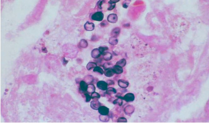
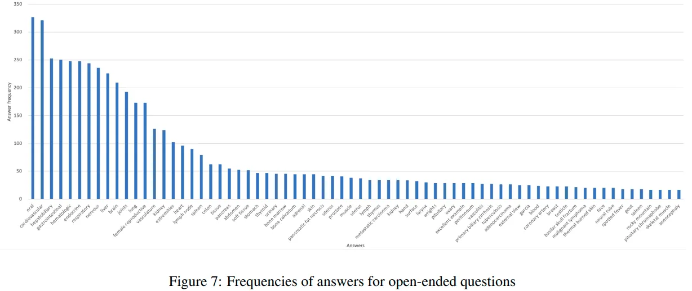
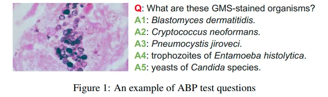
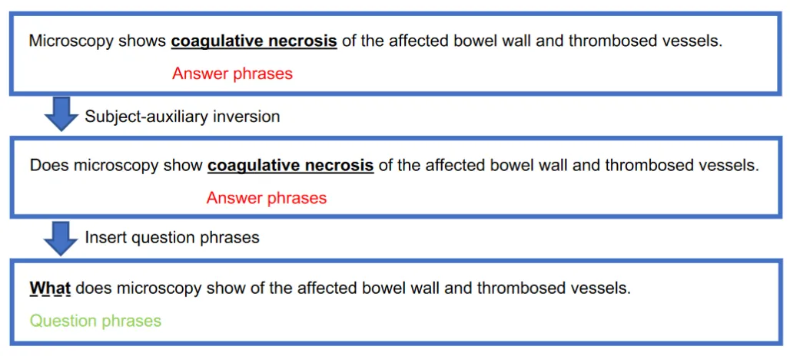
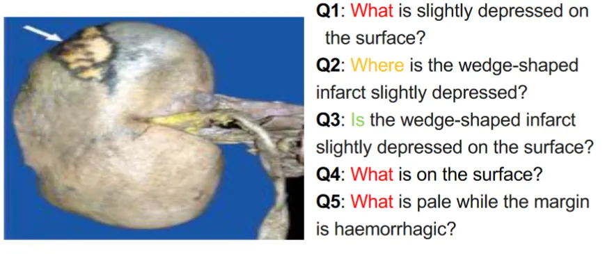

# PathVQA

<div align="center">
    <a href="https://github.com/openmedlab/"></a>
</div>
<p style="text-align:center;font-size:10px;"><em></em></p>

## Dataset Information

PathVQA is a dataset specifically designed for the task of visual question answering in pathology, gathering 4,998 pathological images from two pathology textbooks and the PEIR digital library, generating 32,799 question-answer pairs. Each image in this dataset generates an average of 6.6 questions, with the number of questions ranging from 1 to 14, and an average word count of 9.5 for questions and 2.5 for answers. The questions are categorized into seven types, with 50.2% being open-ended questions. The significance of PathVQA lies in providing actual Q&A cases for the automated parsing and understanding of pathological images, which is crucial for the development of AI-driven medical diagnostic systems. Through these diverse and complex Q&As, AI models can be trained more comprehensively and in-depth, thereby improving their effectiveness in clinical settings.

PathVQA has become an important benchmark in the field of Med-VQA, partly because there are few evaluation datasets for Med-VQA and partly because of the uniqueness of PathVQA. Compared to other Med-VQA datasets, PathVQA focuses mainly on pathology, including pathological/cytological slides and some natural images of diseases, different from past datasets that primarily featured radiographic images. PathVQA holds a significant position in terms of data volume and quality among Med-VQA datasets, although the data quality may decline due to large-scale automated generation. PathVQA uses a semi-automatic method to extract QA pairs and has designed specific rules to enhance the richness and accuracy of the questions. Its classification method has similarities to that of VQA-RAD, for example, "Where" is similar to the "Position" task and "How much" to "Counting," while types like "Whose," "When," etc., are more unique.


## Dataset Meta Information

| Task Type | Language | Train | Val | Test | File Format | Size  |
|------|----------|-------|----------|------|----|-------|
| VQA  | English  | 17325  | 9462   | 6012  | .json，.pkl | 809MB |

## Dataset Information Statistics

Since most of the metadata is missing part or modality-related meta-information, the article only counts the types of questions. As previously introduced, they are mainly classified according to the format of the questions. These QA pairs are mostly focused on Yes/No or "What" questions, which are judgment and identification questions in traditional VQA.

- Statistics of data split

|               | Training set | Validation set | Test set |
|---------------|--------------|----------------|----------|
| # images      | 2,499        | 1,499          | 1,000    |
| # QA pairs    | 17,325       | 9,462          | 6,012    |

- Comparison of VQA datasets

|              | DAQUAR | VQA  | VQA v2 | COCO-QA | CLEVR | VQA-Med | VQA-RAD | Ours (PathVQA) |
|--------------|--------|------|--------|---------|-------|---------|---------|----------------|
| Domain       | General| General | General | General | General | Medical | Medical | Medical        |
| # images     | 1,449  | 204K | 204K   | 123K    | 100K   | 4,200   | 315     | 4,998          |
| # QA pairs   | 12,468 | 614K | 1.1M   | 118K    | 999K   | 15,292  | 3,515   | 32,799         |
| Answer type  | Open   | Open/MC | Open/MC | Open/MC | Open  | Open/MC | Open/MC | Open           |

- Frequency of questions in different categories

| Question type     | Total number and percentage  |
|-------------------|------------------------------|
| Yes/No            | 16,334 (49.8%)               |
| What              | 13,402 (40.9%)               |
| Where             | 1,268 (4.0%)                 |
| How               | 1,014 (3.0%)                 |
| How much/How many | 294 (0.9%)                   |
| When              | 285 (0.9%)                   |
| Whose             | 202 (0.6%)                   |

<div align="center">
    <a href="https://github.com/openmedlab/"></a>
</div>
<p style="text-align:center;font-size:10px;"><em>Frenquencies of answers for open-ended questions.</em></p>


## Dataset Example

<div align="center">
    <a href="https://github.com/openmedlab/"></a>
</div>
<p style="text-align:center;font-size:10px;"><em></em></p>

It seems you have content that you would like to share, but there is no image or text visible in your message. Could you please provide the content you're referring to, or upload the image if you're trying to refer to one? This way, I can better assist you with the information regarding the construction process you mentioned.

<div align="center">
    <a href="https://github.com/openmedlab/"></a>
</div>
<p style="text-align:center;font-size:10px;"><em></em></p>

There are various types of questions generated, as shown in the figure below. In addition to What, Where and Yes/No can also be generated, mainly depending on the amount of information contained in the caption.

<div align="center">
    <a href="https://github.com/openmedlab/"></a>
</div>
<p style="text-align:center;font-size:10px;"><em></em></p>


## File Structure

The folder contains two subfolders and one `QA-pairs.json` file. The `Baselines` folder contains the code, and the `split` folder includes the train, val, test datasets. `QA-pairs.json` contains all the QA pairs.

``` 
.               
├── Baselines # 相关代码
├── QA-pairs.json
└── split
    ├── glove_pvqa_300d.npy
    ├── images
    │   ├── test
    │   ├── train
    │   └── val
    ├── pvqa_dictionary.pkl
    ├── qas
    │   ├── ans2label.pkl
    │   ├── pvqa_trainval_ans.json
    │   ├── q2a.pkl
    │   ├── qid2a.pkl
    │   ├── qid2q.pkl
    │   ├── test
    │   ├── test_vqa.pkl
    │   ├── train
    │   ├── trainval_ans2label.pkl
    │   ├── trainval_label2ans.pkl
    │   ├── train_vqa.pkl
    │   ├── val
    │   └── val_vqa.pkl
    ├── test_img_id2idx.pkl
    ├── train_img_id2idx.pkl
    └── val_img_id2idx.pkl
```

## Authors and Institutions

Xuehai He (University of California, San Diego)

Yichen Zhang (University of California, San Diego)

Luntian Mou (Beijing University of Technology)

Eric Xing (Carnegie Mellon University)

Pengtao Xie (University of California, San Diego)


## Source Information

Official Website: https://pathvqachallenge.grand-challenge.org/

Download Link: https://drive.google.com/drive/folders/1G2C2_FUCyYQKCkSeCRRiTTsLDvOAjFj5

Article Address: https://arxiv.org/abs/2003.10286

Publication Date: 2020.3.7

## Citation

``` 
@article{he2020pathvqa,
  title={PathVQA: 30000+ Questions for Medical Visual Question Answering},
  author={He, Xuehai and Zhang, Yichen and Mou, Luntian and Xing, Eric and Xie, Pengtao},
  journal={arXiv preprint arXiv:2003.10286},
  year={2020}
}
```

Original introduction article is [here](https://zhuanlan.zhihu.com/p/677577553).