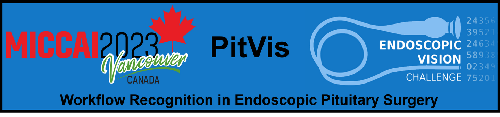
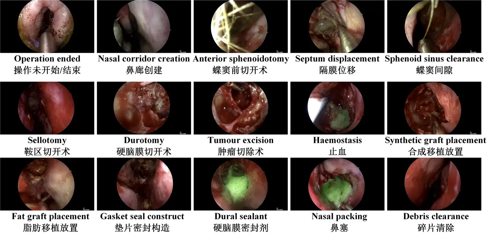

# PitVis

<div align="center">
    <a href="https://github.com/openmedlab/"></a>
</div>
<p style="text-align:center;font-size:10px;"><em></em></p>

## Dataset Information

PitVis is one of five different sub-challenges proposed under the MICCAI 2023 EndoVis framework. Participants can obtain a training dataset of endoscopic pituitary surgery videos in PitVis, which includes annotations for steps and instruments in real-time. The evaluation of unseen test data will be conducted via Docker submission. The test data will not be released to participants. Note that the authors divided the original video data into image data and randomly split it into training and validation sets in an 8:2 ratio, with the image statistics reported in this paper reflecting the split data.

The pituitary gland, located at the base of the brain, is commonly referred to as the "master gland," performing essential functions required to sustain human life. The estimated prevalence of clinically relevant tumors on the pituitary is 1 in 1000 in the population, which can be life-limiting if untreated. Endoscopic pituitary surgery is considered the "gold standard" treatment method, entering directly through the nostril to excise the tumor directly. This surgery is particularly challenging due to the limited working space, which restricts the flexibility of vision and instrument manipulation, potentially leading to poor surgical techniques and adverse outcomes for the patient. Computer-assisted intervention can help overcome these challenges by providing guidance during the operation for senior surgeons and surgical teams, and support for junior surgeons during training.

## Dataset Meta Information

| Dimensions | Modality  | Task Type        | Anatomical Area | Number of Categories | Data Volume | File Format |
|------------|-----------|------------------|-----------------|----------------------|-------------|-------------|
| 2D         | Endoscopy | Classification   | Pituitary       | 15                   | 120024      | PNG         |


### Resolution Details

| Dataset Statistics | size        |
|--------------------|-------------|
| min                | (720, 1280) |
| median             | (720, 1280) |
| max                | (720, 1280) |

## Label Information Statistics

| Label Value | Label                     | Number |
|-------------|---------------------------|--------|
| -1          | Operation ended           | 10851  |
| 1           | Nasal corridor creation   | 2902   |
| 2           | Anterior sphenoidotomy    | 11243  |
| 3           | Septum displacement       | 1386   |
| 4           | Sphenoid sinus clearance  | 18336  |
| 5           | Sellotomy                 | 17132  |
| 6           | Durotomy                  | 6431   |
| 7           | Tumour excision           | 28836  |
| 8           | Haemostasis               | 14117  |
| 9           | Synthetic graft placement | 3536   |
| 10          | Fat graft placement       | 2388   |
| 11          | Gasket seal construct     | 841    |
| 12          | Dural sealant             | 910    |
| 13          | Nasal packing             | 72     |
| 14          | Debris clearance          | 1043   |


## Visualization

<div align="center">
    <a href="https://github.com/openmedlab/"></a>
</div>
<p style="text-align:center;font-size:10px;"><em> Local Visualization.</em></p>

## File Structure

``` 
Dataset
|--- images
|     |---train
|           |---image1.png
|           |---image2.png
|           |---.......
|     |---val
|           |---image1.png
|           |---image2.png
|           |---.......
|—— train.txt
|—— val.txt
```

## Authors and Institutions

Adrito Das (University College London, London, UK)

Yitong Zhang (University College London, London, UK)

Sophia Bano (University College London, London, UK）

Francisco Vasconcelos (University College London, London, UK）

Dimitris Psychogyios (University College London, London, UK)

Danyal Z. Khan (University College London, United Kingdom)

## Source Information

Official Website: https://opencas.dkfz.de/endovis/challenges/2023/

Download Link: https://www.synapse.org/Synapse:syn51232283/wiki/621581

Article Address: https://zenodo.org/records/8315050

Publication Date: 2023

## Citation

``` 
@misc{stefanie_speidel_2023_8315050,
  author       = {Stefanie Speidel and
                  Lena Maier-Hein and
                  Danail Stoyanov and
                  Sebastian Bodenstedt and
                  Annika Reinke and
                  Sophia Bano and
                  Alexander Jenke and
                  Martin Wagner and
                  Marie Daum and
                  Ala Tabibian and
                  Adrito Das and
                  Yitong Zhang and
                  Francisco Vasconcelos and
                  Dimitris Psychogyios and
                  Danyal Z. Khan and
                  Hani J. Marcus and
                  Aneeq Zia and
                  Xi Liu and
                  Kiran Bhattacharyya and
                  Ziheng Wang and
                  Max Berniker and
                  Conor Perreault and
                  Anthony Jarc and
                  Anand Malpani and
                  Kimberly Glock and
                  Haozheng Xu and
                  Chi Xu and
                  Baoru Huang and
                  Stamatia Giannarou},
  title        = {Endoscopic Vision Challenge 2023},
  month        = sep,
  year         = 2023,
  publisher    = {Zenodo},
  doi          = {10.5281/zenodo.8315050},
  url          = {https://doi.org/10.5281/zenodo.8315050}
}
```

Original introduction article is [here](https://zhuanlan.zhihu.com/p/701408782).