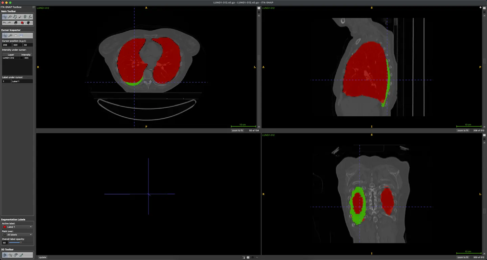

# PleThora

<div align="center">
    <a href="https://github.com/openmedlab/"></a>
</div>
<p style="text-align:center;font-size:10px;"><em></em></p>

## Dataset Information

The PleThora dataset is a database of chest CT images, which includes segmentation data of thoracic cavity and pleural effusion from patients with non-small cell lung cancer (NSCLC). The dataset involves 402 computed tomography (CT) images collected from the "NSCLC-Radiomics" data. These images have manually annotated bilateral thoracic cavity volumes and pleural effusion volumes.

Thoracic segmentation primarily encompasses normal, pathological, and atelectatic lungs, hilar structures, pleural effusions, fibrosis, nodules, tumors, and other anatomical abnormalities. These segmentations were initially auto-generated by a U-Net based algorithm trained on chest CTs without cancer. Subsequently, these auto-segmentations were manually corrected by medical students to include the entire thoracic cavity and revised by a radiation oncologist or radiologist. The segmentation of pleural effusion was entirely manually done by medical students and revised by radiologists or radiation oncologists. The correction results between two doctors showed acceptable consistency.

Furthermore, the PleThora dataset also provides tabulated clinical and technical metadata related to segmented cases. This data helps in developing image analysis processes for pathological lungs, which are the most challenging part for current automatic algorithms. Combined with the already available overall tumor volume segmentations in "NSCLC-Radiomics," pleural effusion segmentation may be very valuable for studying radiographic feature differences between effusions and primary tumors or training algorithms to differentiate them.

These expert-reviewed segmentation data are publicly available in NIfTI format through TCIA (The Cancer Imaging Archive), allowing researchers to conveniently use and analyze these data.

## Dataset Meta Information

| Dimensions | Modality | Task Type | Anatomical Structures          | Anatomical Area | Number of Categories | Data Volume | File Format |
|------------|----------|-----------|--------------------------------|-----------------|----------------------|-------------|-------------|
| 3D         | CT       | Segmentation | Pleural effusion, chest cavity | Chest cavity    | 2                    | 402         | .dicom, .nii.gz     |


### Resolution Details

| Dataset Statistics | spacing (mm)     | size           |
|--------------------|------------------|----------------|
| min                | (0.721, 0.721, 3.0)              | (512, 512, 75)    |
| median             | (0.976, 0.976, 3.0)	           | (512, 512, 124) |
| max                | (0.977, 0.977, 3.0)              | (512, 512, 297) |

Number of two-dimensional slices in the data set: 48233.

## Label Information Statistics

| Category      | Total | With Effusion |
|---------------|-------|---------------|
| Number of Cases | 399   | 77            |
| Percentage      | 100.00% | 19.30%        |
| Min Volume (cm³) | 2108.08 | 9.28          |
| Median Volume (cm³) | 4092.49 | 82.05         |
| Max Volume (cm³) | 8573.33 | 1402.55       |

## Visualization

<div align="center">
    <a href="https://github.com/openmedlab/"></a>
</div>
<p style="text-align:center;font-size:10px;"><em>Case312, red is the chest cavity, green is pleural effusion.</em></p>

## File Structure

``` 
PleThora
│
├── Effusions
│   ├── LUNG1-001
│   │   ├── LUNG1-001_effusion_first_reviewer.nii.gz
│   │   ├── ...
│   ├── LUNG1-002
│   │   ├── LUNG1-002_effusion_first_reviewer.nii.gz
│   │   ├── ...
│   ├── ...
├── manifest-1586193031612
│   ├── LUNG1-001_thor_cav_primary_reviewer.nii.gz
│   │   ├── LUNG1-001
│   │   │   ├── 09-18-2008-StudyID-NA-69331
│   │   │   │   ├── 0.000000-NA-82046
│   │   │   │   │   ├── 1-001.dcm
│   │   │   │   │   ├── 1-002.dcm
│   │   │   │   │   ├── 1-003.dcm
│   │   │   │   │   ├── ...
│   │   ├── LUNG1-002
│   │   │   ├── ...
├── Thoracic_Cavities
│   ├── LUNG1-001
│   │   ├── LUNG1-001_thor_cav_primary_reviewer.nii.gz
│   │   ├── ...
│   ├── LUNG1-002
│   │   ├── LUNG1-002_thor_cav_primary_reviewer.nii.gz
│   │   ├── ...
```

## Authors and Institutions

Kendall J. Kiser (John P. and Katherine G. McGovern Medical School at UTHealth, School of Biomedical Informatics Center for Precision Health, Department of Radiation Oncology at The University of Texas MD Anderson Cancer Center, USA)

Sara Ahmed and Sonja Stieb (Department of Radiation Oncology at The University of Texas MD Anderson Cancer Center, USA)

Abdallah S. R. Mohamed (Department of Radiation Oncology at The University of Texas MD Anderson Cancer Center, The University of Texas MD Anderson Cancer Center - UTHealth Graduate School of Biomedical Sciences, USA)

Hesham Elhalawani (Department of Radiation Oncology at the Cleveland Clinic Taussig Cancer Institute, Cleveland, Ohio, USA)

Peter Y. S. Park, Nathan S. Doyle, and Brandon J. Wang (Department of Diagnostic and Interventional Imaging at John P. and Katherine G. McGovern Medical School, USA)

Arko Barman, Zhao Li, and W. Jim Zheng (Center for Precision Health at the School of Biomedical Informatics at UTHealth, USA)

Clifton D. Fuller (Department of Radiation Oncology at The University of Texas MD Anderson Cancer Center, The University of Texas MD Anderson Cancer Center - UTHealth Graduate School of Biomedical Sciences, USA)

Luca Giancardo (Center for Precision Health at the School of Biomedical Informatics at UTHealth, Department of Radiation Oncology at the Cleveland Clinic Taussig Cancer Institute, Cleveland, Ohio, USA)


## Source Information

Official Website: https://www.cancerimagingarchive.net/analysis-result/plethora/#citations

Download Link: https://www.cancerimagingarchive.net/analysis-result/plethora/#citations

Article Address: https://aapm.onlinelibrary.wiley.com/doi/epdf/10.1002/mp.14424

Publication Date: 2020-04

## Citation

``` 
@article{kiser2020plethora,
  title={PleThora: Pleural effusion and thoracic cavity segmentations in diseased lungs for benchmarking chest CT processing pipelines},
  author={Kiser, Kendall J and Ahmed, Sara and Stieb, Sonja and Mohamed, Abdallah SR and Elhalawani, Hesham and Park, Peter YS and Doyle, Nathan S and Wang, Brandon J and Barman, Arko and Li, Zhao and others},
  journal={Medical physics},
  volume={47},
  number={11},
  pages={5941--5952},
  year={2020},
  publisher={Wiley Online Library}
}
```

Original introduction article is [here](https://zhuanlan.zhihu.com/p/676662245).