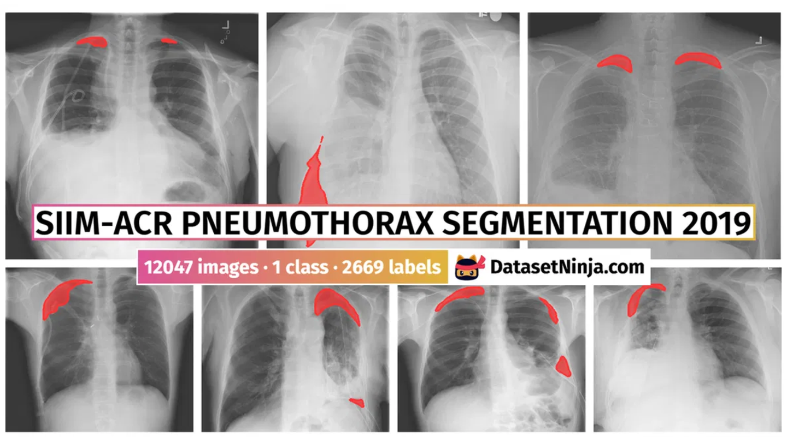
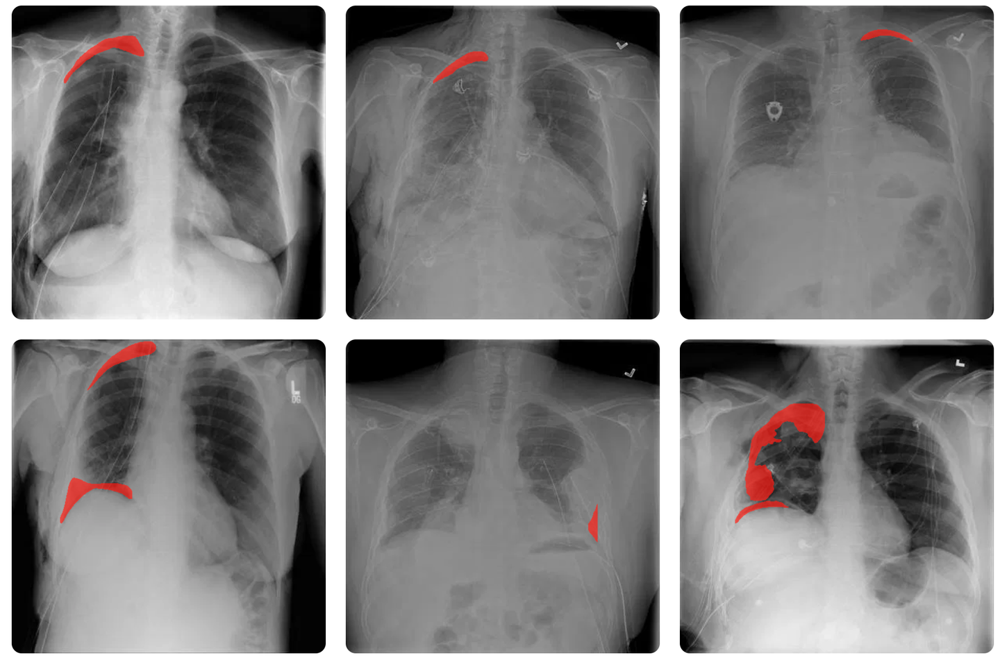
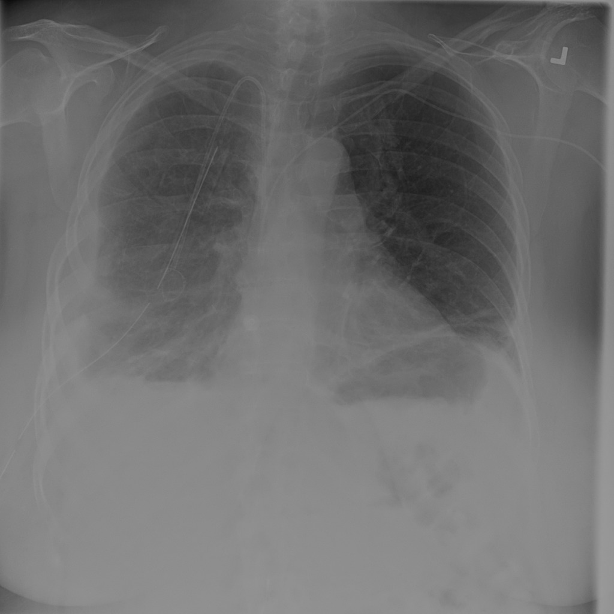

# Pneumothorax Masks X-Ray

<div align="center">
    <a href="https://github.com/openmedlab/"></a>
</div>
<p style="text-align:center;font-size:10px;"><em></em></p>

## Dataset Information

The Pneumothorax Masks X-Ray dataset is the first phase of training and testing data from the Kaggle SIIM-ACR Pneumothorax Segmentation competition, reorganized for ease of use. The dataset contains 12,047 chest X-ray images and corresponding pneumothorax segmentation masks, all with a resolution of 1024x1024 pixels, stored in PNG format. Compared to the original dataset, this dataset converts images and masks from DICOM and RLE encoding to PNG format, features shorter filenames that include target classification information, and has a simplified file structure. Additionally, images for the training and testing sets are stored in two separate CSV files, maintaining links to the original competition image IDs.

This dataset is significant for the development of detection and segmentation models for pneumothorax, a potentially life-threatening condition. With this dataset, researchers can develop models for classification, segmentation, or both, enhancing the efficiency of pneumothorax diagnosis. It also lays the foundation for building automated diagnostic systems, helping to achieve faster and more accurate diagnostic tools in the medical field.

## Dataset Meta Information

| Dimensions | Modality | Task Type                    | Anatomical Structures | Anatomical Area | Number of Categories | Data Volume | File Format |
|------------|----------|------------------------------|-----------------------|-----------------|----------------------|-------------|-------------|
| 2D         | CXR      | Segmentation, Classification | Lung                  | Chest           | 2                    | 12047       | PNG         |


### Resolution Details

| Dataset Statistics | size          |
|--------------------|---------------|
| min                | (1024, 1024)  |
| median             | (1024, 1024)  |
| max                | (1024, 1024)  |

## Label Information Statistics

| Category        | No Pneumothorax | Pneumothorax |
|-----------------|-----------------|--------------|
| Case Count      | 9378            | 2669         |
| Percentage      | 77.85%          | 22.15%       |

## Visualization

<div align="center">
    <a href="https://github.com/openmedlab/"></a>
</div>
<p style="text-align:center;font-size:10px;"><em>An example of Pneumothorax, mask + chest X-ray display.</em></p>

<div align="center">
    <a href="https://github.com/openmedlab/"></a>
</div>
<p style="text-align:center;font-size:10px;"><em>An example of No Pneumothorax.</em></p>

## File Structure

``` 
siim-acr-pneumothorax
├── png_masks
│   ├── 0_test_1_.png
│   ├── 0_train_0_.png
│   ├── 1_test_0_.png
│   ├── 1_train_0_.png
│   └── ...
├── png_images
│   ├── 0_test_1_.png
│   ├── 0_train_0_.png
│   ├── 1_test_0_.png
│   ├── 1_train_0_.png
│   └── ...
├── stage_1_test_images.csv
├── stage_1_train_images.csv
```

## Authors and Institutions

Anna Zawacki (Society for Imaging Informatics in Medicine)

Carol Wu (Society for Imaging Informatics in Medicine)

George Shih (Society for Imaging Informatics in Medicine)

Julia Elliott (Society for Imaging Informatics in Medicine)

Mikhail Fomitchev (Society for Imaging Informatics in Medicine)

Mohannad Hussain (Society for Imaging Informatics in Medicine)

Paras Lakhani (Society for Imaging Informatics in Medicine)

Phil Culliton (Society for Imaging Informatics in Medicine)

Shunxing Bao (Society for Imaging Informatics in Medicine)

## Source Information

Official Website: https://www.kaggle.com/datasets/vbookshelf/pneumothorax-chest-xray-images-and-masks/data

Download Link: https://www.kaggle.com/datasets/vbookshelf/pneumothorax-chest-xray-images-and-masks/data

Article Address: TBD

Publication Date: 2019-01

## Citation

``` 
@dataset{SIIM-ACR Pneumothorax Segmentation 2019,
  author={Anna Zawacki and Carol Wu and George Shih and Julia Elliott and Mikhail Fomitchev and Mohannad Hussain and Paras Lakhani and Phil Culliton and Shunxing Bao},
  title={SIIM-ACR Pneumothorax Segmentation 2019},
  year={2019},
  url={https://www.kaggle.com/competitions/siim-acr-pneumothorax-segmentation/}
}
```

Original introduction article is [here](https://zhuanlan.zhihu.com/p/720299584).