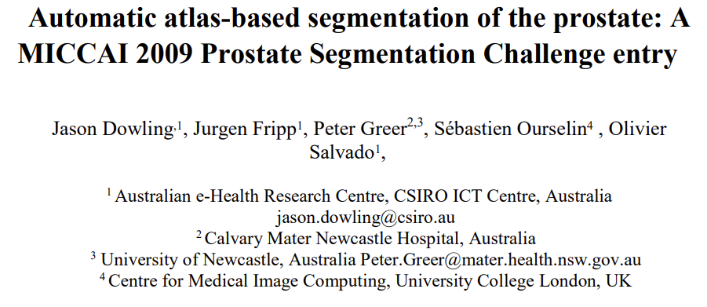
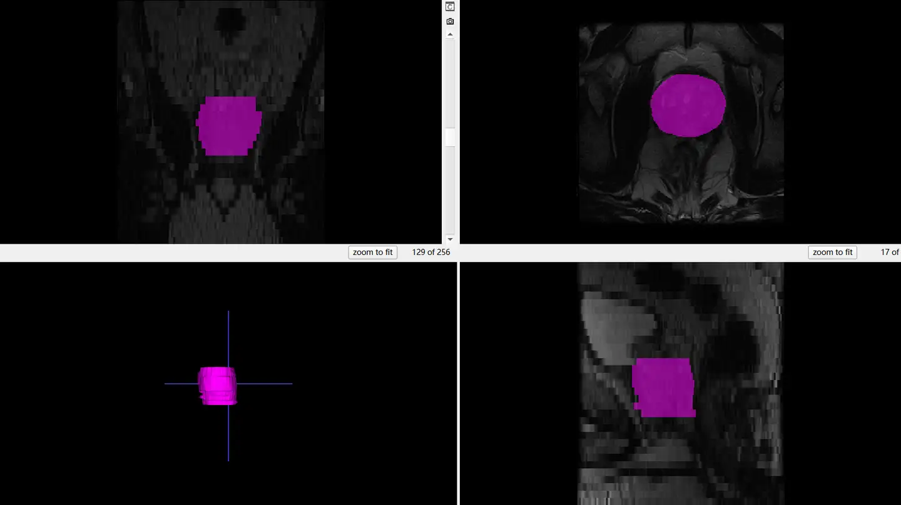

# Promise09

<div align="center">
    <a href="https://github.com/openmedlab/"></a>
</div>
<p style="text-align:center;font-size:10px;"><em></em></p>

## Dataset Information

Promise09 is a prostate magnetic resonance imaging segmentation dataset. The dataset contains 15 T1-weighted prostate MR images and 15 T2-weighted prostate MR images, with expert-level prostate segmentation annotations provided for the T2-weighted images. The dataset does not provide official splits for training, validation, and testing sets. All images were collected from a 1.5T MRI scanner.

This dataset is an earlier classic medical imaging dataset. The prostate is part of the male reproductive system, located below the bladder, with the urethra running through it, and its primary function is to produce prostate fluid. Multimodal magnetic resonance imaging (MRI) helps assess the anatomical structure of the prostate. By segmenting the prostate, doctors can more accurately detect and evaluate prostate diseases, such as prostate cancer, and other potential issues affecting prostate health, thereby enabling early diagnosis and treatment.

## Dataset Meta Information

| Dimensions | Modality | Task Type    | Anatomical Structures  | Anatomical Area | Number of Categories | Data Volume | File Format |
|------------|----------|--------------|------------------------|-----------------|----------------------|-------------|-------------|
| 3D         | MRI      | Segmentation | Prostate               | Abdomen         | 1                    | 15          | .nrrd       |


### Resolution Details

Since the dataset only provides annotations for the T2-weighted images, only this part of the data is considered in the statistics.

| Dataset Statistics | spacing (mm)               | size        |
|--------------------|----------------------------|-------------|
| min                | (0.546875, 0.546875, 5.0)  | 256x256x28  |
| median             | (0.546875, 0.546875, 5.0)  | 256x256x31  |
| max                | (0.703125, 0.703125, 5.0)  | 256x256x34  |

Number of 2D slices in the dataset: 464.

## Label Information Statistics

Statistics are based only on T2-weighted images that provide annotation information

| Metric              | Prostate |
|---------------------|----------|
| Case Count          | 15       |
| Coverage            | 100%     |
| Min Volume (cm³)    | 21.07    |
| Median Volume (cm³) | 46.49    |
| Max Volume (cm³)    | 101.56   |

Visualization of one case in three sections, with the prostate indicated in pink. Includes a schematic of the three-dimensional structure of the prostate.

## Visualization

<div align="center">
    <a href="https://github.com/openmedlab/"></a>
</div>
<p style="text-align:center;font-size:10px;"><em></em></p>

## File Structure

Introduce file structure of original dataset folder.

Take representative MSD dataset for example:

``` 
Promise09
├── T1_images
│   ├── 1
│   │   ├── 000029.00003.001.nrrd
│   ├── 2
│       └── ...
├── T2_images
│   ├── 1
│   │   ├── 000029.00003.002.nrrd
│   ├── 2
│       └── ...
├── T2_segmented_images
│   ├── 1
│   │   ├── 000029.00003.004.nrrd
│   ├── 2
│       └── ...
```

## Authors and Institutions

Jason Dowling（CSIRO ICT Centre, Australia）

Jurgen Fripp（CSIRO ICT Centre, Australia）

Peter Greer（Calvary Mater Newcastle Hospital, Australia）

Peter Greer（University of Newcastle, Australia）

Sébastien Ourselin（University College London, UK）

Olivier Salvado（CSIRO ICT Centre, Australia）

## Source Information

Official Website: https://www.na-mic.org/wiki/Training_Data_Prostate_Segmentation_Challenge_MICCAI09

Download Link: https://www.na-mic.org/wiki/Training_Data_Prostate_Segmentation_Challenge_MICCAI09

Article Address: https://www.na-mic.org/wiki/Training_Data_Prostate_Segmentation_Challenge_MICCAI09

Publication Date: 2009

## Citation

``` 
@article{dowling2009automatic,
  title={Automatic atlas-based segmentation of the prostate: A MICCAI 2009 Prostate Segmentation Challenge entry},
  author={Dowling, Jason and Fripp, Jurgen and Greer, Peter and Ourselin, S{\'e}bastien and Salvado, Olivier},
  journal={Worskshop in Med Image Comput Comput Assist Interv},
  volume={24},
  pages={17--24},
  year={2009}
}
```

Original introduction article is [here](https://zhuanlan.zhihu.com/p/705642317).