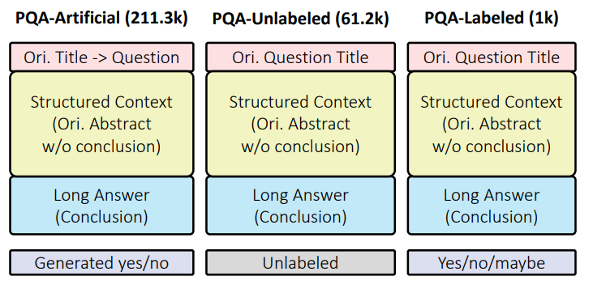
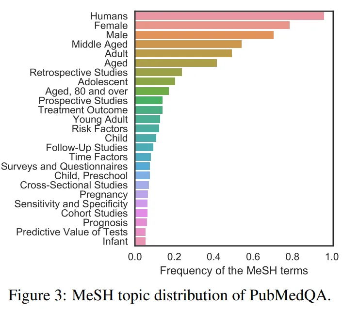
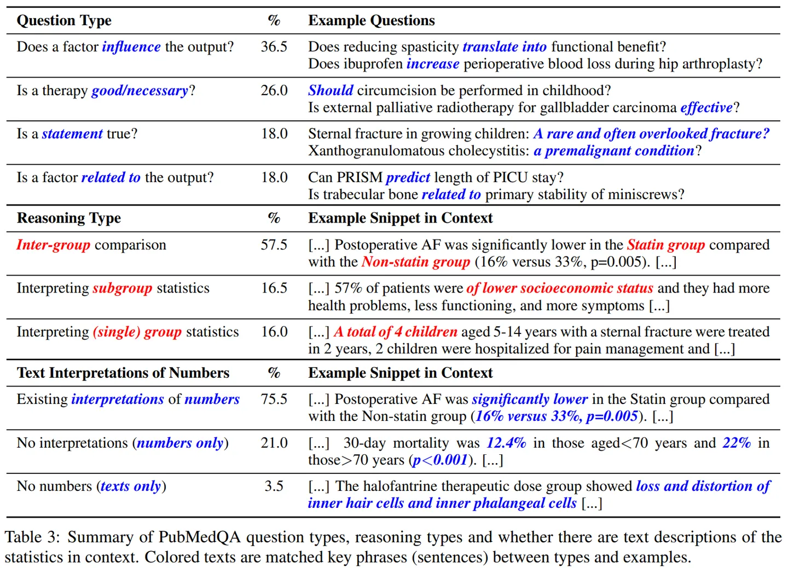
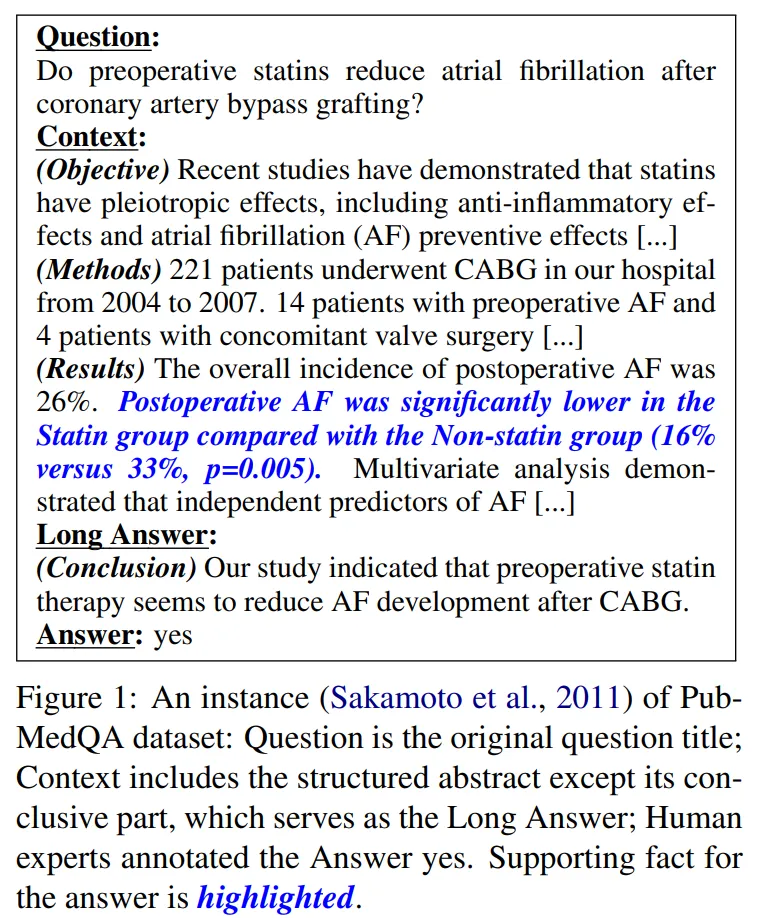

# PubMedQA

<div align="center">
    <a href="https://github.com/openmedlab/"></a>
</div>
<p style="text-align:center;font-size:10px;"><em></em></p>

## Dataset Information

PubMedQA is a biomedical question answering (QA) dataset compiled from PubMed abstracts. The task of PubMedQA is to use the corresponding abstract to answer research questions, with the answers formatted as yes/no/maybe (e.g., "Do preoperative statins reduce atrial fibrillation after coronary artery bypass grafting?"). The dataset contains 1,000 expert-annotated QA instances, 61,200 unannotated instances, and 211,300 artificially generated QA instances. Each PubMedQA instance includes: (1) a question, which may be the title of an existing research article or derived from the title; (2) a context, namely the corresponding abstract excluding the conclusion; (3) a long answer, which is the conclusion of the abstract assumed to answer the research question; (4) a yes/no/maybe answer that summarizes the conclusion.

The uniqueness of PubMedQA lies in its deep mining of PubMed data sources. Approximately 760,000 PubMed article titles are presented in the form of questions, which are often directly related to the conclusion part of the abstract, providing a direct answer source for QA systems. Among them, 120,000 abstracts are presented in a structured style, including traditional scientific paper sections such as "Background" and "Results," enabling these parts to serve as context to aid understanding and conclusion generation. This structure not only facilitates direct association between questions and answers but also raises the requirement for models to handle different writing styles. More than half of the article titles can be answered with a simple yes/no/maybe, providing rich research material for natural language processing and making PubMedQA a valuable resource for scientific reasoning and automated literature processing.


## Dataset Meta Information

| Task Type | Language       | Train                                               | Val | Test | File Format | Size |
|-----------|----------------|-----------------------------------------------------|-----|------|---------|------|
| QA        | English | 500 labeled 61.2k unlabeled 211.3k artificial label | -   | 500  | .json   | 656MB |


## Dataset Information Statistics

| Statistic             | PQA-L  | PQA-U  | PQA-A  |
|-----------------------|--------|--------|--------|
| Number of QA pairs    | 1.0k   | 61.2k  | 211.3k |
| Prop. of yes (%)      | 55.2   | —      | 92.8   |
| Prop. of no (%)       | 33.8   | —      | 7.2    |
| Prop. of maybe (%)    | 11.0   | —      | 0.0    |
| Avg. question length  | 14.4   | 15.0   | 16.3   |
| Avg. context length   | 238.9  | 237.3  | 238.0  |
| Avg. long answer length | 43.2 | 45.9   | 41.0   |

<div align="center">
    <a href="https://github.com/openmedlab/"></a>
</div>
<p style="text-align:center;font-size:10px;"><em>A visualization of the distribution of PubMedQA topics. Nearly all instances are human studies and cover a wide range of topics, including retrospective, prospective, and cohort studies, different age groups, and healthcare-related topics such as treatment outcomes, prognosis, and disease. risk factors.</em></p>

<div align="center">
    <a href="https://github.com/openmedlab/"></a>
</div>
<p style="text-align:center;font-size:10px;"><em>Proportional relationships between textual interpretations of different question types, inference types, and the presence or absence of numbers in context.</em></p>

<div align="center">
    <a href="https://github.com/openmedlab/"></a>
</div>
<p style="text-align:center;font-size:10px;"><em></em></p>

## Dataset Example

<div align="center">
    <a href="https://github.com/openmedlab/"></a>
</div>
<p style="text-align:center;font-size:10px;"><em>Official paper data example</em></p>

``` 
"21645374": {
    "QUESTION": "Do mitochondria play a role in remodelling lace plant leaves during programmed cell death?",
    "CONTEXTS": [
        "Programmed cell death (PCD) is the regulated death of cells within an organism. The lace plant (Aponogeton madagascariensis) produces perforations in its leaves through PCD. The leaves of the plant consist of a latticework of longitudinal and transverse veins enclosing areoles. PCD occurs in the cells at the center of these areoles and progresses outwards, stopping approximately five cells from the vasculature. The role of mitochondria during PCD has been recognized in animals; however, it has been less studied during PCD in plants.",
        "The following paper elucidates the role of mitochondrial dynamics during developmentally regulated PCD in vivo in A. madagascariensis. A single areole within a window stage leaf (PCD is occurring) was divided into three areas based on the progression of PCD; cells that will not undergo PCD (NPCD), cells in early stages of PCD (EPCD), and cells in late stages of PCD (LPCD). Window stage leaves were stained with the mitochondrial dye MitoTracker Red CMXRos and examined. Mitochondrial dynamics were delineated into four categories (M1-M4) based on characteristics including distribution, motility, and membrane potential (\u0394\u03a8m). A TUNEL assay showed fragmented nDNA in a gradient over these mitochondrial stages. Chloroplasts and transvacuolar strands were also examined using live cell imaging. The possible importance of mitochondrial permeability transition pore (PTP) formation during PCD was indirectly examined via in vivo cyclosporine A (CsA) treatment. This treatment resulted in lace plant leaves with a significantly lower number of perforations compared to controls, and that displayed mitochondrial dynamics similar to that of non-PCD cells."
    ],
    "LABELS": [
        "BACKGROUND",
        "RESULTS"
    ],
    "MESHES": [
        "Alismataceae",
        "Apoptosis",
        "Cell Differentiation",
        "Mitochondria",
        "Plant Leaves"
    ],
    "YEAR": "2011",
    "reasoning_required_pred": "yes",
    "reasoning_free_pred": "yes",
    "final_decision": "yes",
    "LONG_ANSWER": "Results depicted mitochondrial dynamics in vivo as PCD progresses within the lace plant, and highlight the correlation of this organelle with other organelles during developmental PCD. To the best of our knowledge, this is the first report of mitochondria and chloroplasts moving on transvacuolar strands to form a ring structure surrounding the nucleus during developmental PCD. Also, for the first time, we have shown the feasibility for the use of CsA in a whole plant system. Overall, our findings implicate the mitochondria as playing a critical and early role in developmentally regulated PCD in the lace plant."
},
```

## File Structure

The dataset file structure is as follows: `ori_pqaa.json` includes 1,000 expert-annotated instances, `ori_pqal.json` contains 61.2 thousand unannotated instances, `ori_pqau.json` contains 211.3 thousand artificially generated instances, and there is a `test_ground_truth.json` file which includes the yes/no/maybe answers for 500 test instances.

``` 
PubMedQA
│
├── ori_pqaa.json
├── ori_pqal.json
├── ori_pqau.json
└── test_ground_truth.json
```

## Authors and Institutions

Qiao Jin (University of Pittsburgh, USA)

Bhuvan Dhingra (Carnegie Mellon University, USA)

Zhengping Liu (University of Pittsburgh, USA)

William W. Cohen (Google AI, USA)

Xinghua Lu (University of Pittsburgh, USA)

## Source Information

Official Website: https://pubmedqa.github.io/

Download Link: https://github.com/pubmedqa/pubmedqa?tab=readme-ov-file#download

Article Address: https://arxiv.org/abs/1909.06146

Publication Date: 2019

## Citation

``` 
@inproceedings{jin2019pubmedqa,
  title={PubMedQA: A Dataset for Biomedical Research Question Answering},
  author={Jin, Qiao and Dhingra, Bhuwan and Liu, Zhengping and Cohen, William and Lu, Xinghua},
  booktitle={Proceedings of the 2019 Conference on Empirical Methods in Natural Language Processing and the 9th International Joint Conference on Natural Language Processing (EMNLP-IJCNLP)},
  pages={2567--2577},
  year={2019}
}
```

Original introduction article is [here](https://zhuanlan.zhihu.com/p/680137083).