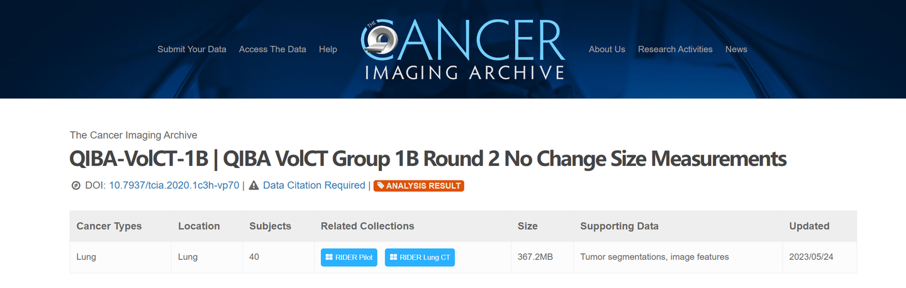
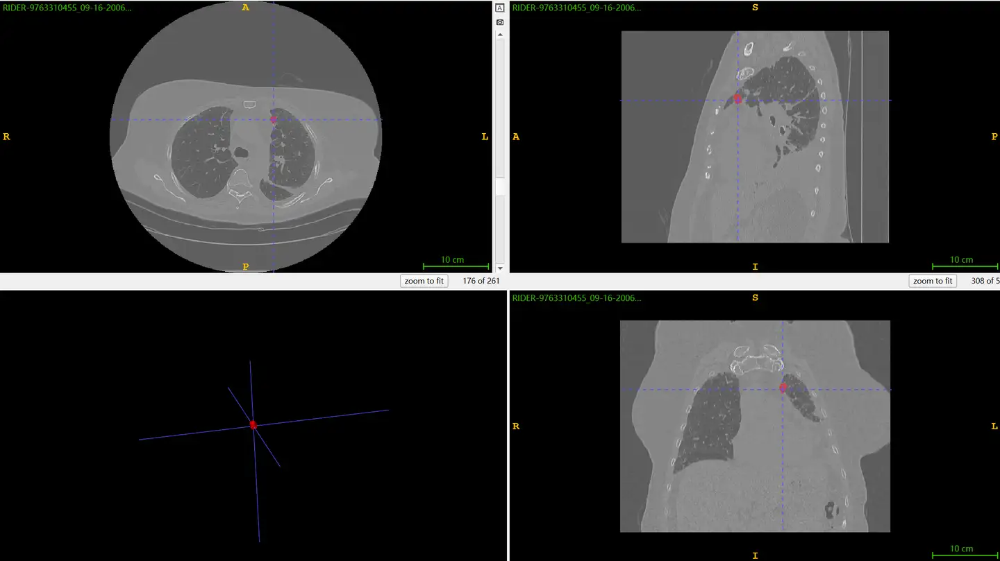

# QIBA-VolCT-1B

<div align="center">
    <a href="https://github.com/openmedlab/"></a>
</div>
<p style="text-align:center;font-size:10px;"><em></em></p>

## Dataset Information

The QIBA-VolCT-1B dataset is designed for measuring changes in the size of lesions (lung tumors) in CT images. For 40 patients, each underwent two CT scans within 15 minutes, and five radiologists used semi-automatic three-dimensional segmentation methods to segment the lesions (lung tumors). By comparing the size of a lesion at two time points, measurement errors by readers can be evaluated. Additionally, the dataset provides annotations of the lesions in the CT images of each patient at different times, totaling 323 CT images with annotated lung tumors.

Accurate measurement of lung tumor size is crucial for determining the nature of the tumor, and subjective errors introduced by radiologists during measurements at different times can lead to inaccurate tumor size assessments, potentially causing misjudgment of the tumor's nature. This dataset is designed with a sound experiment to demonstrate this phenomenon. Moreover, since the dataset includes annotated tumors in CT images, it also aids in the development of fully automatic tumor segmentation algorithms, relying on advanced computing technologies to further reduce measurement errors in tumor sizing.

## Dataset Meta Information

| Dimensions | Modality | Task Type                              | Anatomical Structures | Anatomical Area | Number of Categories | Data Volume | File Format |
|------------|----------|----------------------------------------|-----------------------|-----------------|----------------------|-------------|-------------|
| 3D         | CT       | Segmentation, Lesion Size Measurement  | Lung                  | Lung            | 104                  | 323         | .dcm        |


### Resolution Details

| Dataset Statistics | spacing (mm)           | size            |
|--------------------|------------------------|-----------------|
| min                | (0.498, 0.498, 0.625)  | (512, 512, 20)  |
| median             | (0.703, 0.703, 1.25)   | (512, 512, 218) |
| max                | (0.9375, 0.9375, 10.0) | (512, 512, 321) |

Number of 2D slices in the dataset: 59,688.

## Label Information Statistics

| Metric              | Lung Tumor |
|---------------------|------------|
| Case Count          | 236        |
| Coverage            | 73.15%     |
| Min Volume (cm³)    | 0.26       |
| Median Volume (cm³) | 7.36       |
| Max Volume (cm³)    | 208.67     |

## Visualization

Use ITK-SNAP to visualize CT images and their corresponding lung tumor annotations. The red area is the lung tumor.

<div align="center">
    <a href="https://github.com/openmedlab/"></a>
</div>
<p style="text-align:center;font-size:10px;"><em></em></p>

## File Structure

``` 
QIBA-VolCT-1B
│
├── manifest-1666978701864
│   └── RIDER Pilot
│       ├── 1.3.6.1.4.1.9328.50.1.0109
│       │   ├── 01-01-2000-100-CT CHEST W CONT-53393
│       │   │   ├── 1.000000-APLAT-53394
│       │   │   │   ├── 1-1.dcm
│       │   │   │   └── 2-1.dcm
│       │   │   ├── 2.000000-NA-53398
│       │   │   └── 3.000000-Recon 2-53461
│       │   ├── 03-10-2000-108-CT CHEST W CONT-54652
│       │   └── 03-29-2000-102-CT CHEST W CONT-53671
│       └── 1.3.6.1.4.1.9328.50.1.0117
├── manifest-1666979307896
└── manifest-1666979478693
```

## Authors and Institutions

Michael F. McNitt-Gray (David Geffen School of Medicine at UCLA, Los Angeles, CA, USA)

Grace Hyun Kim (Columbia University Medical Center, New York, NY, USA)

Binsheng Zhao (Columbia University Medical Center, New York, NY, USA)

Lawrence H. Schwartz (Columbia University Medical Center, New York, NY, USA)

David Clunie (Pixel Med Publishing, LLC, Bangor, PA, USA)

Kristin Cohen (Janssen Pharmaceutical Research and Development, Titusville, NJ, USA)

Nicholas Petrick (Center for Devices and Radiological Health, U.S. Food and Drug Administration, Silver Spring, MD, USA)

Charles Fenimore (The Image-Quality Measurement Consultancy, Gaithersburg, MD, USA)

Z.Q. John Lu (National Institute of Standards and Technology, Gaithersburg, MD, USA)

Andrew J. Buckler (Elucid Bioimaging Inc, Wenham, MA, USA)

## Source Information

Official Website: https://www.cancerimagingarchive.net/analysis-result/qiba-volct-1b/

Download Link: https://www.cancerimagingarchive.net/analysis-result/qiba-volct-1b/

Article Address: https://www.sciencedirect.com/science/article/pii/S1936523315000029?via%3Dihub

Publication Date: 2015

## Citation

``` 
@article{mcnitt2015determining,
  title={Determining the variability of lesion size measurements from CT patient data sets acquired under “no change” conditions},
  author={McNitt-Gray, Michael F and Kim, Grace Hyun and Zhao, Binsheng and Schwartz, Lawrence H and Clunie, David and Cohen, Kristin and Petrick, Nicholas and Fenimore, Charles and Lu, ZQ John and Buckler, Andrew J},
  journal={Translational oncology},
  volume={8},
  number={1},
  pages={55--64},
  year={2015},
  publisher={Elsevier}
}
```

Original introduction article is [here](https://zhuanlan.zhihu.com/p/708986956).