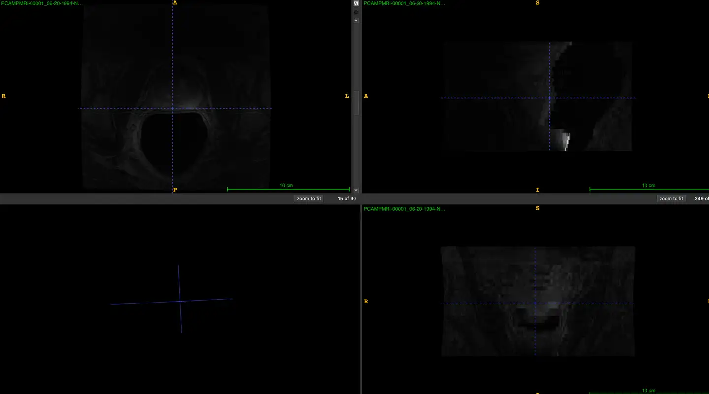
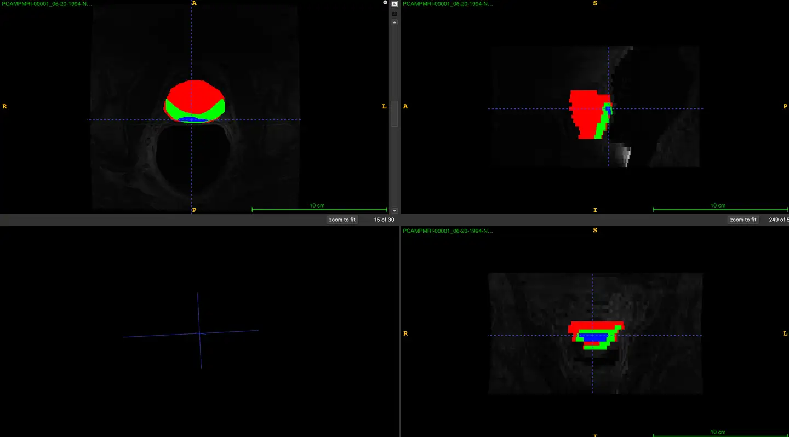

# QIN-PROSTATE-Repeatability

<div align="center">
    <a href="https://github.com/openmedlab/"></a>
</div>
<p style="text-align:center;font-size:10px;"><em></em></p>

## Dataset Information

The QIN-PROSTATE-Repeatability dataset is an MR modality dataset for segmenting prostate cancer, part of the TCIA collection. It consists of 30 cases. Repeatability data for prostate mpMRI is limited, yet crucial for establishing the technical characteristics of mpMRI as an imaging biomarker for prostate cancer. The data was provided by the team at Brigham and Women's Hospital, supported by U01 CA151261 (PI Fiona Fennessy), and the public sharing was facilitated by U24 CA180918 (MPI Andrey Fedorov and Ron Kikinis). This study utilized a standard prostate mpMRI protocol, with all imaging performed at a 3 Tesla magnetic field strength. Due to scanner hardware upgrades, baseline and repeat studies for some patients were conducted on different platforms. The imaging protocol includes T2-weighted, diffusion-weighted (b-values of 0 and 1400 mm/s²), and dynamic contrast-enhanced (DCE) sequences. The imaging data includes manually segmented whole gland, peripheral zone of the prostate, suspected tumors, and normal regions (as applicable), along with derived data such as volume measurements and average ADC.

The QIN-PROSTATE-Repeatability dataset provides a crucial technical validation base for the development of prostate cancer imaging biomarkers. The dataset encompasses manually segmented images and segmentation-based measurement data, all stored as DICOM objects. Future plans include enriching this dataset by analyzing additional clinical data (such as demographics, PSA), pathology sampling data (biopsy Gleason scores), and PI-RADS interpretation results, pending IRB approval. These enhancements and future expansions will significantly support open and reproducible scientific research in prostate cancer imaging.

## Dataset Meta Information

| Dimensions | Modality | Task Type    | Anatomical Structures | Anatomical Area | Number of Categories | Data Volume | File Format |
|------------|----------|--------------|-----------------------|-----------------|----------------------|-------------|-------------|
| 3D         | MR       | Segmentation | Prostate              | Abdomen         | 3                    | 30          | .dcm        |


### Resolution Details

| Dataset Statistics | spacing (mm)        | size            |
|--------------------|---------------------|-----------------|
| min                | (0.27, 0.27, 3.00)  | (512, 512, 26)  |
| median             | (0.27, 0.27, 3.50)  | (512, 512, 30)  |
| max                | (0.40, 0.40, 3.50)  | (512, 512, 36)  |

Number of 2D slices in the dataset: 890.

## Label Information Statistics

| Segmentation | Full Gland | Peripheral Zone | Suspected Tumor |
|--------------|------------|-----------------|-----------------|
| Cases        | 30         | 30              | 22              |
| Completeness | 100%       | 100%            | 73.33%          |
| Min Volume (cm³) | 11.39    | 3.24            | 0.02            |
| Median Volume (cm³) | 22.68 | 9.37            | 0.305           |
| Max Volume (cm³)   | 103.58 | 18.3            | 0.81            |


## Visualization

<div align="center">
    <a href="https://github.com/openmedlab/"></a>
</div>
<p style="text-align:center;font-size:10px;"><em>Raw image.</em></p>

<div align="center">
    <a href="https://github.com/openmedlab/"></a>
</div>
<p style="text-align:center;font-size:10px;"><em>Image with label. Red represents the prostate, green represents the peripheral zone of the prostate, and blue represents prostate tumors.</em></p>

## File Structure

Under the dataset folder, there are a total of fifteen folders, each containing two datasets, totaling 30 datasets, including different modalities of MRI.

``` 
QIN-PROSTATE-Repeatability
│
├── PCAMPMRI-00001
│   ├── 06-20-1994-NA-PROBD Pelvis w-01133
│   │   ├── 6.000000-T2 Weighted Axial-23000
│   │   ├── 9.000000-DWI-97525
│   │   ├── 9.000000-DWI-97525
│   │   ├── 100.000000-DCE Subtraction-80090
│   │   ├── 901.000000-Apparent Diffusion Coefficient-27387
│   │   ├── 1006.000000-T2 Weighted Axial Segmentations-7.172
│   │   ├── 1100.000000-DCE Subtraction Segmentations-6.412
│   │   ├── 1901.000000-Apparent Diffusion Coefficient Segmentations-8.345
│   │   ├── 2006.000000-T2 Weighted Axial Measurements-18.24
│   │   ├── 2100.000000-DCE Subtraction Measurements-6.733
│   │   ├── 2901.000000-Apparent Diffusion Coefficient Measurements-8.730
│   └── 07-02-1994-NA-BDPRO Pelvis w-25664
│   │   ├── ...
├── PCAMPMRI-00002
│   ├── 07-09-1994-NA-MR RECTUM SCH-96240
│   │   ├── ...
│   ├── 07-23-1994-NA-BDPRO Pelvis w-27478
│   │   ├── ...
├── ...
```

## Authors and Institutions

Introduce authors and their institutions of this dataset.


## Source Information

Official Website: https://www.cancerimagingarchive.net/collection/qin-prostate-repeatability/

Download Link: https://www.cancerimagingarchive.net/collection/qin-prostate-repeatability/

Publication Date: 2020-11-09

## Citation

``` 
Fedorov, A; Schwier, M; Clunie, D; Herz, C; Pieper, S; Kikinis, R; Tempany, C; Fennessy, F. (2018). Data From QIN-PROSTATE-Repeatability. The Cancer Imaging Archive. 
DOI: 10.7937/K9/TCIA.2018.MR1CKGND
```

Original introduction article is [here](https://zhuanlan.zhihu.com/p/705091676).