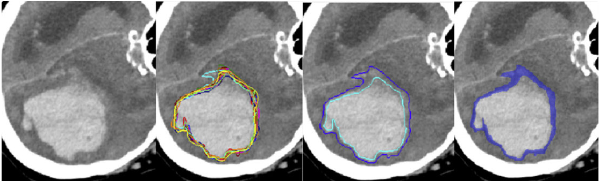
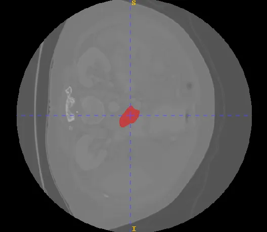
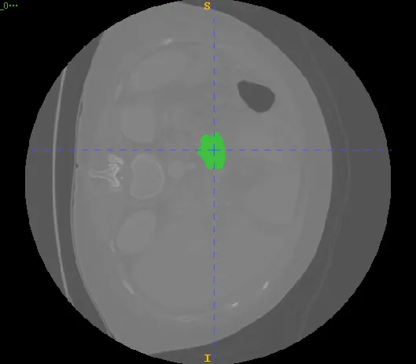

# QUBIQ2021

<div align="center">
    <a href="https://github.com/openmedlab/"></a>
</div>
<p style="text-align:center;font-size:10px;"><em></em></p>

## Dataset Information

The Quantification of Uncertainties in Biomedical Image Quantification Challenge 2021 (QUBIQ2021) focuses on the quantification of uncertainties in biomedical imaging, offering data for semantic segmentation that includes both 2D and 3D MRI and CT datasets. These datasets encompass segmentation tasks for prostate cancer, brain growth regions, brain tumors, kidneys, pancreas, and pancreatic lesions. This text primarily discusses the 3D data from the challenge dataset, all of which are CT datasets, including segmentation of two parts: the pancreas and pancreatic lesions.

The goal of QUBIQ2021 is to benchmark segmentation algorithms that return uncertainty estimates (probability scores, areas of variation, etc.) in medical imaging segmentation tasks. Specifically, the challenge compares algorithm outputs with the uncertainties attributed to the local delineations of various image structures related to diagnosis, such as lesions or anatomical features, by human annotators. To quantify the variability of boundary delineations, a group of experts annotated structures in several CT and MR image datasets multiple times.

## Dataset Meta Information

| Dimensions | Modality | Task Type             | Anatomical Structures        | Anatomical Area | Number of Categories | Data Volume | File Format |
|------------|----------|-----------------------|------------------------------|-----------------|----------------------|-------------|-------------|
| 3D         | CT       | Semantic Segmentation | Pancreas, Pancreatic Lesions | abdomen              | 2                    | 90          | .nii.gz     |


### Resolution Details

| Dataset Statistics | spacing (mm)     | size             |
|--------------------|------------------|------------------|
| min                | (1, 1, 1)              | (36, 512, 512)   |
| median             | (1, 1, 1)           | (53, 512, 512)   |
| max                | (1, 1, 1)              | (194, 512, 512)  |

Number of two-dimensional slices in the data set: 31744 (based on statistics of 62 cases in the training set)

## Label Information Statistics

| Metric        | Pancreas | Pancreatic Lesions |
|---------------|----------|--------------------|
| Case Count    | 40       | 22                 |
| Coverage      | 64.52%    | 35.48%             |
| Min Volume (cm³) | 6.17     | 1.27               | 
| Median Volume (cm³) | 19.455     | 6.955              | 
| Max Volume (cm³) | 74.08    | 27.07              |

## Visualization

<div align="center">
    <a href="https://github.com/openmedlab/"></a>
</div>
<p style="text-align:center;font-size:10px;"><em>Pancreas. </em></p>

<div align="center">
    <a href="https://github.com/openmedlab/"></a>
</div>
<p style="text-align:center;font-size:10px;"><em>Pancreatic Lesions. </em></p>

## File Structure

The organizational structure of the data set includes two main folders: training set and validation set. The sub-folder within each pancreatic lesion segmentation task is further divided into multiple case folders, which contain related images and their corresponding segmentation results.

``` 
Dataset
│
├── training_data_v3_QC
│   ├── pancreas
│   │   ├── case1-1
│   │   │   ├── image.nii.gz
│   │   │   ├── task01_seg01.nii.gz
│   │   │   ├── ...
│   │   ├── case1-2
│   │   │   ├── image.nii.gz
│   │   │   ├── task01_seg01.nii.gz
│   │   │   ├── ...
│   ├── pancreatic-lesion
│   │   ├── case1-1
│   │   │   ├── image.nii.gz
│   │   │   ├── task01_seg01.nii.gz
│   │   │   ├── ...
│   │   ├── case1-2
│   │   │   ├── image.nii.gz
│   │   │   ├── task01_seg01.nii.gz
│   │   │   ├── ...
├── validation_data_qubiq2021_QC
│   ├── pancreas
│   │   ├── case13-1
│   │   │   ├── image.nii.gz
│   │   │   ├── task01_seg01.nii.gz
│   │   │   ├── ...
│   │   ├── case13-2
│   │   │   ├── image.nii.gz
│   │   │   ├── task01_seg01.nii.gz
│   │   │   ├── ...
│   ├── pancreatic-lesion
│   │   ├── case13-1
│   │   │   ├── image.nii.gz
│   │   │   ├── task01_seg01.nii.gz
│   │   │   ├── ...
│   │   ├── case13-2
│   │   │   ├── image.nii.gz
│   │   │   ├── task01_seg01.nii.gz
│   │   │   ├── ...
```

## Authors and Institutions

Bjoern Menze (University of Zurich, Switzerland)

Leo Joskowicz (Hebrew University of Jerusalem, Israel)

Spyridon Bakas (University of Pennsylvania, USA)

Andras Jakab (University of Zurich, Switzerland)

Ender Konukoglu (University of Zurich, Switzerland)

Anton Becker (University Hospital Zurich, Switzerland)

## Source Information

Official Website: https://qubiq21.grand-challenge.org/QUBIQ2021/

Download Link: https://qubiq21.grand-challenge.org/participation/

Article Address: https://link.springer.com/chapter/10.1007/978-3-031-08999-2_9

Publication Date: 2021-08

## Citation

``` 
@inproceedings{vzukovec2021modeling,
  title={Modeling Multi-annotator Uncertainty as Multi-class Segmentation Problem},
  author={{\v{Z}}ukovec, Martin and Dular, Lara and {\v{S}}piclin, {\v{Z}}iga},
  booktitle={International MICCAI Brainlesion Workshop},
  pages={112--123},
  year={2021},
  organization={Springer}
}
```

Original introduction article is [here](https://zhuanlan.zhihu.com/p/686215806).