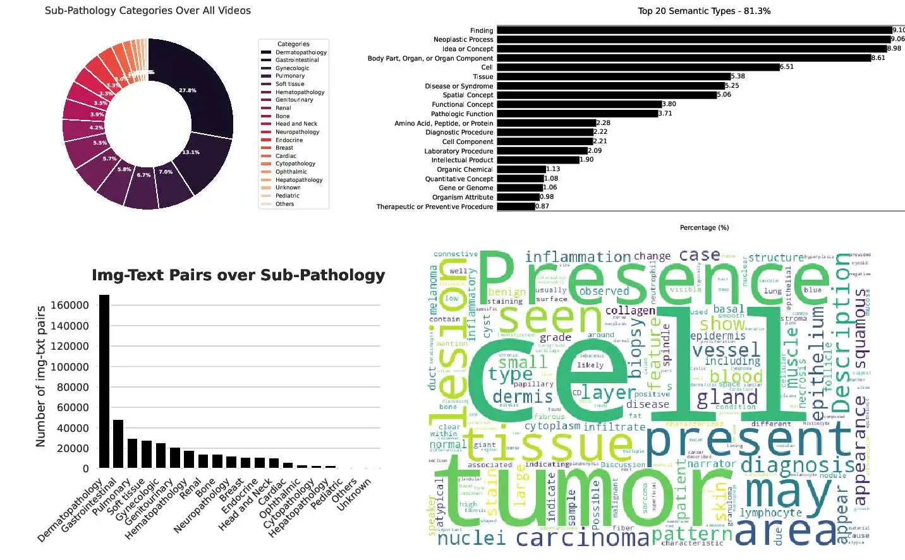
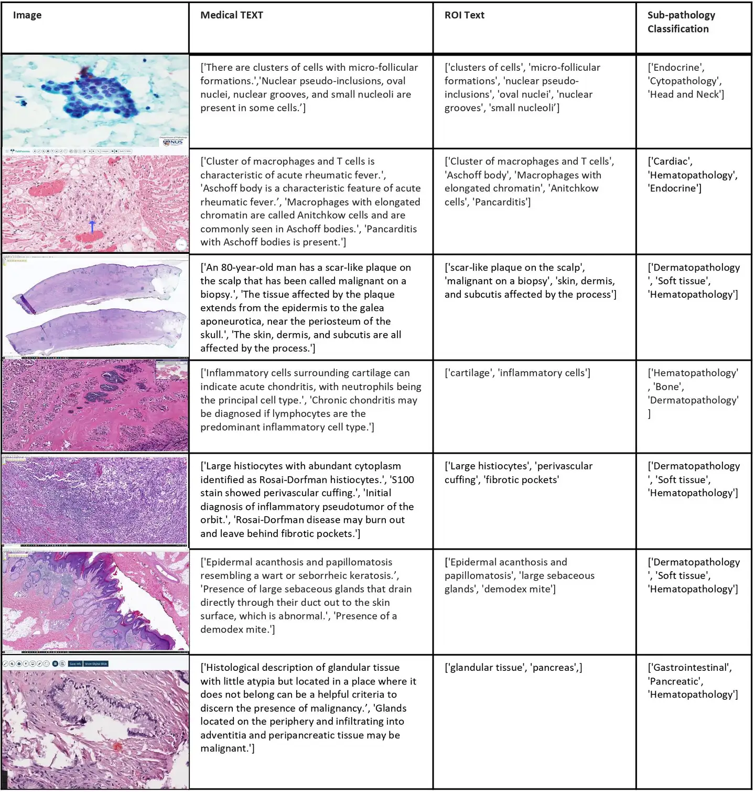

# Quilt-1M

<div align="center">
    <a href="https://github.com/openmedlab/"></a>
</div>
<p style="text-align:center;font-size:10px;"><em></em></p>

## Dataset Information

Quilt-1M is the largest visual-language histopathology dataset to date, containing 1 million pairs of image-text samples, derived from 4504 narrative videos totaling 1087 hours, covering over 438K unique images and 768K corresponding text pairs. The dataset includes a total of 1.469 million UMLS entities, involving 28.5K unique entities mentioned in the text. The images cover different microscope magnification ranges (0-10x, 10-20x, 20-40x), obtaining (280K, 75K, 107K) images from each range respectively. The average length of the text titles is 22.76 words, the average for Region of Interest (ROI) text is 8.68 words, with an average of 1.74 medical sentences per image (ranging from a maximum of 5.33 to a minimum of 1.0).

The curation of the Quilt dataset is highly automated, employing a variety of models including large language models, handcrafted algorithms, human knowledge databases, and automatic speech recognition tools. By fine-tuning the pretrained CLIP model, the Quilt-1M dataset has proven its value in zero-shot and linear probe tasks for novel pathological image classification, outperforming state-of-the-art models, and has shown good performance in cross-modal retrieval tasks across 13 different, diversified patch-level datasets containing 8 subtypes of pathology.

## Dataset Meta Information

| Task Type | Language | Train | Val | Test | File Format | Size      |
|-----------|----------|-------|-----|------|--------|-----------|
| Caption   | English  | 768,826   | -   | -    | .csv, .jpg   | 36G/110G  |


## Dataset Information Statistics

<div align="center">
    <a href="https://github.com/openmedlab/"></a>
</div>
<p style="text-align:center;font-size:10px;"><em></em></p>


## Dataset Example

<div align="center">
    <a href="https://github.com/openmedlab/"></a>
</div>
<p style="text-align:center;font-size:10px;"><em></em></p>

## File Structure

The Quilt-1M dataset has the following structure, which includes a lookup table in CSV format and a directory to store all image files.

``` 
.
├── quilt_1M_lookup.csv
└── quilt-1m
       ├── 00001000010913.jpg
       └── 0-RuE0Ldx6U_image_ffbf02cb-a316-4b76-9810-5f7d41d73842.jpg
       └── ...
```

## Authors and Institutions

Wisdom O. Ikezogwo (Department of Computer Science, University of Washington)

Mehmet S. Seyfioglu (Department of Computer Science, University of Washington)

Fatemeh Ghezloo (Department of Computer Science, University of Washington)

Dylan Geva (Department of Computer Science, University of Washington)

Fatwir S. Mohammed (Department of Computer Science, University of Washington)

Pavan K. Anand (Department of Computer Science, University of Washington)

Ranjay Krishna (Department of Computer Science, University of Washington)

Linda G. Shapiro (Department of Computer Science, University of Washington)


## Source Information

Official Website: https://quilt1m.github.io/

Download Link: https://zenodo.org/records/8239942

Article Address: https://arxiv.org/pdf/2306.11207v3.pdf

Publication Date: 2023.6

## Citation

``` 
@article{ikezogwo2023quilt,
      title={Quilt-1M: One Million Image-Text Pairs for Histopathology},
      author={Ikezogwo, Wisdom Oluchi and Seyfioglu, Mehmet Saygin and Ghezloo, Fatemeh and Geva, Dylan Stefan Chan and Mohammed, Fatwir Sheikh 
      and Anand, Pavan Kumar and Krishna, Ranjay and Shapiro, Linda},
      journal={arXiv preprint arXiv:2306.11207},
      year={2023}
    }
```

Original introduction article is [here](https://zhuanlan.zhihu.com/p/689591767).