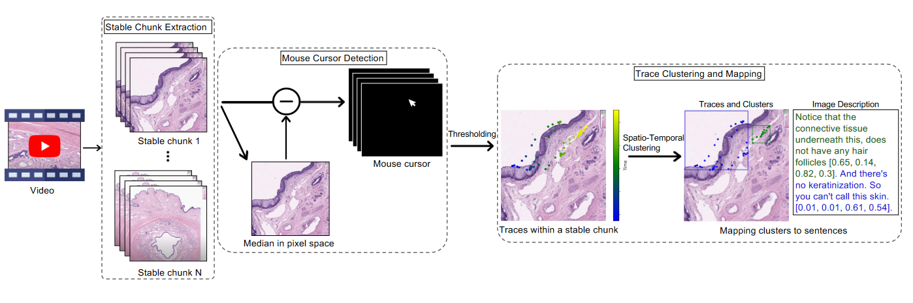
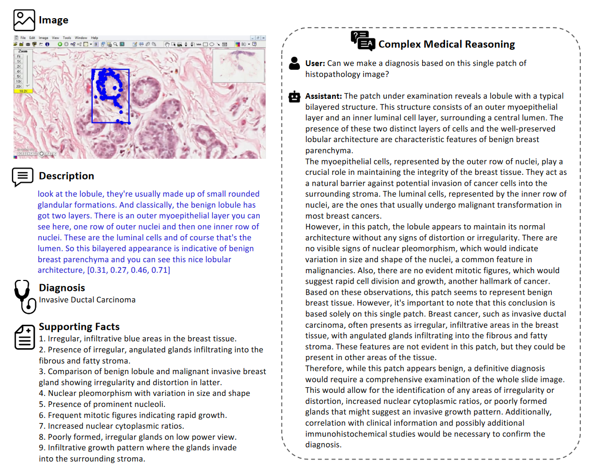
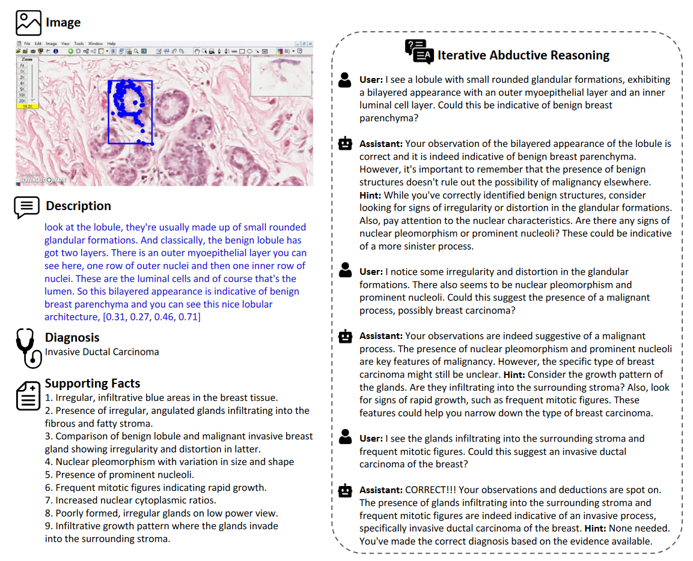

# Quilt-Instruct

<div align="center">
    <a href="https://github.com/openmedlab/"></a>
</div>
<p style="text-align:center;font-size:10px;"><em></em></p>

## Dataset Information

Quilt-Instruct is a dataset specifically designed for the visual question answering (VQA) task on pathology images, containing 107,131 question-answer pairs related to whole slide images (WSIs). The dataset generates two types of question-answer pairs. First, *Independent Prompts* use text associated with individual image patches to generate question-answer pairs, similar to existing methods. Second, *Reasoning-based Prompts* incorporate global WSI information, allowing the language model to reason within a broader context, beyond immediate local information, further improving the accuracy and coherence of the answers.

The construction process of QUILT-INSTRUCT started with extracting 162,566 image-caption pairs from QUILT, resulting in 114,343 valid image-caption pairs after filtering. Based on these data, 107,131 question-answer pairs were generated, with an average of 16.5 words per question and 101 words per answer. For the reasoning-based prompts, we manually screened 4,149 videos, ultimately selecting 2,066 videos focused on individual patient WSIs, further enriching the dataset’s diversity and reasoning depth. QUILT-INSTRUCT provides a valuable resource for multimodal large language models in the field of pathology, promoting advancements in whole slide image analysis.

## Dataset Meta Information

| Task Type | Language | Number   | File Format | 
|-----------|----------|----------|-------------|
| VQA       | English  | 107,131  | .json       |

## Dataset Information Statistics

| Q-A pairs | Avg Questions Length (words) | Avg Answer Length (words) | from Videos | 
|-----------|------------------------------|---------------------------|-------------|
| 107,131   | 16.5                         | 101.0                     | 4149        |

## Dataset Example

<div align="center">
    <a href="https://github.com/openmedlab/"></a>
</div>
<p style="text-align:center;font-size:10px;"><em>Complete example of QUILT-INSTRUCT conversation and detailed description type question and answer.</em></p>

<div align="center">
    <a href="https://github.com/openmedlab/"></a>
</div>
<p style="text-align:center;font-size:10px;"><em>QUILT-INSTRUCT A complete example of complex medical reasoning type question answering.</em></p>
<div align="center">
    <a href="https://github.com/openmedlab/"></a>
</div>
<p style="text-align:center;font-size:10px;"><em>A complete example of QUILT-INSTRUCT iterative abductive question answering.</em></p>

## File Structure

```
.               
├── quilt_instruct_107k.json
├──quilt_instruct_ablation_40k.json
├──quilt_instruct_complex_abductive.json
├──quilt_instruct_conv_desc.json
├──quilt_pretrain.json
```

## Authors and Institutions

Mehmet Saygin Seyfioglu (University of Washington)

Wisdom O. Ikezogwo (University of Washington)

Fatemeh Ghezloo (University of Washington)

Ranjay Krishna (University of Washington)

Linda Shapiro (University of Washington)

## Source Information

Official Website: https://quilt-llava.github.io/

Download Link: https://huggingface.co/datasets/wisdomik/QUILT-LLaVA-Instruct-107K

Article Address: https://quilt-llava.github.io/

Publication Date: 2024-02

## Citation

``` 
@inproceedings{seyfioglu2024quilt,
  title={Quilt-LLaVA: Visual Instruction Tuning by Extracting Localized Narratives from Open-Source Histopathology Videos},
  author={Seyfioglu, Mehmet Saygin and Ikezogwo, Wisdom O and Ghezloo, Fatemeh and Krishna, Ranjay and Shapiro, Linda},
  booktitle={Proceedings of the IEEE/CVF Conference on Computer Vision and Pattern Recognition},
  pages={13183--13192},
  year={2024}
}
```

Original introduction article is [here](https://zhuanlan.zhihu.com/p/931282647).