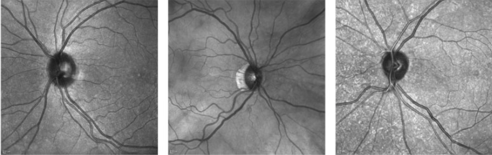
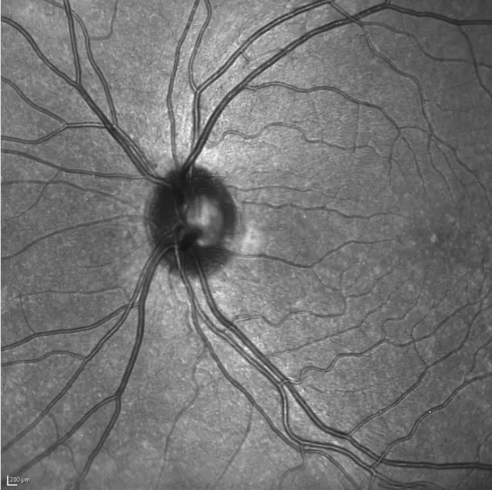
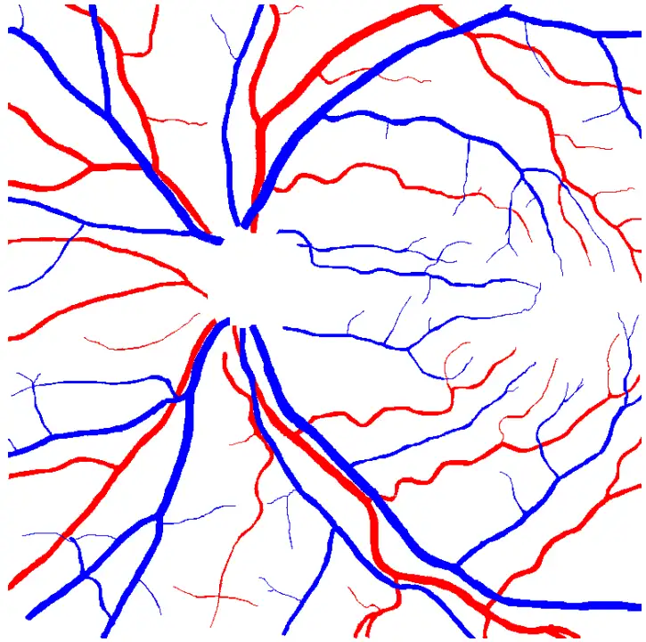

# RAVIR

<div align="center">
    <a href="https://github.com/openmedlab/"></a>
</div>
<p style="text-align:center;font-size:10px;"><em></em></p>

## Dataset Information

**RAVIR** (Retinal Arteries and Veins in Infrared Reflectance Imaging) is a dataset for semantic segmentation and quantitative analysis of retinal arteries and veins in infrared reflectance imaging. The images in this dataset were acquired using infrared (wavelength greater than 815 nm) scanning laser ophthalmoscopy, with a field of view of 30 degrees, resulting in high image quality and contrast. The image size in the dataset is 768x768 pixels, and they are saved in .png format. Each pixel corresponds to an actual length of 12.5 micrometers. The dataset contains a total of 46 images, with 26 used for training and 20 for testing.

Retinal blood vessels provide important clues for diagnosing and monitoring systemic diseases, including hypertension and diabetes. In these cases, the microvascular system is the primary system under study, and the retina is the only anatomical site where the microvasculature can be directly observed. For a long time, objective evaluation of retinal vessels has been considered an important reference for systemic vascular diseases. With the recent advances in retinal imaging and computer vision technology, this topic has gained renewed attention. The RAVIR dataset supports the creation of deep learning-based models that can differentiate and extract vessel types without extensive post-processing, providing foundational data for the development of quantitative analysis models for retinal vascular lesions.

## Dataset Meta Information

| Dimensions | Modality | Task Type     | Anatomical Structures | Anatomical Area | Number of Categories | Data Volume | File Format |
|------------|----------|---------------|-----------------------|-----------------|----------------------|-------------|-------------|
| 2D         | IR       | Segmentation  | Vessels               | Retina          | 2                    | 46          | PNG         |


### Resolution Details

| Dataset Statistics | spacing (µm) | size     |
|--------------------|-------------|----------|
| min                | 12.5x12.5   | 768x768  |
| median             | 12.5x12.5   | 768x768  |
| max                | 12.5x12.5   | 768x768  |

## Label Information Statistics

Only 26 training sets are counted:

| Anatomy          | vein blood vessels  | rtery blood vessels |
|------------------|---------------------|---------------------|
| Occurrence       | 26                  | 100%                |
| Occurrence Ratio | 26                  | 100%                |

## Visualization

<div align="center">
    <a href="https://github.com/openmedlab/"></a>
</div>
<p style="text-align:center;font-size:10px;"><em> Raw Image.</em></p>

<div align="center">
    <a href="https://github.com/openmedlab/"></a>
</div>
<p style="text-align:center;font-size:10px;"><em>Segmentation annotation, where red areas represent arteries and blue areas represent veins.</em></p>

## File Structure

``` 
RAVIR Dataset/
│
├── test/
│   ├── IR_Case_006.png
│   └── IR_Case_024.png
│
├── train/
    ├── training_images/
    │   ├── IR_Case_011.png
    │   └── IR_Case_017.png
    │
    └── training_masks/
        ├── IR_Case_011.png
        └── IR_Case_017.png
```

## Authors and Institutions

Ali Hatamizadeh (University of California, Los Angeles)

Hamid Hosseini (University of California, Los Angeles)

Niraj Patel (University of California, Los Angeles)

Jinseo Choi (University of California, Los Angeles)

Cameron C. Pole (University of California, Los Angeles)

Cory M. Hoeferlin (University of California, Los Angeles)

Steven D. Schwartz (University of California, Los Angeles)

Demetri Terzopoulos (University of California, Los Angeles; VoxelCloud, Inc.)

## Source Information

Official Website: https://ravir.grand-challenge.org/RAVIR/

Download Link: https://ravir.grand-challenge.org/RAVIR/

Article Address: https://arxiv.org/pdf/2203.14928

Publication Date: 2022-03

## Citation

``` 
@article{hatamizadeh2022ravir,
  title={RAVIR: A dataset and methodology for the semantic segmentation and quantitative analysis of retinal arteries and veins in infrared reflectance imaging},
  author={Hatamizadeh, Ali and Hosseini, Hamid and Patel, Niraj and Choi, Jinseo and Pole, Cameron C and Hoeferlin, Cory M and Schwartz, Steven D and Terzopoulos, Demetri},
  journal={IEEE Journal of Biomedical and Health Informatics},
  volume={26},
  number={7},
  pages={3272--3283},
  year={2022},
  publisher={IEEE}
}
```

Original introduction article is [here](https://zhuanlan.zhihu.com/p/714221995).