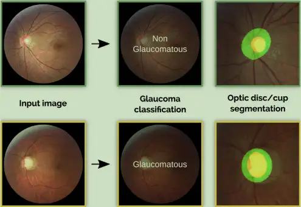

# REFUGE

<div align="center">
    <a href="https://github.com/openmedlab/"></a>
</div>
<p style="text-align:center;font-size:10px;"><em></em></p>

## Dataset Information

The REFUGE dataset originates from the MICCAI 2018 Retinal Fundus Glaucoma Challenge, which includes two main tasks: optic disc/cup segmentation and glaucoma classification. REFUGE has publicly released a dataset containing 1200 fundus images, including real segmentations and clinical glaucoma labels, making it the largest known dataset of its kind. The authors have also established an evaluation framework to simplify and ensure fairness when comparing different models, encouraging the development of new technologies in this field.

Glaucoma is a leading cause of irreversible yet preventable blindness in the working-age population. Color fundus photography (CFP) is the most cost-effective imaging modality for screening retinal diseases. However, due to the limited size of available datasets, the application of CFP in glaucoma is restricted to calculating some related biomarkers, such as the vertical cup-to-disc ratio. Although deep learning methods are widely used in medical image analysis, they have not been extensively employed in glaucoma assessment. Additionally, the lack of standardized benchmark strategies makes it difficult to compare existing methods in a unified manner.

## Dataset Meta Information

| Dimensions | Modality | Task Type                    | Anatomical Structures | Anatomical Area | Number of Categories | Data Volume                     | File Format |
|------------|----------|------------------------------|-----------------------|-----------------|----------------------|---------------------------------|-------------|
| 2D         | Fundus   | Classification, Segmentation | Eye                   | Eye             | 2                    | train: 400, val: 400, test: 400 | PNG         |


### Resolution Details

| Dataset Statistics | size         |
|--------------------|--------------|
| min                | [2056,2124]  |
| median             | [2056,2124]  |
| max                | [2056,2124]  |

## Label Information Statistics

Only the training set and validation set provide labels, and the test set does not.

| Categories   | Number |
|--------------|--------|
| Glaucoma     | 80     |
| Non-Glaucoma | 720    |

## Visualization

<div align="center">
    <a href="https://github.com/openmedlab/"></a>
</div>
<p style="text-align:center;font-size:10px;"><em>Visualization Results.</em></p>

## File Structure

The file structure of the REFUGE dataset is as follows:

``` 
images
├── train
│   ├──xxxx.png
│   ├──xxxx.png
│   │    ...
├── val
│   ├──xxxx.png
│   ├──xxxx.png
│   │    ...
├── test
│   ├──xxxx.png
│   ├──xxxx.png
│   │    ...
├──train.txt
├──val.txt
├──test.txt
```

## Authors and Institutions

Jos´e Ignacio Orlando (Medical University of Vienna)

Huazhu Fu (Inception Institute of Artificial Intelligence)

Hrvoje Bogunovi´c (Medical University of Vienna)


## Source Information

Official Website: https://refuge.grand-challenge.org/

Download Link: https://refuge.grand-challenge.org/

Article Address: https://arxiv.org/pdf/1910.03667v1

Publication Date: 2018-03

## Citation

``` 
@article{orlando2020refuge,
  title={Refuge challenge: A unified framework for evaluating automated methods for glaucoma assessment from fundus photographs},
  author={Orlando, Jos{\'e} Ignacio and Fu, Huazhu and Breda, Jo{\~a}o Barbosa and Van Keer, Karel and Bathula, Deepti R and Diaz-Pinto, Andr{\'e}s and Fang, Ruogu and Heng, Pheng-Ann and Kim, Jeyoung and Lee, JoonHo and others},
  journal={Medical image analysis},
  volume={59},
  pages={101570},
  year={2020},
  publisher={Elsevier}
}
```

Original introduction article is [here](https://zhuanlan.zhihu.com/p/696859876).