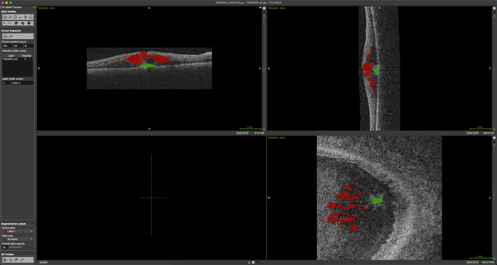

# RETOUCH

<div align="center">
    <a href="https://github.com/openmedlab/"></a>
</div>
<p style="text-align:center;font-size:10px;"><em> </em></p>

## Dataset Information

The RETOUCH (The Retinal OCT Fluid Detection and Segmentation Benchmark and Challenge) dataset is a specialized resource for medical imaging, focusing specifically on the retinal Optical Coherence Tomography (OCT) images. This dataset plays a key role in the automatic detection and segmentation of various types of retinal fluids, which are indicators of multiple retinal diseases. It includes 3D OCT data collected from equipment of three different manufacturers (Cirrus, Spectralis, and Topcon), ensuring a wide representation of imaging conditions and devices.

The dataset consists of a labeled training set with 70 cases and an unlabeled test set with 42 cases. The labels in the dataset categorize retinal fluids into three main types, each with a specific label: intraretinal fluid (IRF) is marked as 1, subretinal fluid (SRF) as 2, and pigment epithelial detachment (PED) as 3. Anything else is marked as 0, indicating the absence of these specific types of fluid.

The RETOUCH challenge includes two main tasks: the detection of the presence of retinal fluids and voxel-level segmentation of IRF, SRF, and PED. This challenge not only fosters the development of new algorithms but also provides a standardized framework for evaluation. This framework allows for a uniform comparison of developed methods, making a significant contribution to the advancement of automatic retinal OCT segmentation technology.

Furthermore, the dataset and challenge encourage participation from the medical imaging community, inviting researchers and developers to test and refine their algorithms using this comprehensive and clinically relevant dataset. The RETOUCH challenge and dataset represent a significant contribution in the field of medical imaging, particularly in the context of the diagnosis and management of retinal diseases.

## Dataset Meta Information

| Dimensions | Modality | Task Type     | Anatomical Structures | Anatomical Area | Number of Categories | Data Volume | File Format |
|------------|---------|---------------|-----------------------|-----------------|----------------------|-------------|-------------|
| 2D         | OCT     | Segmentation  | Retianl               | Eye             | 3                    | 112         | .mhd、.raw   |


### Resolution Details

| Image Type         | Spacing (mm)        | Size          |
|--------------------|---------------------|---------------|
| Axial Resolution   | (0.010, 0.002, 0.047) | (512, 496, 49) |
| Coronal Resolution | (0.012, 0.003, 0.047) | (512, 885, 128)|
| Sagittal Resolution| (0.012, 0.004, 0.129) | (512, 1024, 128)|

Number of two-dimensional slices in the data set: 6936

## Label Information Statistics

| Category | Total Images | Training Set | Validation Set |
|----------|--------------|--------------|----------------|
| Number   | 55           | 37           | 33             |
| Percent  | 78.57%       | 52.86%       | 47.14%         |

## Visualization

<div align="center">
    <a href="https://github.com/openmedlab/"></a>
</div>
<p style="text-align:center;font-size:10px;"><em> ITK-SNAP Visualization. Case 1. </em></p>

## File Structure

``` 
TOUCH
├── RETOUCH-TestSet-Cirrus
│   ├── TEST001
│   │   ├── oct.mhd
│   │   └── oct.raw
│   ├── TEST002
│   │   ├── ...
├── RETOUCH-TestSet-Spectralis
│   ├── TEST015
│   │   ├── oct.mhd
│   │   └── oct.raw
│   ├── TEST016
│   │   ├── ...
├── RETOUCH-TestSet-Topcon
│   ├── TEST029
│   │   ├── oct.mhd
│   │   └── oct.raw
│   ├── TEST030
│   │   ├── ...
├── RETOUCH-TrainingSet-Cirrus
│   ├── TRAIN001
│   │   ├── oct.mhd
│   │   ├── oct.raw
│   │   ├── reference.mhd
│   │   └── reference.raw
│   ├── TRAIN002
│   │   ├──...
├── RETOUCH-TrainingSet-Spectralis
│   ├── TRAIN025
│   │   ├── oct.mhd
│   │   ├── oct.raw
│   │   ├── reference.mhd
│   │   └── reference.raw
│   ├── TRAIN026
│   │   ├── ...
└── RETOUCH-TrainingSet-Topcon
    ├── TRAIN049
    │   ├── oct.mhd
    │   ├── oct.raw
    │   ├── reference.mhd
    │   └── reference.raw
    ├── TRAIN050
    │   ├── ...
```

## Authors and Institutions

Hrvoje Bogunovic (Iverson and Christian Doppler Laboratory for Ophthalmic Image Analysis, Austria)

Freerk Venhuizen (Department of Radiology and Nuclear Medicine, Medical School, Radboud University Nijmegen, The Netherlands)

Sophie Klimscha (Iverson and Christian Doppler Laboratory for Ophthalmic Image Analysis, Austria)

Stefanos Apostolopoulos (Swiss Bern AG, Switzerland)

Alireza Bab-Hadiashar (Department of Engineering, Royal Melbourne Institute of Technology, Melbourne, Australia)

Ulas Bagci (University of Central Florida, USA)

Mirza Faisal Beg (Simon Fraser University, Canada)

Loza Bekalo (Nanjing University of Science and Technology, China)

Qiang Chen (Nanjing University of Science and Technology, China)

Carlos Ciller (Swiss Bern AG, Switzerland)

Karthik Gopinath (International Institute of Information Technology, Hyderabad, India)


## Source Information

Official Website: https://retouch.grand-challenge.org/Home/

Download Link: https://retouch.grand-challenge.org/Home/

Article Address: https://optima.meduniwien.ac.at/wp-content/uploads/2021/12/2019_HBogunovic_RETOUCH_IEEETransactions_preprint.pdf

Publication Date: 2017-04

## Citation

``` 
@article{bogunovic2019retouch,
  title={RETOUCH: The retinal OCT fluid detection and segmentation benchmark and challenge},
  author={Bogunovi{\'c}, Hrvoje and Venhuizen, Freerk and Klimscha, Sophie and Apostolopoulos, Stefanos and Bab-Hadiashar, Alireza and Bagci, Ulas and Beg, Mirza Faisal and Bekalo, Loza and Chen, Qiang and Ciller, Carlos and others},
  journal={IEEE transactions on medical imaging},
  volume={38},
  number={8},
  pages={1858--1874},
  year={2019},
  publisher={IEEE}
}
```

Original introduction article is [here](https://zhuanlan.zhihu.com/p/676816128).