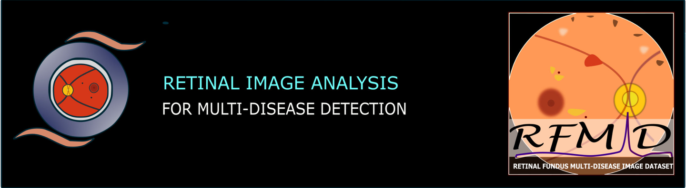
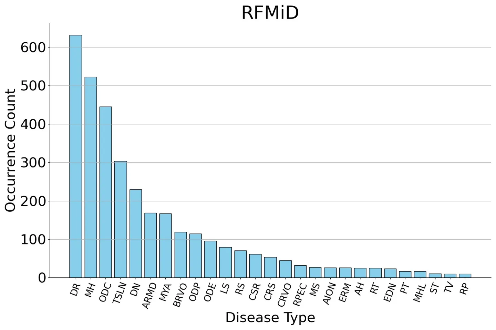
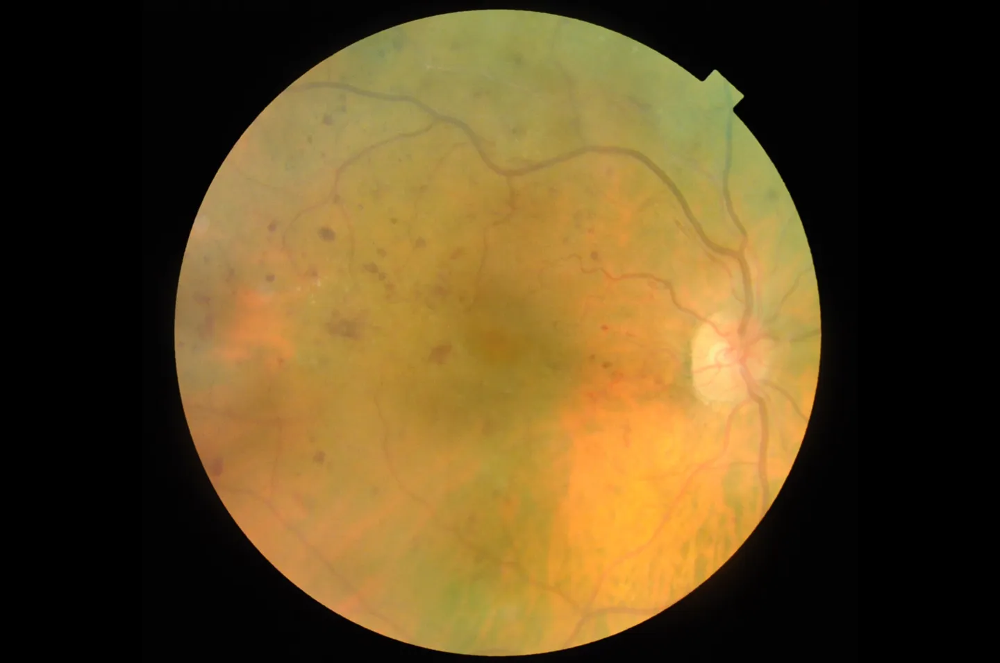
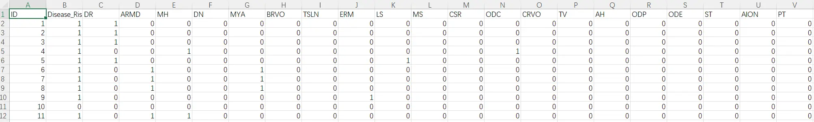

# RFMiD 2.0

<div align="center">
    <a href="https://github.com/openmedlab/"></a>
</div>
<p style="text-align:center;font-size:10px;"><em></em></p>

## Dataset Information

The RFMiD 2.0 dataset is a multi-label classification dataset for fundus images. It is an updated version of the RFMiD (1.0 version), which was used in the RIADD Challenge at ISBI 2021. Released in 2023, the update primarily includes modifications to the label categories, refining the previously general 'Other' category into specific rare diseases, thereby enhancing the quality of the labels. The dataset contains a total of 3,200 cases, and as of now, images and labels for all cases have been provided. With annotations for 45 different ocular diseases, RFMiD 2.0 holds the distinction of having the most disease categories among publicly available fundus datasets.

Fundus images, due to their similarity to natural images, have been used as a benchmark for the generalizability of methods in the medical field by researchers of natural images. This includes datasets such as CHASE, DRIVE, etc., which have been discussed in our previous articles. As the fundus dataset with the most annotated categories available publicly, RFMiD 2.0 is of value to both general multi-label classification researchers and those working on computer-aided diagnostic research related to vision. Given the large number of annotation categories in the dataset, some categories inevitably have very few samples, making this dataset also relevant for research into multi-label long-tail problems and issues related to limited samples in the medical field.

## Dataset Meta Information

| Dimensions | Modality      | Task Type      | Anatomical Structures | Anatomical Area | Number of Categories | Data Volume                                         | File Format |
|------------|---------------|----------------|-----------------------|-----------------|----------------------|-----------------------------------------------------|-------------|
| 2D         | Retinal Image | Classification | Eye                   | Eye       | 45                   | 1920 for training, 640 for validation, 640 for test | png         |


### Resolution Details

You can also write down the resolution details such as size (x, y, z) and spacing information about the dataset.

For example:

| Dataset Statistics | spacing (mm)     | size            |
|--------------------|------------------|-----------------|
| min                | (1.5, 1.5, 1.5)              | (10, 10, 5)     |
| median             | (1.5, 1.5, 1.5)           | (256, 256, 100) |
| max                | (1.5, 1.5, 1.5)              | (512, 512, 200) |

## Label Information Statistics

This section is statistics results of label information.

| Metric        | Tumor    |
|---------------|----------|
| Case Count    | 501      |
| Coverage      | 49.4%    |
| Min Volume (cm³) | 0.1    |
| Median Volume (cm³) | 99 |
| Max Volume (cm³) | 2480   |

<div align="center">
    <a href="https://github.com/openmedlab/"></a>
</div>
<p style="text-align:center;font-size:10px;"><em></em></p>

## Visualization

<div align="center">
    <a href="https://github.com/openmedlab/"></a>
</div>
<p style="text-align:center;font-size:10px;"><em> Image </em></p>

<div align="center">
    <a href="https://github.com/openmedlab/"></a>
</div>
<p style="text-align:center;font-size:10px;"><em>Annotation (a total of 45 types of bool type tags, only some are shown here)</em></p>

## File Structure

Train / Val / Test are provided for download as separate files. After unzipping each downloaded zip file, there will be an annotation file and a folder containing all the images.

``` 
Dataset
│
├── Training_Set
│   ├── Training
│   │   ├── 1.png
│   │   ├── 2.png
│   │   ├── 3.png
│   │   ├── ...
│   │   ├── 1920.png
│   └── RFMiD_Training_Labels.csv
├── Validation_Set
│   ├── Validation
│   │   ├── 1.png
│   │   ├── 2.png
│   │   ├── 3.png
│   │   ├── ...
│   │   ├── 640.png
│   └── RFMiD_Validation_Labels.csv
├── Test_Set
│   ├── Test
│   │   ├── 1.png
│   │   ├── 2.png
│   │   ├── 3.png
│   │   ├── ...
│   │   ├── 640.png
│   └── RFMiD_Test_Labels.csv
```

## Authors and Institutions

Samiksha Pachade (Shri Guru Gobind Singhji Institute of Engineering and Technology, India)

Prasanna Porwal (Shri Guru Gobind Singhji Institute of Engineering and Technology, India)

Dhanashree Thulkar (Vilasrao Deshmukh College of Engineering and Technology, India)

Manesh Kokare (Shri Guru Gobind Singhji Institute of Engineering and Technology, India)


## Source Information

Official Website: https://riadd.grand-challenge.org/Home/

Download Link: https://riadd.grand-challenge.org/Download/

Article Address: https://www.mdpi.com/2306-5729/8/2/29

Publication Date: 2023-01

## Citation

``` 
Article{data8020029,
AUTHOR = {Panchal, Sachin and Naik, Ankita and Kokare, Manesh and Pachade, Samiksha and Naigaonkar, Rushikesh and Phadnis, Prerana and Bhange, Archana},
TITLE = {Retinal Fundus Multi-Disease Image Dataset (RFMiD) 2.0: A Dataset of Frequently and Rarely Identified Diseases},
JOURNAL = {Data},
VOLUME = {8},
YEAR = {2023},
NUMBER = {2},
ARTICLE-NUMBER = {29},
URL = {https://www.mdpi.com/2306-5729/8/2/29},
ISSN = {2306-5729},
ABSTRACT = {Irreversible vision loss is a worldwide threat. Developing a computer-aided diagnosis system to detect retinal fundus diseases is extremely useful and serviceable to ophthalmologists. Early detection, diagnosis, and correct treatment could save the eye&rsquo;s vision. Nevertheless, an eye may be afflicted with several diseases if proper care is not taken. A single retinal fundus image might be linked to one or more diseases. Age-related macular degeneration, cataracts, diabetic retinopathy, Glaucoma, and uncorrected refractive errors are the leading causes of visual impairment. Our research team at the center of excellence lab has generated a new dataset called the Retinal Fundus Multi-Disease Image Dataset 2.0 (RFMiD2.0). This dataset includes around 860 retinal fundus images, annotated by three eye specialists, and is a multiclass, multilabel dataset. We gathered images from a research facility in Jalna and Nanded, where patients across Maharashtra come for preventative and therapeutic eye care. Our dataset would be the second publicly available dataset consisting of the most frequent diseases, along with some rarely identified diseases. This dataset is auxiliary to the previously published RFMiD dataset. This dataset would be significant for the research and development of artificial intelligence in ophthalmology.},
DOI = {10.3390/data8020029}
}
```

Original introduction article is [here](https://zhuanlan.zhihu.com/p/666832474).