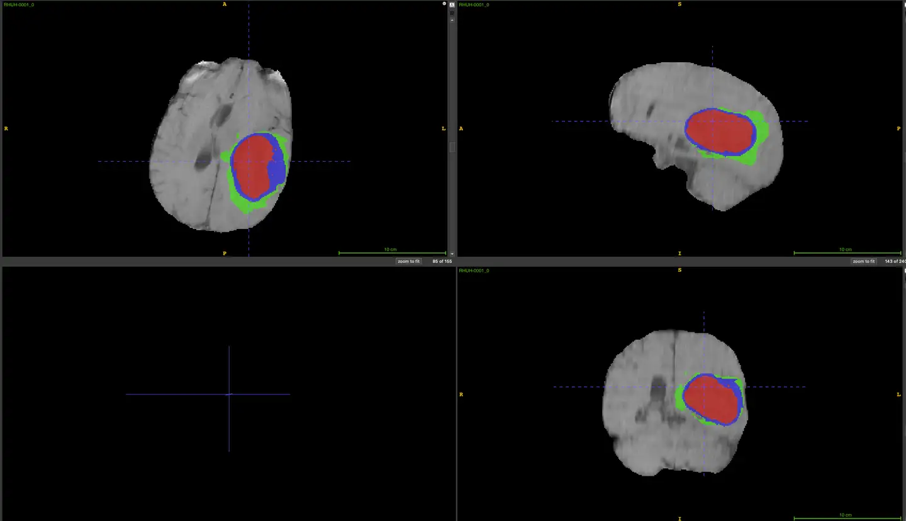
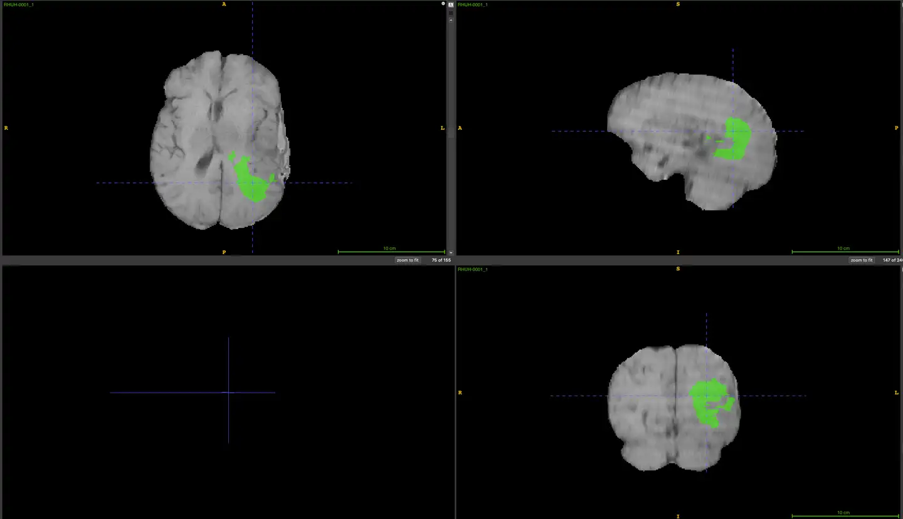
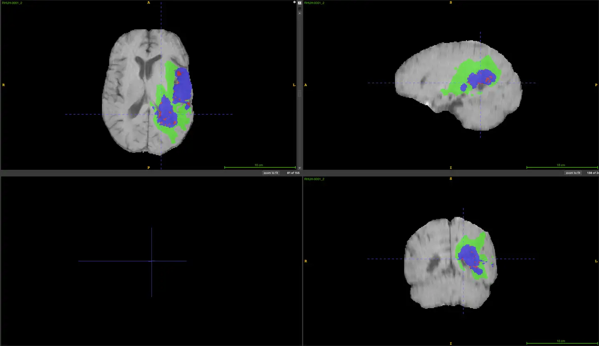

# RHUH-GBM

<div align="center">
    <a href="https://github.com/openmedlab/"></a>
</div>
<p style="text-align:center;font-size:10px;"><em></em></p>

## Dataset Information

The RHUH-GBM dataset is a 3D dataset focused on MR modality glioblastoma segmentation, originating from TCIA. A unique feature of this dataset is that it includes data from patients who have undergone over 95% tumor resection, covering pre-operative, early post-operative (within 72 hours after surgery), and follow-up scans. The dataset encompasses 120 entries from 40 patients.

This dataset comes from 40 adult patients at Rio Hortega University Hospital, whose tumors were histopathologically confirmed as WHO grade IV astrocytomas. The dataset covers three time points: pre-operative, early post-operative (within 72 hours post-surgery), and follow-up scans for recurrence diagnosis. Patients underwent either gross total resection (GTR) or near-total resection (NTR), defined as no residual tumor enhancement and resection of more than 95% of the initial enhanced volume, respectively. The dataset includes multiparametric MRI scan sequences, such as T1-weighted imaging (T1w), T2-weighted imaging (T2w), Fluid Attenuated Inversion Recovery imaging (FLAIR), T1 contrast-enhanced imaging (T1ce), and diffusion-weighted imaging (DWI) derived Apparent Diffusion Coefficient (ADC) maps. It also includes clinical and demographic data, IDH status, treatment information, and volumetric assessments of the resection extent. Additionally, the dataset contains expert-validated segmentations of tumor sub-regions (such as enhancing tumor, necrosis, peritumoral edema) generated through computer-assisted methods from pre-operative, post-operative, and follow-up scans.

## Dataset Meta Information

| Dimensions | Modality | Task Type    | Anatomical Structures | Anatomical Area | Number of Categories | Data Volume | File Format |
|------------|----------|--------------|-----------------------|-----------------|----------------------|-------------|-------------|
| 3D         | MR       | Segmentation | Brain                 | Head and Neck   | 3                    | 120         | .nii.gz     |


### Resolution Details

You can also write down the resolution details such as size (x, y, z) and spacing information about the dataset.

For example:

| Dataset Statistics | spacing (mm)     | size              |
|--------------------|------------------|-------------------|
| min                | (1.0, 1.0, 1.0)  | 	(230, 230, 138)  |
| median             | (1.0, 1.0, 1.0)  | 	(230, 230, 138)  |
| max                | (1.0, 1.0, 1.0)  | 	(230, 230, 138)  |

Number of 2D slices in the dataset: 18583.

## Label Information Statistics

| Anatomical Feature    | Necrotic Tumor Core | Peritumoral Edema | Enhancing Tumor |
|-----------------------|---------------------|-------------------|-----------------|
| Number of Cases       | 75                  | 120               | 93              |
| Segmentation Accuracy | 62.50%              | 100%              | 77.50%          |
| Min Volume (cm³)      | 0.02                | 1.05              | 0.1             |
| Median Volume (cm³)   | 4.52                | 48.02             | 9.86            |
| Max Volume (cm³)      | 72.61               | 180.26            | 84.34           |

## Visualization

The following three images are visualizations of pre-operative, early post-operative, and diagnostic follow-up scans, respectively. In these images, the red area represents the tumor core, the blue area represents the enhanced tumor, and the green area is the edema.

<div align="center">
    <a href="https://github.com/openmedlab/"></a>
</div>
<p style="text-align:center;font-size:10px;"><em>Preoperative MRI.</em></p>

<div align="center">
    <a href="https://github.com/openmedlab/"></a>
</div>
<p style="text-align:center;font-size:10px;"><em>Early postoperative MRI.</em></p>

<div align="center">
    <a href="https://github.com/openmedlab/"></a>
</div>
<p style="text-align:center;font-size:10px;"><em>Recurrence diagnosis follow-up scan MRI.</em></p>

## File Structure

The main directory includes MR data of different modalities, along with their segmentation data. The numbers 0, 1, and 2 correspond to different time points for the patients, including pre-operative, within 72 hours post-operative, and post-operative follow-up, encompassing data from 40 patients.

``` 
.
├── clinical_data_TCIA_RHUH-GBM.csv
├── RHUH-0001
│   ├── 0
│   │   ├── RHUH-0001_0_adc.nii.gz
│   │   ├── RHUH-0001_0_flair.nii.gz
│   │   ├── RHUH-0001_0_segmentations.nii.gz
│   │   ├── RHUH-0001_0_t1ce.nii.gz
│   │   ├── RHUH-0001_0_t1.nii.gz
│   │   └── RHUH-0001_0_t2.nii.gz
│   ├── 1
│   │   ├── RHUH-0001_1_adc.nii.gz
│   │   ├── RHUH-0001_1_flair.nii.gz
│   │   ├── RHUH-0001_1_segmentations.nii.gz
│   │   ├── RHUH-0001_1_t1ce.nii.gz
│   │   ├── RHUH-0001_1_t1.nii.gz
│   │   └── RHUH-0001_1_t2.nii.gz
│   └── 2
│       ├── RHUH-0001_2_adc.nii.gz
│       ├── RHUH-0001_2_flair.nii.gz
│       ├── RHUH-0001_2_segmentations.nii.gz
│       ├── RHUH-0001_2_t1ce.nii.gz
│       ├── RHUH-0001_2_t1.nii.gz
│       └── RHUH-0001_2_t2.nii.gz
├── RHUH-0002
│   ├── 0
│   │   ├── ...
├── ...
└── RHUH-0040
    ├── 0
    │   ├── RHUH-0040_0_adc.nii.gz
    │   ├── RHUH-0040_0_flair.nii.gz
    │   ├── RHUH-0040_0_segmentations.nii.gz
    │   ├── RHUH-0040_0_t1ce.nii.gz
    │   ├── RHUH-0040_0_t1.nii.gz
    │   └── RHUH-0040_0_t2.nii.gz
    ├── 1
    │   ├── RHUH-0040_1_adc.nii.gz
    │   ├── ...
    └── 2
        ├── RHUH-0040_2_adc.nii.gz
        ├── ...
```

## Authors and Institutions

Santiago Cepeda (Río Hortega University Hospital, Spain)

Sergio García-García (Río Hortega University Hospital, Spain)

Ignacio Arrese (Río Hortega University Hospital, Spain)

Francisco Herrero (Department of Radiology, Río Hortega University Hospital, Spain)

Trinidad Escudero (Department of Radiology, Río Hortega University Hospital, Spain)

Tomás Zamora (Río Hortega University Hospital, Spain)

Rosario Sarabia (Río Hortega University Hospital, Spain)


## Source Information

Official Website: https://www.cancerimagingarchive.net/collection/rhuh-gbm/

Download Link: https://www.cancerimagingarchive.net/collection/rhuh-gbm/

Article Address: https://www.sciencedirect.com/science/article/pii/S2352340923007023

Publication Date: 2023-06

## Citation

``` 
@article{cepeda2023rio,
  title={The R{\'\i}o Hortega University Hospital Glioblastoma dataset: A comprehensive collection of preoperative, early postoperative and recurrence MRI scans (RHUH-GBM)},
  author={Cepeda, Santiago and Garc{\'\i}a-Garc{\'\i}a, Sergio and Arrese, Ignacio and Herrero, Francisco and Escudero, Trinidad and Zamora, Tom{\'a}s and Sarabia, Rosario},
  journal={Data in Brief},
  volume={50},
  pages={109617},
  year={2023},
  publisher={Elsevier}
}
```

Original introduction article is [here](https://zhuanlan.zhihu.com/p/700096640).