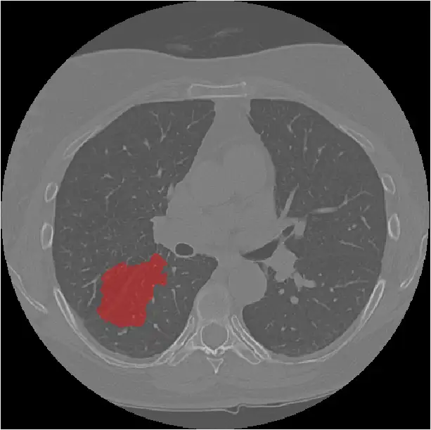
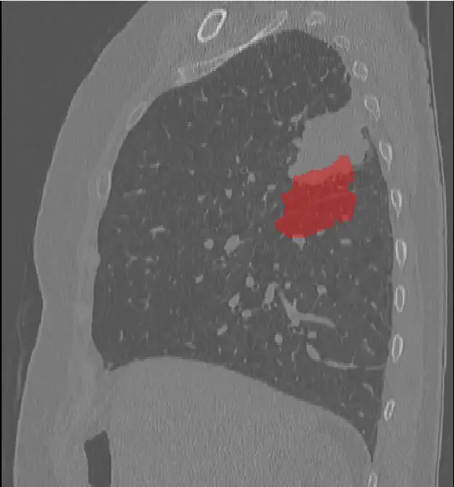
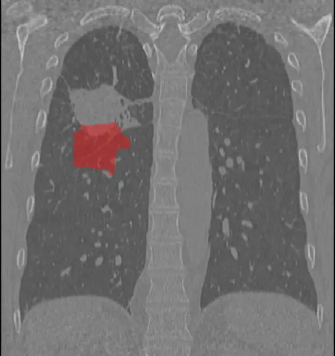
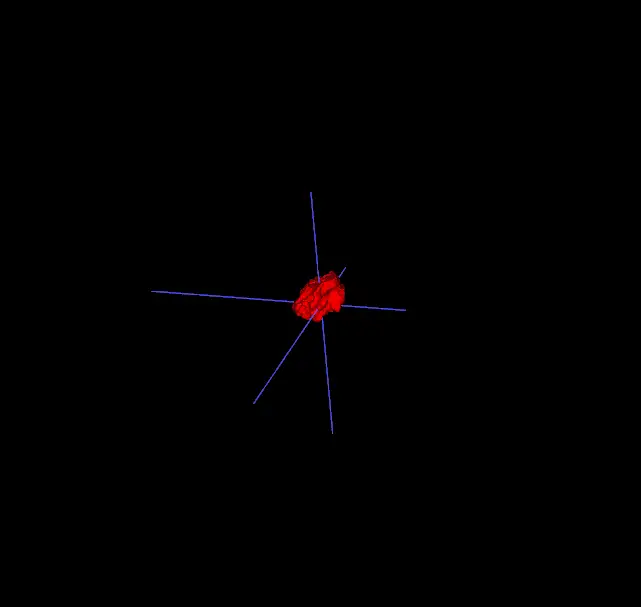

# RIDER-LungCT-Seg

<div align="center">
    <a href="https://github.com/openmedlab/"></a>
</div>
<p style="text-align:center;font-size:10px;"><em></em></p>

## Dataset Information

The RIDER-LungCT-Seg (Reference Image Database to Evaluate Therapy Response-LungCT-Seg) is a dataset designed for the segmentation of cancer in lung CT images. This dataset includes CT images of 31 patients with non-small cell lung cancer (NSCLC) from the RIDER-LungCT collection in the TCIA database. For these patients, a radiation oncologist manually annotated the lung tumors in the test images and retest images. The remaining data were annotated using an internal automatic segmentation method combined with manual corrections.

This dataset utilizes images of non-small cell lung cancer patients from the RIDER Lung CT collection, annotated manually and automatically by radiation oncologists without the knowledge of 3D information, using automatic segmentation methods. It provides essential data for developing algorithms for qualitative and quantitative analysis of lung tumors. This establishes a significant foundation for the application of imaging analysis in tumor research and personalized treatment.

## Dataset Meta Information

| Dimensions | Modality | Task Type     | Anatomical Structures | Anatomical Area | Number of Categories | Data Volume | File Format |
|------------|----------|---------------|-----------------------|-----------------|----------------------|-------------|-------------|
| 3D         | CT       | Segmentation  | Tumor                 | Lung            | 1                    | 59          | .dcm        |


### Resolution Details

| Dataset Statistics | spacing (mm)          | size         |
|--------------------|-----------------------|--------------|
| min                | (0.5078,0.5078,1.25)  | 512x512x189  |
| median             | (0.6602,0.6602,1.25)  | 512x512x245  |
| max                | (0.9102,0.9102,1.25)  | 512x512x321  |

Number of 2D slices in the dataset: 14319.

## Label Information Statistics

| Metric              | Tumor  |
|---------------------|--------|
| Case Count          | 59     |
| Coverage            | 100%   |
| Min Volume (cm³)    | 0.29   |
| Median Volume (cm³) | 9.92   |
| Max Volume (cm³)    | 149.11 |

## Visualization

The figure below shows three cross-sectional images of the CT image (including lung tumor annotations) in the dataset and a 3D image of the tumor.

<div align="center">
    <a href="https://github.com/openmedlab/"></a>
</div>
<p style="text-align:center;font-size:10px;"><em></em></p>

<div align="center">
    <a href="https://github.com/openmedlab/"></a>
</div>
<p style="text-align:center;font-size:10px;"><em></em></p>

<div align="center">
    <a href="https://github.com/openmedlab/"></a>
</div>
<p style="text-align:center;font-size:10px;"><em></em></p>

<div align="center">
    <a href="https://github.com/openmedlab/"></a>
</div>
<p style="text-align:center;font-size:10px;"><em></em></p>

## File Structure

``` 
RIDER-LungCT-Seg
│
├── RIDER Lung CT Original Scans
│   └── manifest-1581629373965
│       └── RIDER Lung CT
│           ├── RIDER-1129164940
│           │   └── 09-20-2006-1-NA-96508
│           │       ├── 4.000000-NA-24533
│           │       │   ├── 1-001.dcm
│           │       │   ├── 1-002.dcm
│           │       │   ├── 1-003.dcm
│           │       │   ├── 1-004.dcm
│           │       │   └── ...
│           │       └── 8.000000-NA-08100
│           │           └── ...
│           ├── RIDER-1225316081
│           │   └── ...
│           └── RIDER-1286684383
│               └── ...
│
└── RIDER Lung CT RTSTRUCTS DICOM SEGS
    └── RIDER-1129164940
        └── 09-20-2006-1-NA-96508
            ├── 9.000000-TEST-21526
            │   ├── 1-1.dcm
            │   └── ...
            ├── 10.000000-RETEST-21610
            │   └── ...
            ├── 300.000000-RIDER-112916494020190220TEST-24503
            │   └── ...
            └── 300.000000-RIDER-112916494020190402RETEST-93341
                └── ...
```

## Authors and Institutions

Hugo J.W.L. Aerts (Department of Radiation Oncology, Maastricht University, The Netherlands / Netherlands Institute for Radiotherapy Research)

Emmanuel Rios Velazquez (Department of Radiation Oncology, Maastricht University, The Netherlands / Netherlands Institute for Radiotherapy Research)

Ralph T.H. Leijenaar (Department of Radiation Oncology, Maastricht University, The Netherlands)

Chintan Parmar (Department of Radiation Oncology, Maastricht University, The Netherlands / Department of Radiation Oncology, Dana-Farber Cancer Institute, Harvard Medical School)

Patrick Grossmann (Department of Radiation Oncology, Dana-Farber Cancer Institute, Harvard Medical School)

Sara Carvalho (Department of Radiation Oncology, Maastricht University, The Netherlands)

Johan Bussink (Department of Radiation Oncology, Radboud University Medical Center, The Netherlands)

René Monshouwer (Department of Radiation Oncology, Radboud University Medical Center, The Netherlands)

Benjamin Haibe-Kains (Princess Margaret Cancer Centre, University of Toronto, Canada)

Derek Rietveld (Department of Radiation Oncology, Amsterdam UMC, Vrije Universiteit Amsterdam, The Netherlands)

Frank Hoebers (Department of Radiation Oncology, Maastricht University, The Netherlands)

Michelle M. Rietbergen (Department of Otolaryngology, Amsterdam UMC, Vrije Universiteit Amsterdam, The Netherlands)

C. René Leemans (Department of Otolaryngology, Amsterdam UMC, Vrije Universiteit Amsterdam, The Netherlands)

Andre Dekker (Department of Radiation Oncology, Maastricht University, The Netherlands)

John Quackenbush (Department of Biostatistics and Computational Biology, Dana-Farber Cancer Institute, Harvard Medical School)

Robert J. Gillies (Moffitt Cancer Center, USA)

Philippe Lambin (Department of Radiation Oncology, Maastricht University, The Netherlands)

## Source Information

Official Website: https://www.cancerimagingarchive.net/analysis-result/rider-lungct-seg/

Download Link: https://www.cancerimagingarchive.net/analysis-result/rider-lungct-seg/

Article Address: https://www.nature.com/articles/ncomms5006

Publication Date: 2020-02

## Citation

``` 
@article{aerts2014decoding,
  title={Decoding tumour phenotype by noninvasive imaging using a quantitative radiomics approach},
  author={Aerts, Hugo JWL and Velazquez, Emmanuel Rios and Leijenaar, Ralph TH and Parmar, Chintan and Grossmann, Patrick and Carvalho, Sara and Bussink, Johan and Monshouwer, Ren{\'e} and Haibe-Kains, Benjamin and Rietveld, Derek and others},
  journal={Nature communications},
  volume={5},
  number={1},
  pages={4006},
  year={2014},
  publisher={Nature Publishing Group UK London}
}
```

Original introduction article is [here](https://zhuanlan.zhihu.com/p/717766836).