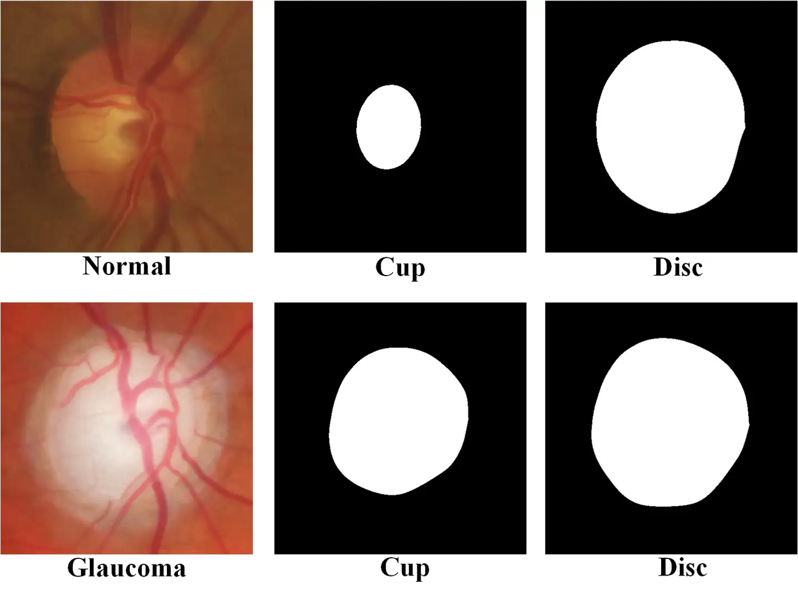

# RIM-ONE DL

<div align="center">
    <a href="https://github.com/openmedlab/"></a>
</div>
<p style="text-align:center;font-size:10px;"><em></em></p>

## Dataset Information

The RIM-ONE DL dataset comes from the "Retinal Image Database for Optic Nerve Evaluation (RIM-ONE)," which has been further revised for the development of deep learning methods. This dataset includes 313 retinal images from healthy individuals and 172 retinal images from patients with glaucoma. All these images have been evaluated by two experts and include manual segmentation of the optic disc and optic cup.

RIM-ONE DL plays an important role and holds significant value. Firstly, it provides a reliable, publicly available dataset for assessing and validating the performance of deep learning models in retinal image analysis. Using this dataset, researchers and developers can more accurately evaluate their algorithms and models in diagnosing ophthalmic diseases like glaucoma. Secondly, the manual segmentation results in this dataset offer valuable training and validation data for deep learning models. The segmentation of the optic disc and optic cup is a crucial task in retinal image analysis, essential for the accurate diagnosis and monitoring of diseases such as glaucoma. By using this dataset for training and testing, researchers can develop more accurate and reliable automatic segmentation algorithms, thereby improving the effectiveness and efficiency of ophthalmic diagnosis.

## Dataset Meta Information

| Dimensions | Modality | Task Type                     | Anatomical Structures | Anatomical Area | Number of Categories | Data Volume | File Format |
|------------|----------|-------------------------------|-----------------------|-----------------|----------------------|-------------|-------------|
| 2D         | Fundus   | Classification / Segmentation | Eye                   | Eye             | 2                    | 485         | PNG         |


### Resolution Details

| Dataset Statistics | size        |
|--------------------|-------------|
| min                | (274, 274)  |
| median             | (497, 497)  |
| max                | (790, 790)  |

## Label Information Statistics

| Categories   | Number |
|--------------|--------|
| 0 - Normal   | 313    |
| 1 - Glaucoma | 172    |

## Visualization

<div align="center">
    <a href="https://github.com/openmedlab/"></a>
</div>
<p style="text-align:center;font-size:10px;"><em></em></p>

## File Structure

``` 
RIM-ONE DL
├── images
│      ├─ train
│            ├─ glaucoma
│                   ├─ xxx.png
│                   ├─ xxx.png
│                   ├─ ......
│            ├── normal
│                   ├─ xxx.png
│                   ├─ xxx.png
│                   ├─ ......
│──  ├─ test
│            ├─ glaucoma
│                   ├─ xxx.png
│                   ├─ xxx.png
│                   ├─ ......
│            ├── normal
│                   ├─ xxx.png
│                   ├─ xxx.png
│                   ├─ ......
├── RIM-ONE_DL_reference_segmentations
│            ├─ glaucoma
│                   ├─ xxx_cup.png
│                   ├─ xxx_disc.png
│                   ├─ ......
│            ├── normal
│                   ├─ xxx_cup.png
│                   ├─ xxx_disc.png
│                   ├─ ......
├── train.txt
├── val.txt
```

## Authors and Institutions

FRANCISCO FUMERO (University of La Laguna)

TINGUARO DIAZ-ALEMAN (Hospital Universitario de Canarias)

JOSE SIGUT (University of La Laguna)

SILVIAAL AYON (University of La Laguna)

RAFAEL ARNAY (University of La Laguna)

DENISSE ANGEL-PEREIRA (Hospital Universitario de Canarias)


## Source Information

Official Website: https://github.com/miag-ull/rim-one-dl

Download Link: https://github.com/miag-ull/rim-one-dl

Article Address: https://doi.org/10.5566/ias.2346

Publication Date: 2020-06

## Citation

``` 
@article{RIMONEDLImageAnalStereol2346,
	author = {Francisco José Fumero Batista and Tinguaro Diaz-Aleman and Jose Sigut and Silvia Alayon and Rafael Arnay and Denisse Angel-Pereira},
	title = {RIM-ONE DL: A Unified Retinal Image Database for Assessing Glaucoma Using Deep Learning},
	journal = {Image Analysis & Stereology},
	volume = {39},
	number = {3},
	year = {2020},
	keywords = {Convolutional Neural Networks; Deep Learning; Glaucoma Assessment; RIM-ONE},
	issn = {1854-5165},
	pages = {161--167},
	doi = {10.5566/ias.2346},
	url = {https://www.ias-iss.org/ojs/IAS/article/view/2346}
}
```

Original introduction article is [here](https://zhuanlan.zhihu.com/p/695013264).