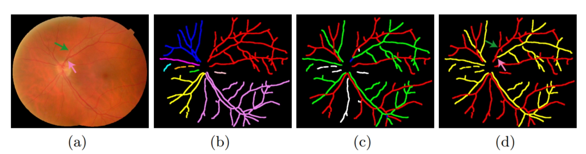
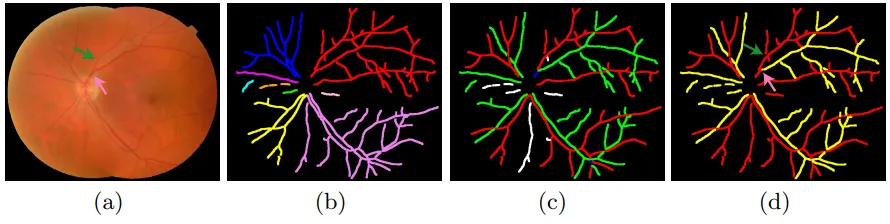

# RITE

<div align="center">
    <a href="https://github.com/openmedlab/"></a>
</div>
<p style="text-align:center;font-size:10px;"><em></em></p>

## Dataset Information

The RITE (Retinal Image vessel Tree Extraction) database is specifically designed for the segmentation or classification of arteries and veins in retinal fundus images. This database is based on the publicly available DRIVE database, which is a digital retinal imaging database for vessel extraction. Segmentation and classification of retinal images are important research directions in the field of medical image processing and computer vision, contributing to assisting doctors in diagnosing and treating problems related to eye diseases.

The RITE database contains 40 sets of images, divided into training and test subsets in the same manner as the DRIVE database. Such division ensures reliability and repeatability in algorithm evaluation and comparison. Each set includes a fundus photograph stored in TIFF format, preserving the high-quality details of the image. In addition, each set includes a vascular reference standard and an artery/vein (A/V) reference standard, stored in PNG format. The vascular reference standard provides accurate vascular segmentation results corresponding to the image, while the A/V reference standard provides classification information for arteries and veins.

## Dataset Meta Information

| Dimensions | Modality | Task Type     | Anatomical Structures | Number of Categories | Data Volume                     | File Format |
|------------|----------|---------------|-----------------------|----------------------|---------------------------------|-------------|
| 2D         | fundus photography   | Segmentation  | Eye             | 1                    | train: 20, test: 20 | image：tiff, label：png         |


### Resolution Details

| Dataset Statistics | size        |
|--------------------|-------------|
| min                | (584, 565)  |
| median             | (584, 565)  |
| max                | (584, 565)  |

## Label Information Statistics

| Category          | Retinal Vessel |
|-------------------|----------------|
| Number of Images  | 20             |
| Availability      | 100%           |
| Small Vessel Count| 16584          |
| Medium Vessel Count| 28050          |
| Large Vessel Count| 38241          |

## Visualization

<div align="center">
    <a href="https://github.com/openmedlab/"></a>
</div>
<p style="text-align:center;font-size:10px;"><em> Paper Visualization.</em></p>

## File Structure

The dataset file structure is as follows. The RITE dataset consists of two folders: `images` and `masks`, where the former contains the images and the latter contains the corresponding annotations.

``` 
RITE         
├── images            
│   ├── train
│       ├── 21_training.tif
│       ├── 22_training.tif
│       └──  ...
│   ├── test
│       ├── 01_test.tif
│       ├── 02_test.tif
│       └──  ...
├── masks            
│   ├── train
│       ├── 21_training.png
│       ├── 22_training.png
│       └──  ...
│   ├── test
│       ├── 01_test.tif
│       ├── 02_test.tif
│       └──  ...
```

## Authors and Institutions

Qiao Hu (Departments of Electrical and Computer Engineering)

Michael D. Abr`amof (Ophthalmology and Visual Sciences)

Mona K. Garvin (Department of Veterans Affairs Health Care System)


## Source Information

Official Website: https://medicine.uiowa.edu/eye/rite-dataset

Download Link: https://uiowa.qualtrics.com/jfe/form/SV_a3mc5H4SG2B3e2p?Q_JFE=qdg

Article Address: https://iacl.ece.jhu.edu/proceedings/miccai2013/papers/8150/81500436.pdf

Publication Date: 2013

## Citation

``` 
@inproceedings{hu2013automated,
  title={Automated separation of binary overlapping trees in low-contrast color retinal images},
  author={Hu, Qiao and Abr{\`a}moff, Michael D and Garvin, Mona K},
  booktitle={Medical Image Computing and Computer-Assisted Intervention--MICCAI 2013: 16th International Conference, Nagoya, Japan, September 22-26, 2013, Proceedings, Part II 16},
  pages={436--443},
  year={2013},
  organization={Springer}
}
```

Original introduction article is [here](https://zhuanlan.zhihu.com/p/678792639).