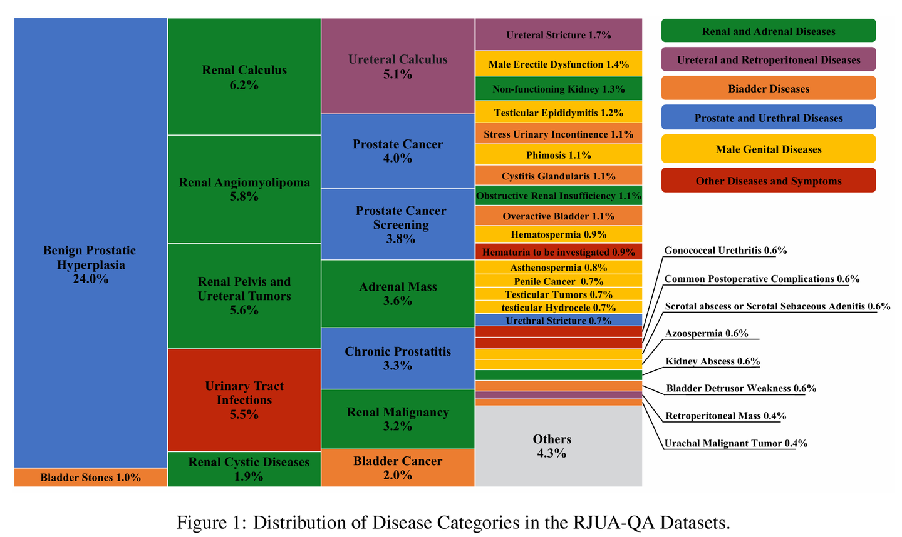
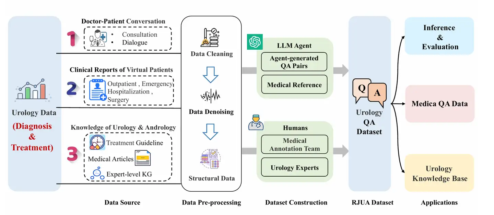
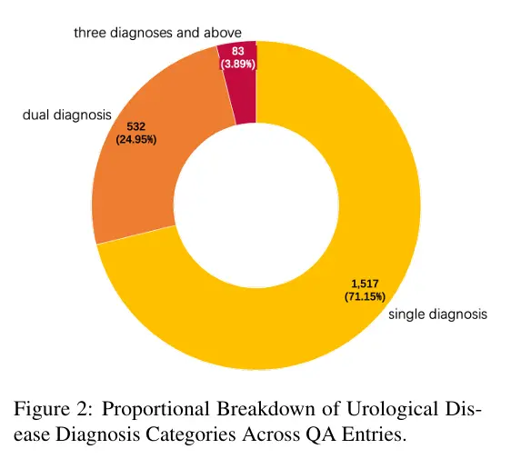

# RJUA-QA

<div align="center">
    <a href="https://github.com/openmedlab/"></a>
</div>
<p style="text-align:center;font-size:10px;"><em></em></p>

## Dataset Information

The RJUA-QA (RenJi hospital Department of Urology and Antgroup Collaborative Question and Answer dataset) is an innovative medical urology-specific QA reasoning dataset. This dataset is a collaborative creation by the AntGroup Medical LLM team and the expert team from the Department of Urology at the Renji Hospital, affiliated with the Shanghai Jiao Tong University School of Medicine. The development of this dataset aims to transform real clinical patient data into virtual patient clinical dialogues presented in a Q&A format, with data production being a collaborative effort between AI technology and expert teams to ensure high efficiency and accuracy. **The case data in this dataset is compiled by professional doctors based on clinical experience, thus it does not involve any personal privacy of patients and doctors.**

The RJUA-QA dataset contains 2,132 question-answer pairs, each crafted by doctors based on clinical experience with expert-provided answers and relevant reasoning contexts, derived from Chinese Urological and Andrological disease diagnosis and treatment guidelines. The dataset encompasses urological disease data collected from outpatient diagnoses, emergency interventions, hospital surgeries, and daily public education from 2019 to 2023, ensuring comprehensive coverage and depth across multiple medical scenarios. The dataset focuses on ten sub-specialties within urology, including but not limited to urological tumors, stones, prostate diseases, male health, urinary incontinence, urological reconstructive surgery, pediatric urological diseases, and kidney transplantation, covering over 97.6% of urological patient visits. Constructed with the involvement of the professional medical team from Renji Hospital's Department of Urology, the RJUA-QA dataset not only guarantees the authenticity and accuracy of its data but also offers significant practical value for real-world medical applications.

<div align="center">
    <a href="https://github.com/openmedlab/"></a>
</div>
<p style="text-align:center;font-size:10px;"><em>Dataset construction process.</em></p>

## Dataset Meta Information

| Task Type | Language  | Train | Val | Test | File Format | Size    |
|-----------|-----------|-------|-----|------|-------------|---------|
| QA        | Chinese   | 1705  | 211 | 213  | .json       | 11.7MB  |

The number is the actual download amount.

## Dataset Information Statistics

67 common urological disease categories, which cover more than 97.6% of cases among the medical population.

| Category                            | Diseases/Symptoms                                   |
|-------------------------------------|-----------------------------------------------------|
| **Renal and Adrenal Diseases**      | Adrenal Mass                                        |
|                                     | Renal Malignancy                                    |
|                                     | Renal Angiomyolipoma                                |
|                                     | Renal Pelvis and Ureteral Tumors                    |
|                                     | Renal Calculus                                      |
|                                     | Renal Cystic Diseases                               |
|                                     | Renal Abscess                                       |
|                                     | Renal Trauma                                        |
|                                     | Spontaneous Renal Rupture                           |
|                                     | Obstructive Nephropathy                             |
|                                     | Non-functioning Kidney                              |
|                                     | Duplex Kidney                                       |
|                                     | Polycystic Kidney Disease                           |
|                                     | Renal Transplantation                               |
| **Bladder Diseases**                | Bladder Cancer                                      |
|                                     | Overactive Bladder                                  |
|                                     | Bladder Stones                                      |
|                                     | Bladder Diverticulum                                |
|                                     | Bladder Foreign Body                                |
|                                     | Vesicovaginal Fistula                               |
|                                     | Vesicoureteral Fistula                              |
|                                     | Cystitis Glandularis                                |
|                                     | Bladder Detrusor Weakness                           |
|                                     | Stress Urinary Incontinence                         |
|                                     | Neurogenic Bladder                                  |
|                                     | Urachal Cyst                                        |
|                                     | Urachal Cancer                                      |
|                                     | Urachal Anomaly                                     |
| **Prostate and Urethral Diseases**  | Benign Prostatic Hyperplasia                        |
|                                     | Acute Prostatitis                                   |
|                                     | Chronic Prostatitis                                 |
|                                     | Prostate Cancer                                     |
|                                     | Prostate Cancer Screening                           |
|                                     | Urethral Stricture                                  |
|                                     | Urethral Diverticulum                               |
|                                     | Urethral Foreign Bodies                             |
|                                     | Gonococcal Urethritis                               |
| **Male Genital Diseases**           | Balanoposthitis                                     |
|                                     | Phimosis                                            |
|                                     | Prepuce                                             |
|                                     | Preputial Scars                                     |
|                                     | Frenular Tear                                       |
|                                     | Penile Cancer                                       |
|                                     | Scrotal Gangrene                                    |
|                                     | Scrotal Abscess                                     |
|                                     | Scrotal Trauma                                      |
|                                     | Seminal Vesiculitis                                 |
|                                     | Spermatic Cord Cyst                                 |
|                                     | Epididymal Cyst                                     |
|                                     | Testicular Tumor                                    |
|                                     | Epididymo-orchitis                                  |
|                                     | Testicular Torsion                                  |
|                                     | Hydrocele Testis                                    |
|                                     | Cryptorchidism                                      |
|                                     | Erectile Dysfunction                                |
|                                     | Male Infertility                                    |
|                                     | Azoospermia                                         |
|                                     | Oligozoospermia                                     |
|                                     | Hematospermia                                       |
| **Ureteral and Retroperitoneal Diseases** | Ureteral Calculus                             |
|                                     | Ureteral Stricture                                  |
|                                     | Retroperitoneal Mass                                |
|                                     | Pelvic Lipomatosis                                  |
|                                     | Retroperitoneal Fibrosis                            |
| **Other Diseases and Symptoms**     | Urinary Tract Infections                            |
|                                     | Common Postoperative Complications                  |
|                                     | Hematuria of Unknown Origin                         |


## Visualization


<div align="center">
    <a href="https://github.com/openmedlab/"></a>
</div>
<p style="text-align:center;font-size:10px;"><em>Common urological disease categories and proportions.</em></p>

<div align="center">
    <a href="https://github.com/openmedlab/"></a>
</div>
<p style="text-align:center;font-size:10px;"><em>24.95% (532/2132) of patients in the dataset had two urological diagnoses. 3.99% (83/2132) of patients had three or more urological diagnoses.</em></p>

## Dataset Example

``` 
{
  "id": "4",
  "question": "医生您好，我是60岁男性，2天前出现右侧腰痛，尿量减少来就医。到了医院急诊检查CT：双侧侧输尿管上段结石伴积水。血指标：白细胞 15.6，中性粒细胞百分比 83%，血红蛋白 127，血小板 251，C反应蛋白 91，静脉血气PH7.28，血钠 138, 血钾 4.6, AB 21，乳酸 0.8，血肌酐 865，降钙素原 0.245。请问我是什么诊断，该如何治疗？",
  "context": [
    "Context：临床表现：1.疼痛：典型的表现为肾绞痛，可以是持续性但常阵发性加剧并向会阴部放射。但在慢性逐渐产生的梗阻性肾病患者，有时疼痛不一定很突出，偶然仅表现为腰酸不适等。肾脏体积在急性原因引起的梗阻性肾病可以明显肿大，但慢性者则因为有不少纤维组织增生者，体积则不一定增大，不少病例病侧肾脏反而萎缩。2.排尿障碍：双侧完全性梗阻可以造成无尿，但大部分本病患者梗阻并不十分完全，因此多呈多尿。在继续发作的病例有时可呈现在发作时可以无尿，发作间期多尿表现。在感染原因所致梗阻病例，可能出现膀胱刺激症状。由膀胱颈部阻塞引起者（例如前列腺肥大）则可有尿潴留表现。3.高血压：相当常见，其机制可因肾小管腔内压过高，或间质压过高等促使肾素分泌过多；也可以因肾对水、钠调节机制障碍，导致水、钠潴留而发生高血压。一般由单侧肾脏病变导致本病而发生的高血压以肾素依赖型为多，双侧病变引起者则水钠依赖型为多数。梗阻解除后高血压一般可以好转。但如果病变时间已较长，则高血压有时可持续相当长时间。4.红细胞增多症：主要由于肾盂积水刺激促红细胞生成激素分泌过多而致。在外科手术纠正梗阻后过高的血细胞压积可以下降。但临床上真正出现典型本症者并不一定很多。5.酸中毒：主要因为影响肾小管对H+的分泌而致。部分病例可合并有血钾过高。",
    "Context：检查：1.尿常规：尿常规中依病因不同也可不同。大多数病例有蛋白尿，但为量一般不多。红、白细胞常可观察到。由结石肿瘤等引起者，血细胞可以甚多，有时有肉眼血尿、合并感染则可有较多白细胞。肾乳头坏死引起者，尿中不仅可有较多红细胞，也多伴有较多白细胞。此时典型的尿液色呈“洗肉水”样，红纱布滤过后可看到坏死组织。管型检查常可提示病因，例如由磺胺药，尿酸等引起，其特殊结晶可附在管型上。合并感染者的病例，其尿pH常升高，如果pH值在7.5以上者大多提示梗阻时间已久，且病变已较慢性。2.B超检查：除可测得肾脏大小外，还可探得肾盂积水情况，不少结石也可探得。如果检查中发现排尿后膀胱内潴尿仍然很多，则提示有前列腺肥大、肿瘤或者神经源性造成。3.腹部X线平片：可以探测出阳性尿路结石，由结核杆菌引起者则可在腹腔内及肾区见到钙化灶，同时也可大致观察到肾脏大小。CT除可测得肾脏大小以外，还可检出有否集合管系统扩张的情况。特点是如果由肿瘤（肾内或肾外）、腹腔后病变等引起者，则对确诊更为重要。少部分特殊病例需行逆行输尿管造影。部分急性梗阻病例经静脉肾盂造影后可以帮助明确病因。",
    "Context：治疗根据病因而定，结石可用震波碎石方法而去除，一般对结石7～15mm大小者较有效。在输尿管中下段结石经保守治疗（饮水、中药等）后仍无效者应采用在膀胱镜下逆行取石方法，有时结石影响肾功能或用上法不能成功者则需外科手术去除。常常需要同时使用抗生素，不少梗阻性肾病梗阻并不完全，但因继发感染造成水肿，炎症分泌物阻塞等可以使梗阻变得更明显，经抗生素使用后，梗阻可以明显好转，但使用剂量及选择用药需依据培养及肾功能情况而加以调整。由肿瘤等原因引起者需应用化疗或外科手术处理。梗阻后所出现的多尿等造成水、电解质等紊乱应及时予以纠正。",
    "Context：上尿路结石包括肾结石和输尿管结石。肾结石分为肾集合管结石、肾盏(肾盏憩室)结石、肾盂结石、鹿角形结石。输尿管结石可分为输尿管上段结石、中段结石及下段结石。",
    "Context：所有具有泌尿系结石临床症状的患者都应该进行影像学检查，其结果对于结石的进一步诊治具有重要价值。超声波检查超声波检查可作为泌尿系结石的常规检查方法，更是儿童和孕妇在怀疑泌尿系结石时的首选方法。其优点是简便、经济、无创伤，可以发现2mm以上结石。由于受肠道内容物的影响，超声波检查诊断输尿管中下段结石的敏感性较低。",
    "Context：部分患者可以通过保守治疗自发性排出结石。结石自发性排出与结石的部位和大小有关[35]。49%的输尿管上段结石、58%的中段结石和68%的远端输尿管结石可自行排出。75%的<5mm的结石和62%的>5mm的结石可自行排出，排出结石的平均时间约为17天(范围6~29天)[36]。随着结石大小的增加结石自行排出的概率会逐步减少，并且个体患者之间存在差异。",
    "Context：促排石药物包括α受体阻滞剂、钙通道抑制剂和磷酸二酯酶V型抑制剂(PDEI-5)[37]。α受体阻滞剂的排石效应已在临床中得到证实，对远端输尿管结石>5mm的患者使用α受体阻滞剂可增加排石概率[38]。部分研究不推荐在药物排石治疗中将PDEI-5或皮质类固醇与α受体阻滞剂联合使用[30]。",
    "Context：体外冲击波碎石术(extracorporealshockwavelithotripsy，ESWL)是利用体外产生的冲击波聚焦于体内的结石使之粉碎，继而将其排出体外以达到治疗目的的治疗方法。",
    "Context：1.非手术治疗 对于直径<5mm的输尿管结石，约75%可自行排出，因此首选非手术治疗;对于直径5~10mm的结石，可在密切监测下选用非手术治疗[142,143]。非手术治疗措施包括:大量饮水，每天2500~3000ml;适度运动;应用镇痛药物缓解肾绞痛症状;定期监测结石位置及肾积水的变化。输尿管结石的平均排石时间为6~29天[142]，因此建议对于排石的随访观察以1个月以内为宜。",
    "Context：非手术治疗适应证:1无症状、无梗阻的肾盏结石、憩室结石、髓质海绵肾患者;2结石导致患肾无功能、无症状、对侧肾功能正常的患者;3存在体外冲击波碎石及各种手术禁忌证的患者。非手术治疗的策略是纠正结石的易发因素，根据24小时尿成分分析及血生化检查，调整饮食结构和饮水习惯;控制BMI<25kg/m2;使24小时尿量维持在2000ml以上[154];对于高尿钙患者，限盐，保证每日钙摄入量1000mg以上，少食富含草酸的食物;适当运动。"
  ],
  "answer": "您好，根据您的描述，你现在是双侧输尿管结石伴积水感染，急性梗阻性肾衰。你应该尽快行双侧输尿管支架置入术，术后继续抗感染、补液、对症支持治疗，密观患者生命体征变化、感染指标、肾功能、电解质及尿量。",
  "disease": "双侧输尿管结石伴积水感染、急性梗阻性肾衰",
  "advice": "双侧输尿管支架置入术、术后抗感染、补液、对症支持治疗"
}
```

## File Structure

The dataset is divided into three files, of which the training set and validation set are used for model training and validation, and the test set is used for model reasoning indicator evaluation.
```
RJUA_train
RJUA_valid
RJUA_test
```

## Authors and Institutions

- Shiwei Lyu (Ant Group)
- Chenfei Chi (Renji Hospital, affiliated with Shanghai Jiao Tong University School of Medicine)
- Hongbo Cai (Ant Group)
- Lei Shi (Ant Group)
- Xiaoyan Yang (Ant Group)
- Lei Liu (Ant Group)
- Xiang Chen (Ant Group)
- Deng Zhao (Ant Group)
- Zhiqiang Zhang (Ant Group)
- Xianguo Lyu (Renji Hospital, affiliated with Shanghai Jiao Tong University School of Medicine)
- Ming Zhang (Renji Hospital, affiliated with Shanghai Jiao Tong University School of Medicine)
- Fangzhou Li (Renji Hospital, affiliated with Shanghai Jiao Tong University School of Medicine)
- Xiaowei Ma (Renji Hospital, affiliated with Shanghai Jiao Tong University School of Medicine)
- Yue Shen (Ant Group)
- Jinjie Gu (Ant Group)
- Wei Xue (Renji Hospital, affiliated with Shanghai Jiao Tong University School of Medicine)
- Yiran Huang (Renji Hospital, affiliated with Shanghai Jiao Tong University School of Medicine)

## Source Information

Official Website: https://github.com/alipay/RJU_Ant_QA/

Download Link: http://data.openkg.cn/dataset/rjua-qadatasets

Article Address: https://arxiv.org/abs/2312.09785

Publication Date: 2023

## Citation

``` 
@misc{lyu2023rjuaqa,
      title={RJUA-QA: A Comprehensive QA Dataset for Urology}, 
      author={Shiwei Lyu and Chenfei Chi and Hongbo Cai and Lei Shi and Xiaoyan Yang and Lei Liu and Xiang Chen and Deng Zhao and Zhiqiang Zhang and Xianguo Lyu and Ming Zhang and Fangzhou Li and Xiaowei Ma and Yue Shen and Jinjie Gu and Wei Xue and Yiran Huang},
      year={2023},
      eprint={2312.09785},
      archivePrefix={arXiv},
      primaryClass={cs.CL}
}
```

Original introduction article is [here](https://zhuanlan.zhihu.com/p/703924918).