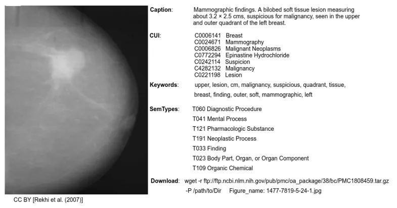

# ROCOV2

<div align="center">
    <a href="https://github.com/openmedlab/"></a>
</div>
<p style="text-align:center;font-size:10px;"><em></em></p>

## Dataset Information

The ROCOv2 (Radiology Objects in COntext Version 2) dataset is an innovative multimodal medical imaging dataset that integrates radiological images with related medical concepts and descriptions. This dataset contains 80,080 radiographic images extracted from the open-access subset of PubMed, each with accompanying medical concepts, descriptions, keywords, and unique identifiers and semantic types from the Unified Medical Language System (UMLS). ROCOv2 is an updated version of the ROCO dataset released in 2018, with an additional 35,852 images added from PubMed since 2018, as well as manually curated clinical patterns, anatomical regions (for X-rays), and directionalities (for X-rays). The ROCOv2 dataset has been used in the 2023 ImageCLEFmedical concept detection and caption prediction tasks. Participants can access the training and validation sets after signing a user agreement for corresponding research and experiments. The dataset is particularly suited for training image annotation models based on image-caption pairs or for performing multi-label image classification using the provided UMLS concepts, thus helping to build systems that support structured medical reporting.

The development of the ROCOv2 dataset stems from the rapid progress of deep learning technologies in the field of medical image analysis, which often require large amounts of training data with high-quality labels. However, generating such data is difficult and time-consuming. Thus, ROCOv2 was created to provide a rich resource to facilitate research and development in this field. Unlike the MIMIC-CXR dataset, ROCOv2 contains seven different clinical patterns, which makes it potentially more broadly applicable for automatic analysis of medical images.

## Dataset Meta Information

- Statistics of data split

| Task Type | Language | Train | Val | Test | File Format | Size  |
|------|----------|-------|----------|------|----|-------|
| caption  | English  | 60,163  | 9,945   | 9,972  | .csv, .jpg | 6.0G |

## Dataset Information Statistics

The ROCOv2 dataset contains 80,080 images that include a variety of clinical modalities (encompassing seven different types), anatomical regions (as seen in X-rays), and orientations (also pertaining to X-rays). Each image is accompanied by a title, keywords, and unique identifiers for medical concepts from the Unified Medical Language System (UMLS), as well as semantic types. This dataset is an update from the ROCO dataset released in 2018, with a significant number of new images and manually curated medical concepts added to its collection.

## Dataset Example

<div align="center">
    <a href="https://github.com/openmedlab/"></a>
</div>
<p style="text-align:center;font-size:10px;"><em></em></p>

<div align="center">
    <a href="https://github.com/openmedlab/"></a>
</div>
<p style="text-align:center;font-size:10px;"><em></em></p>


## File Structure

The directory includes three compressed folders named `train_images.zip`, `valid_images.zip`, and `test_images.zip`, which contain the training, validation, and testing sets of images, respectively. There's a `cui_mapping.csv` file that provides a lookup table for each term. Files named `*_captions.csv` contain caption information for images in the training, validation, and test sets. Additionally, `*_concepts.csv` files include lookup information for the medical concepts associated with images in the training, validation, and test sets.

``` 
.
├── cui_mapping.csv
├── license_information.csv
├── test_captions.csv
├── test_concepts.csv
├── test_concepts_manual.csv
├── test_images.zip
├── train_captions.csv
├── train_concepts.csv
├── train_concepts_manual.csv
├── train_images.zip
├── valid_captions.csv
├── valid_concepts.csv
├── valid_concepts_manual.csv
└── valid_images.zip
```

## Authors and Institutions

Obioma Pelka: Department of Computer Science, University of Applied Sciences and Arts Dortmund (FHDO), University of Duisburg-Essen, University Hospital Essen

Sven Koitka: Department of Computer Science, University of Applied Sciences and Arts Dortmund (FHDO), Department of Computer Science, TU Dortmund University, Department of Diagnostic and Interventional Radiology and Neuroradiology

Johannes Rückert: Department of Computer Science, University of Applied Sciences and Arts Dortmund (FHDO)

Felix Nensa: Department of Diagnostic and Interventional Radiology and Neuroradiology

Christoph M. Friedrich: Department of Computer Science, University of Applied Sciences and Arts Dortmund (FHDO), Institute for Medical Informatics, Biometry and Epidemiology (IMIBE)


## Source Information

Official Website: https://zenodo.org/records/8333645

Download Link: https://zenodo.org/records/8333645

Article Address: https://link.springer.com/chapter/10.1007/978-3-030-01364-6_20

Publication Date: 2023-11-10

## Citation

``` 
@inproceedings{pelka2018radiology,
  title={Radiology Objects in COntext (ROCO): a multimodal image dataset},
  author={Pelka, Obioma and Koitka, Sven and R{\"u}ckert, Johannes and Nensa, Felix and Friedrich, Christoph M},
  booktitle={Intravascular Imaging and Computer Assisted Stenting and Large-Scale Annotation of Biomedical Data and Expert Label Synthesis: 7th Joint International Workshop, CVII-STENT 2018 and Third International Workshop, LABELS 2018, Held in Conjunction with MICCAI 2018, Granada, Spain, September 16, 2018, Proceedings 3},
  pages={180--189},
  year={2018},
  organization={Springer}
}
```

Original introduction article is [here](https://zhuanlan.zhihu.com/p/677570388).