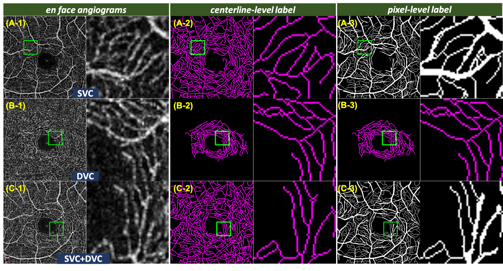
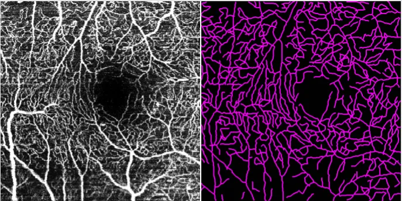
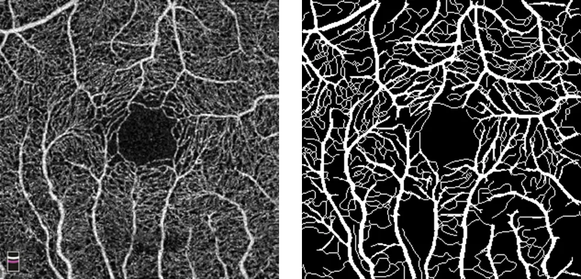

# ROSE

<div align="center">
    <a href="https://github.com/openmedlab/"></a>
</div>
<p style="text-align:center;font-size:10px;"><em></em></p>

## Dataset Information

The ROSE (**R**etinal **O**CT-Angiography vessel **SE**gmentation) dataset is an open-source OCTA retinal blood vessel segmentation dataset, comprising two sub-datasets: ROSE-1 and ROSE-2.

The ROSE-1 dataset includes 117 OCTA images from 39 subjects (26 Alzheimer's patients and 13 healthy subjects). The dataset is divided into 90 images for training and 27 images for testing. Each subject has en face (horizontal cross-sectional) angiograms of the superficial vascular complex (SVC), deep vascular complex (DVC), and the inner retinal vascular plexuses containing both SVC and DVC. The scanning area is a 3×3 square millimeter region centered around the fovea, with an image resolution of 304×304 pixels. ROSE-1 provides two different types of vascular annotations: **centerline-level annotations and pixel-level annotations**.

The ROSE-2 dataset contains a total of 112 OCT-A images, with 90 for training and 22 for testing. All images in this dataset are en face angiograms of the SVC within a 3×3 square millimeter area centered around the fovea. Only centerline-level annotations are provided.

Retinal vascular changes can assess disease and treatment effectiveness, especially in the foveal region - the part of the retina responsible for sharp central vision. Traditional color fundus photography struggles to capture the subtle vessels around the fovea, while methods like fluorescein angiography, though detailed, carry invasive risks. Optical Coherence Tomography Angiography (OCTA), as a safe technology, provides high-resolution images of the vasculature in the foveal region, essential for the early diagnosis of retinal diseases. Changes revealed by OCTA are also related to neurodegenerative diseases such as Alzheimer's disease, making it a powerful tool for researching and monitoring these conditions.

## Dataset Meta Information

| Dimensions | Modality | Task Type | Anatomical Structures | Anatomical Area | Number of Categories | Data Volume | File Format |
|------------|----------|-----------|-----------------------|-----------------|----------------------|-------------|-------------|
| 2D         | OCTA     | Segmentation | Fundus Vessel         | Fundus          | 1                    | 229         | .png .tif         |


### Resolution Details

The image size for ROSE-1 is 304×304.

The image size for ROSE-2 is 512×512.

## Label Information Statistics

### ROSE-1

| Category          | Retinal Vessel |
|-------------------|----------------|
| Number of Images  | 117            |
| Availability      | 100%           |
| Small Vessel Count| 225            |
| Medium Vessel Count| 15928         |
| Large Vessel Count| 22627         |

### ROSE-2

| Category          | Retinal Vessel |
|-------------------|--------------|
| Number of Images  | 112          |
| Availability      | 100%         |
| Small Vessel Count| 4218         |
| Medium Vessel Count| 19792        |
| Large Vessel Count| 39159        |

## Visualization

<div align="center">
    <a href="https://github.com/openmedlab/"></a>
</div>
<p style="text-align:center;font-size:10px;"><em> Paper Visualization: Annotations of the ROSE-1 Dataset</em></p>

<div align="center">
    <a href="https://github.com/openmedlab/"></a>
</div>
<p style="text-align:center;font-size:10px;"><em> Paper Visualization: Annotations of the ROSE-2 Dataset</em></p>

<div align="center">
    <a href="https://github.com/openmedlab/"></a>
</div>
<p style="text-align:center;font-size:10px;"><em> Local Visualization: Visualization of ROSE-1 Images and Annotations.</em></p>

<div align="center">
    <a href="https://github.com/openmedlab/"></a>
</div>
<p style="text-align:center;font-size:10px;"><em> Local Visualization: Visualization of ROSE-2 Images and Annotations.</em></p>

## File Structure

The file structure of the ROSE dataset is as follows, divided into two sub-datasets: `ROSE-1` and `ROSE-2`. Each sub-dataset provides `train` and `test` folders, with each folder offering `img` and `gt`.

``` 
data
├── ROSE-1
│   ├── DVC
│   │   ├── test
│   │   │   ├── gt
│   │   │   └── img
│   │   └── train
│   │       ├── gt
│   │       └── img
│   ├── SVC
│   │   ├── test
│   │   │   ├── gt
│   │   │   └── img
│   │   └── train
│   │       ├── gt
│   │       └── img
│   └── SVC_DVC
│       ├── test
│       │   ├── gt
│       │   └── img
│       └── train
│           ├── gt
│           └── img
└── ROSE-2
    ├── test
    │   ├── gt
    │   └── original
    └── train
        ├── gt
        └── original
```

## Authors and Institutions

Yitian Zhao (Medical and Ophthalmic Imaging Team, Ningbo Institute of Industrial Technology)


## Source Information

Official Website: https://imed.nimte.ac.cn/dataofrose.html

Download Link: https://imed.nimte.ac.cn/dataofrose.html

Article Address: https://arxiv.org/pdf/2007.05201.pdf

Publication Date: 2020

## Citation

``` 
article{ma2021rose:,
  title={ROSE: a retinal OCT-angiography vessel segmentation dataset and new model},
  author={Ma, Yuhui and Hao, Huaying and Xie, Jianyang and Fu, Huazhu and Zhang, Jiong and Yang, Jianlong and Wang, Zhen and Liu, Jiang and Zheng, Yalin and Zhao, Yitian},
  journal={IEEE Transactions on Medical Imaging},
  year={2021},
  volume={40},
  number={3},
  pages={928--939},
  doi={10.1109/TMI.2020.3042802},
  publisher={IEEE}
}
```

Original introduction article is [here](https://zhuanlan.zhihu.com/p/670025254).