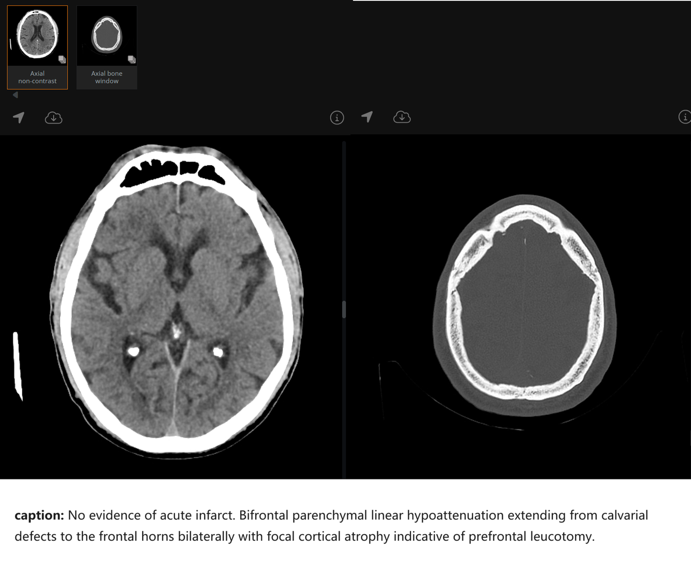
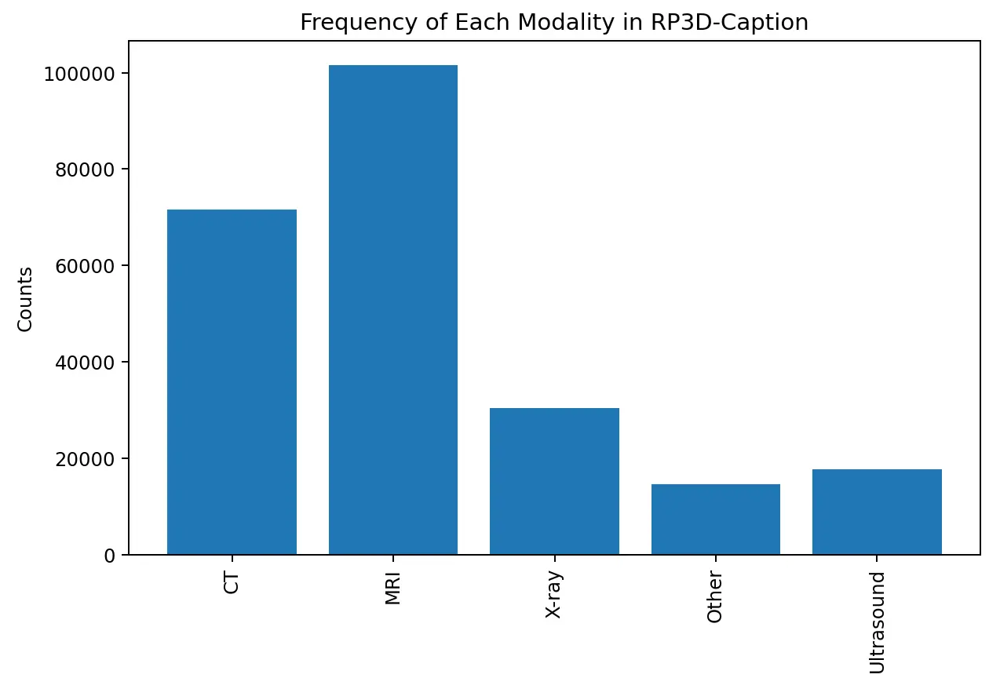
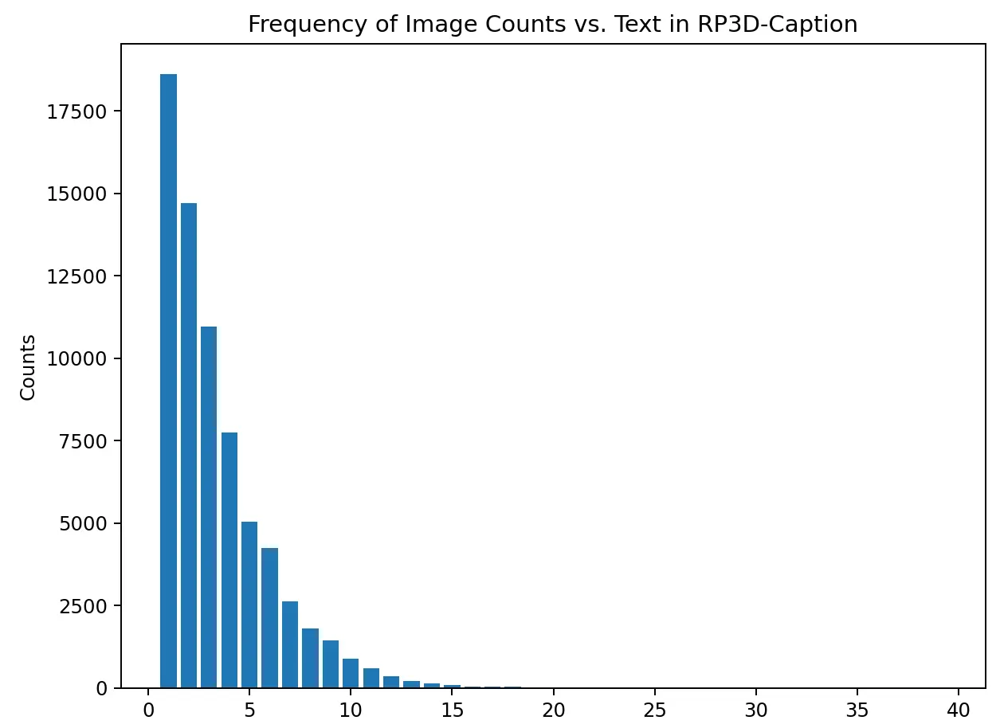
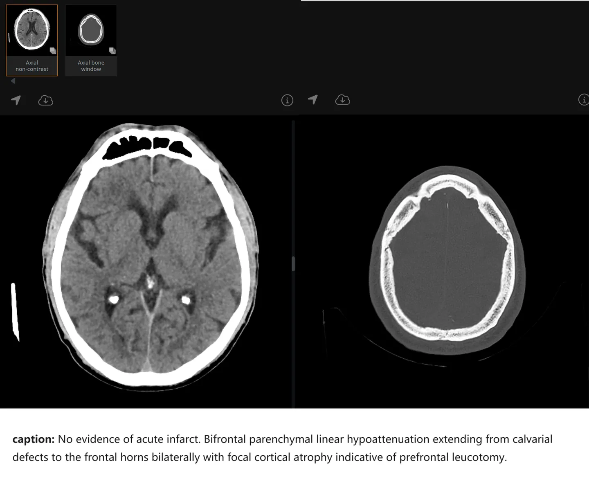

# RP3D-Caption

<div align="center">
    <a href="https://github.com/openmedlab/"></a>
</div>
<p style="text-align:center;font-size:10px;"><em></em></p>

## Dataset Information

RP3D-Caption is one of the datasets used for training and evaluation of the medical foundational model RadFM, which is a part of the RP3D (RadioPaedia 3D) dataset. The RP3D dataset consists of four subsets: Caption, VQA, Rationale, and Modality, all sharing the same source of data from Radiopaedia, a medical imaging teaching website featuring 3D radiographic images uploaded by doctors along with descriptive introductions. The content of RP3D-Caption introduced here consists of image-text pairs, where multiple 3D medical images of the same patient (often from different angles or modalities) correspond to one caption (a general description of the condition). This format includes the 3D imaging data of a complete case and the general information about the condition, which is suitable for injecting medical knowledge into multimodal models.

Just as CLIP did with web-scale image-text pairs for natural images, training models with such pairs, whether solely for image-text pre-training or other training approaches, can potentially create foundational models of significant utility for the AI field. However, there is always a magnitude difference in the scale of data between 3D and 2D image-text pairs. On the other hand, the size of 3D images in RP3D-Caption is larger (for example, 300x512x512), indicating a complexity and volume of image information that far exceeds that of 2D image-text pairs. Although RP3D-Caption, due to its source, has been reviewed by professional physicians and thus is of good quality, the relatively small scale of the dataset and the relative difficulty and complexity of medical knowledge, compared to natural images, still pose questions about how effective the models will be. This requires further exploration and discussion, and the significance of such research is also worthy of attention. Researchers are encouraged to delve into and explore this area.

## Dataset Meta Information

| Task Type | Language       | Train | Val | Test | File Format | Size   |
|-----------|----------------|-------|-----|------|-------------|--------|
| caption       | English | 66085  | -   | 3438 | .json       | 400GB+ |

## Dataset Information Statistics

<div align="center">
    <a href="https://github.com/openmedlab/"></a>
</div>
<p style="text-align:center;font-size:10px;"><em> Modality statistics.</em></p>

The specific modality statistics are as shown above. It can be seen that the data is primarily composed of two modalities, CT and MRI, followed by X-ray, then Ultrasound, and finally various other modalities. This distribution also corresponds to some extent with the frequency of use of various modalities in clinical settings for 3D medical imaging.

<div align="center">
    <a href="https://github.com/openmedlab/"></a>
</div>
<p style="text-align:center;font-size:10px;"><em></em></p>

Another point worth noting is that, compared to other image-text pair datasets, the RP3D-Caption follows a pattern of multiple images corresponding to one caption. We also plotted a distribution graph to illustrate the distribution of the number of images per caption. From the graph, we can see that the vast majority of cases have five or fewer images; however, surprisingly, there is still a considerable portion of data with 5-10 images, and the maximum even has a situation where 39 images correspond to one caption, which can be said to be quite a stark contrast.

## Dataset Example

<div align="center">
    <a href="https://github.com/openmedlab/"></a>
</div>
<p style="text-align:center;font-size:10px;"><em></em></p>

As shown in the data example above, this case includes 2 3D images plus a text caption describing the condition.

## File Structure

The dataset file structure is as follows: there are JSON files related to text descriptions (divided into train/test), and image files are separately divided into 20 ZIP files, among which folder1 and folder2 are further divided into individual sub-compressed volumes due to their large size.

``` 
├── subfolder1.zip
├── subfolder1.z01
├── subfolder1.z02
├── subfolder1.z03
├── subfolder2.zip
├── subfolder2.z01
├── subfolder2.z02
├── folder3.zip
├── ...
├── folder20.zip
├── radiology_test.json (from huggingface)
├── radiology_train.json (from huggingface)
```

## Authors and Institutions

Chaoyi Wu (Shanghai Jiaotong University, Shanghai AI Lab)

Xiaoman Zhang (Shanghai Jiaotong University, Shanghai AI Lab)

Ya Zhang (Shanghai Jiaotong University, Shanghai AI Lab)

Yanfeng Wang (Shanghai Jiaotong University, Shanghai AI Lab)

Weidi Xie (Shanghai Jiaotong University, Shanghai AI Lab)


## Source Information

Official Website: https://chaoyi-wu.github.io/RadFM/

Download Link: https://pan.baidu.com/s/1E_uSoCLm5H66a7KkpRfi1g?pwd=urfg#list/path=%2Fsharelink1453268354-263138785675996%2FRad&parentPath=%2Fsharelink1453268354-263138785675996

Article Address: https://arxiv.org/abs/2308.02463

Publication Date: 2023/11/16

## Citation

``` 
@arxiv{wu2023generalist,
      title={Towards Generalist Foundation Model for Radiology}, 
      author={Chaoyi Wu and Xiaoman Zhang and Ya Zhang and Yanfeng Wang and Weidi Xie},
      year={2023},journal={arXiv preprint arXiv:2308.02463},
}
```

Original introduction article is [here](https://zhuanlan.zhihu.com/p/681308770).