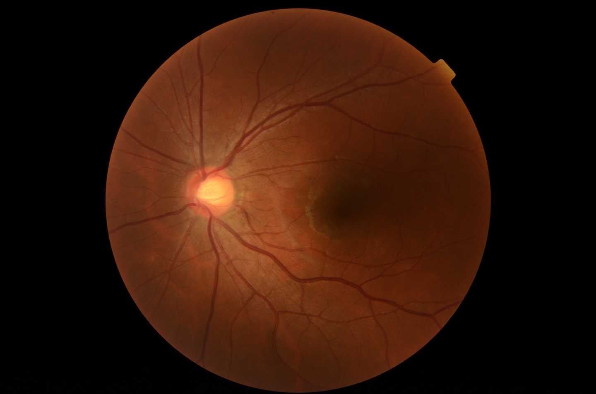
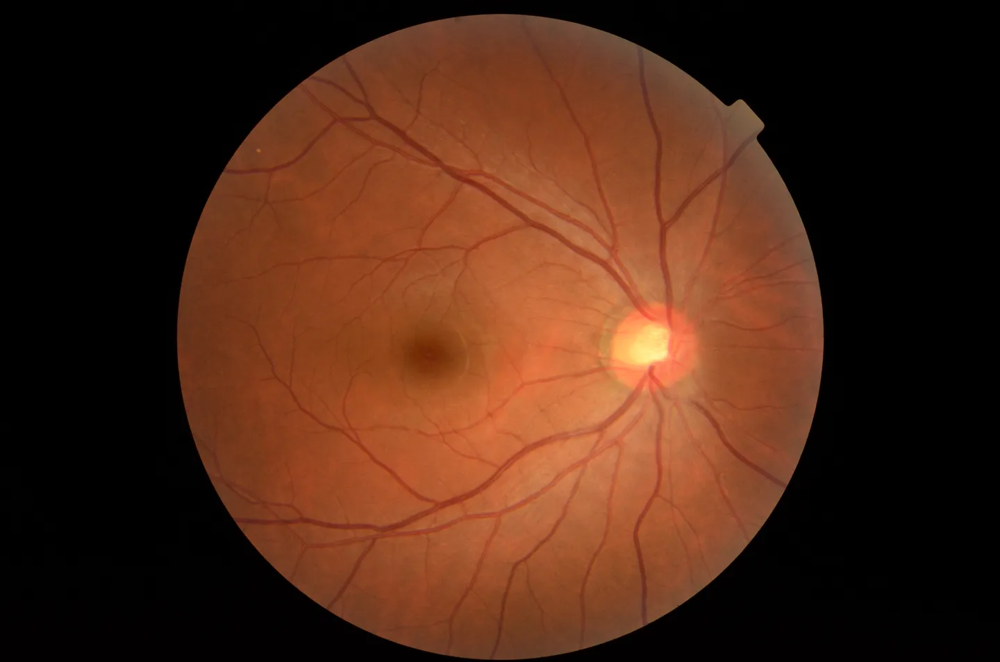
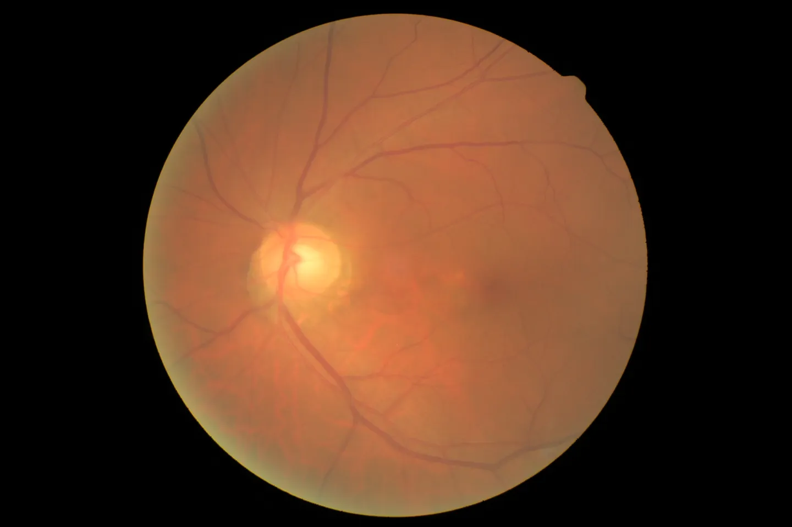
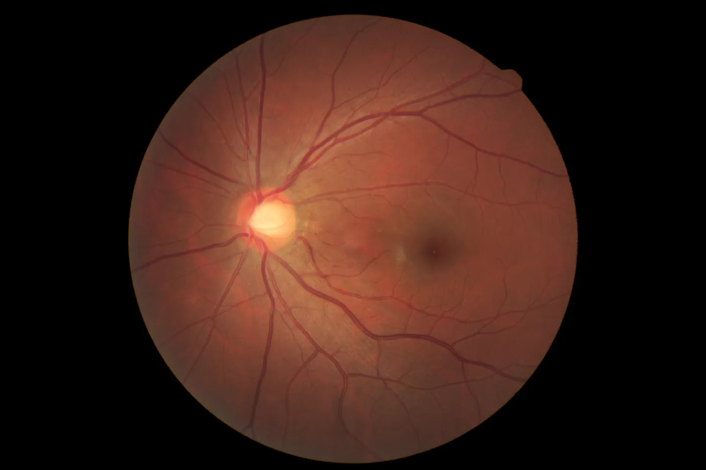
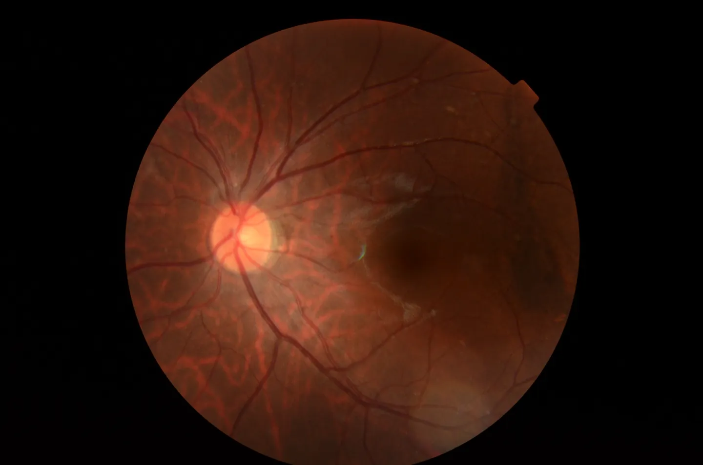

# Retina

<div align="center">
    <a href="https://github.com/openmedlab/"></a>
</div>
<p style="text-align:center;font-size:10px;"><em> ITK-SNAP Visualization.</em></p>

## Dataset Information

The Retina dataset contains 601 retinal fundus images involving 4 categories, which are 300 normal images, 100 cataract images, 101 glaucoma images, and 100 retina disease images. Every year, a significant number of people worldwide are diagnosed with vision impairments, including millions with retinal diseases alone. As global aging intensifies, this population with vision impairments is expected to grow, with glaucoma, cataract, and retinal diseases being the most common types of vision disorders. In recent years, artificial intelligence technologies, represented by deep learning algorithms, have been actively advancing the field of medical imaging. The authors hope that the Retina dataset can assist researchers in developing models and software for the identification of vision impairment diseases based on retinal fundus images, aiding doctors in the rapid and accurate diagnosis and analysis of treatment effectiveness.

## Dataset Meta Information

| Dimensions | Modality | Task Type      | Anatomical Structures | Anatomical Area | Number of Categories | Data Volume | File Format |
|------------|----------|----------------|-----------------------|-----------------|----------------------|-------------|-------------|
| 2D         | Fundus photography       | Classification | Retina                | Eye             | 4                    | 601         | .png        |


### Resolution Details

| Dataset Statistics | size         |
|--------------------|--------------|
| min                | [1848,1224]  |
| median             | [2592,1728]  |
| max                | [2592,1728]  |

## Label Information Statistics

| Category       | Number of Images |
|----------------|------------------|
| Normal         | 300              |
| Cataract       | 100              |
| Glaucoma       | 101              |
| Retina Disease | 100              |

## Visualization

<div align="center">
    <a href="https://github.com/openmedlab/"></a>
</div>
<p style="text-align:center;font-size:10px;"><em> Normal example.</em></p>

<div align="center">
    <a href="https://github.com/openmedlab/"></a>
</div>
<p style="text-align:center;font-size:10px;"><em> Cataract example.</em></p>

<div align="center">
    <a href="https://github.com/openmedlab/"></a>
</div>
<p style="text-align:center;font-size:10px;"><em> Glaucoma example.</em></p>

<div align="center">
    <a href="https://github.com/openmedlab/"></a>
</div>
<p style="text-align:center;font-size:10px;"><em> Retina Disease example.</em></p>

## File Structure

The file structure of the dataset is as follows, containing a README.md file and a folder with four categories of images.

``` 
Retina Dataset
├── dataset
│   ├── 1_normal
│   │   ├── NL_001.png
│   │   ├── NL_002.png
│   │   ├── ...
│   ├── 2_cataract
│   │   ├── cataract_001.png
│   │   ├── cataract_002.png
│   │   ├── ...
│   ├── 3_glaucoma
│   │   ├── Glaucoma_001.png
│   │   ├── Glaucoma_002.png
│   │   ├── ...
│   ├── 4_retina_disease
│   │   ├── Retina_001.png
│   │   ├── Retina_002.png
│   │   ├── ...
│   ├── ...
├── README.md
```

## Authors and Institutions

yiweichen04 （github user）


## Source Information

Official Website: TBD

Download Link: TBD

Article Address: TBD

Publication Date: TBD

## Citation

``` 
@misc{ Retina,
title= { Retina_Dataset},
author= { yiweichen04 },
url= { https://github.com/yiweichen04/retina_dataset },
year = { 2016 },
}
```

Original introduction article is [here](https://zhuanlan.zhihu.com/p/684542743).