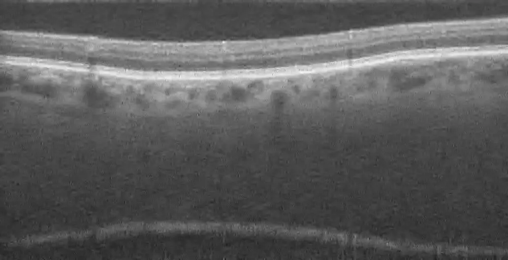
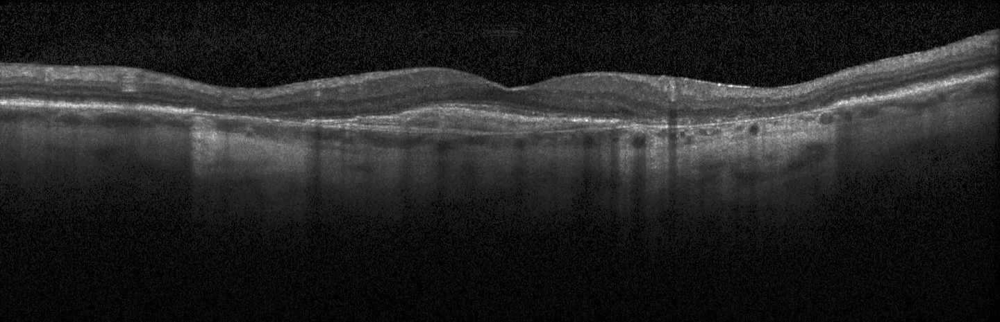
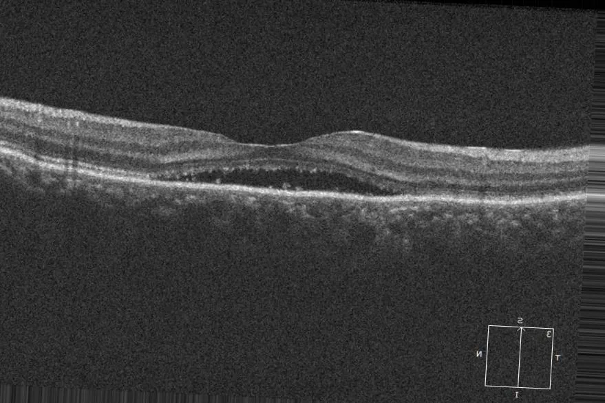
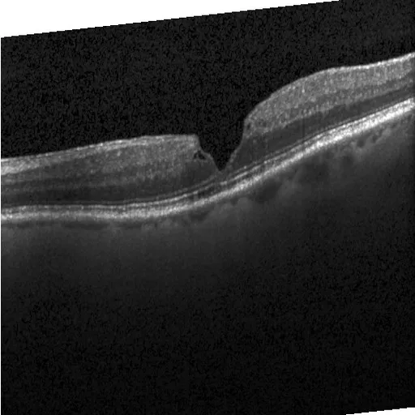
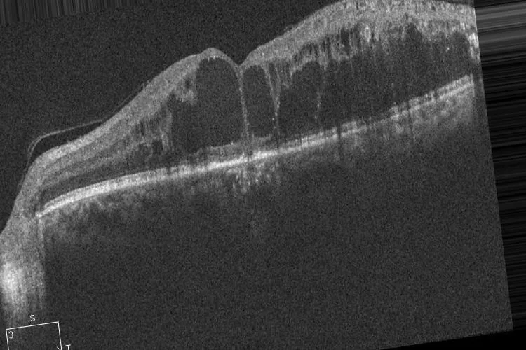
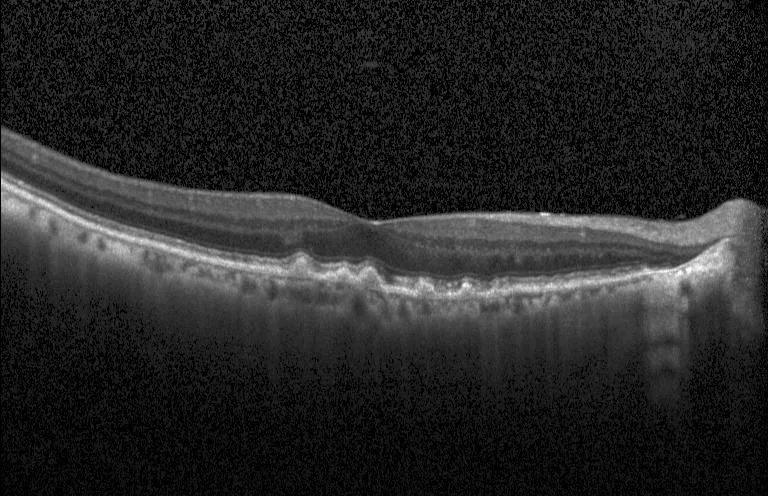
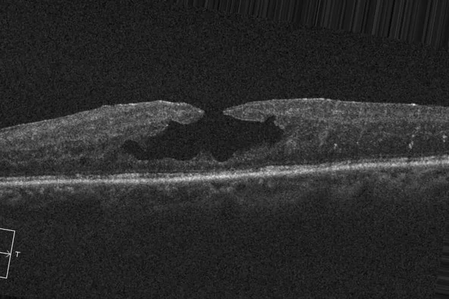

# Retinal OCT-C8

<div align="center">
    <a href="https://github.com/openmedlab/"></a>
</div>
<p style="text-align:center;font-size:10px;"><em></em></p>

## Dataset Information

The **Retinal OCT-C8** dataset contains 24,000 two-dimensional OCT images, covering 8 categories, namely Age-related Macular Degeneration (AMD), Choroidal Neovascularization (CNV), Central Serous Retinopathy (CSR), Diabetic Macular Edema (DME), Macular Hole (MH), Drusen, Diabetic Retinopathy (DR), and Normal. The dataset is pre-divided into three subsets for training, validation, and testing to facilitate the training of deep learning models, with image counts of 18,400, 2,800, and 2,800, respectively. Every year, millions of people worldwide are diagnosed with retinal diseases. These retinal diseases can damage any part of the retina and ultimately lead to vision impairment or even blindness. Optical Coherence Tomography (OCT) is a high-resolution, non-invasive diagnostic technique that can collect cross-sectional images of the retina, assisting doctors in analyzing and determining the retinal layers affected by lesions and choosing appropriate treatment plans. Traditional image processing methods can achieve an accuracy of 91% in identifying retinal diseases. In recent years, artificial intelligence technologies, represented by deep learning algorithms, are actively promoting the development of the medical imaging field. The authors hope that more researchers can utilize this dataset to develop retinal disease models based on deep learning technology with higher recognition levels, helping doctors to provide treatment plans more quickly and effectively, allowing patients to recover as soon as possible.

## Dataset Meta Information

| Dimensions | Modality | Task Type      | Anatomical Structures | Anatomical Area | Number of Categories | Data Volume | File Format |
|------------|---------|----------------|-----------------------|-----------------|----------------------|-------------|-------------|
| 2D         | OCT     | Classification | Tissue                | Retinal         | 8                    | 24000       | .jpg        |


### Resolution Details

| Dataset Statistics | size          |
|--------------------|---------------|
| min                | [384,496]  |
| median             | [750,500]  |
| max                | [1536,496]  |

## Label Information Statistics

| Category                   | train | val | test |
|----------------------------|-------|-----|------|
| Age-related Macular Degeneration (AMD) | 2300  | 350 | 350  |
| Choroidal Neovascularization (CNV)     | 2300  | 350 | 350  |
| Central Serous Retinopathy (CSR)       | 2300  | 350 | 350  |
| Diabetic Macular Edema (DME)           | 2300  | 350 | 350  |
| Macular Hole (MH)                      | 2300  | 350 | 350  |
| Drusen                                 | 2300  | 350 | 350  |
| Diabetic Retinopathy (DR)              | 2300  | 350 | 350  |
| Normal                                 | 2300  | 350 | 350  |

## Visualization

<div align="center">
    <a href="https://github.com/openmedlab/"></a>
</div>
<p style="text-align:center;font-size:10px;"><em> Age-related Macular Degeneration Example Image.</em></p>


<div align="center">
    <a href="https://github.com/openmedlab/"></a>
</div>
<p style="text-align:center;font-size:10px;"><em> Choroidal Neovascularization Example Image.</em></p>

<div align="center">
    <a href="https://github.com/openmedlab/"></a>
</div>
<p style="text-align:center;font-size:10px;"><em> Central Serous Retinopathy Example Image.</em></p>

<div align="center">
    <a href="https://github.com/openmedlab/"></a>
</div>
<p style="text-align:center;font-size:10px;"><em> Diabetic Macular Edema Example Image.</em></p>

<div align="center">
    <a href="https://github.com/openmedlab/"></a>
</div>
<p style="text-align:center;font-size:10px;"><em> Diabetic Retinopathy Example Image.</em></p>

<div align="center">
    <a href="https://github.com/openmedlab/"></a>
</div>
<p style="text-align:center;font-size:10px;"><em> Choroidal Drusen Example Image.</em></p>

<div align="center">
    <a href="https://github.com/openmedlab/"></a>
</div>
<p style="text-align:center;font-size:10px;"><em> Macular Hole Example Image.</em></p>

<div align="center">
    <a href="https://github.com/openmedlab/"></a>
</div>
<p style="text-align:center;font-size:10px;"><em> Normal Example Image.</em></p>
## File Structure

The file structure of the dataset is as follows: it includes `train`, `val`, and `test` folders, with each folder containing 8 subfolders. Each subfolder stores images of the corresponding category.

``` 
Retinal OCT-C8 Dataset
├── test
│   ├── AMD
│   │   ├── amd_test_1001.jpg
│   │   ├── amd_test_1002.jpg
│   │   ├── ...
│   ├── CNV
│   │   ├── cnv_test_1001.jpg
│   │   ├── cnv_test_1002.jpg
│   │   ├── ...
│   ├── ...
├── train
│   ├── AMD
│   │   ├── amd_train_1001.jpg
│   │   ├── amd_train_1002.jpg
│   │   ├── ...
│   ├── CNV
│   │   ├── cnv_train_1001.jpg
│   │   ├── cnv_train_1002.jpg
│   │   ├── ...
│   ├── ...
├── val
│   ├── AMD
│   │   ├── amd_val_1001.jpg
│   │   ├── amd_val_1002.jpg
│   │   ├── ...
│   ├── CNV
│   │   ├── cnv_val_1001.jpg
│   │   ├── cnv_val_1002.jpg
│   │   ├── ...
│   ├── ...
```

## Authors and Institutions

Malliga Subramanian（Kongu Engineering College, India）

Kogilavani Shanmugavadivel（Kongu Engineering College, India）

Obuli Sai Naren（Kongu Engineering College, India）

K Premkumar（Kongu Engineering College, India）

K Rankish（Kongu Engineering College, India）


## Source Information

Official Website: https://www.kaggle.com/datasets/obulisainaren/retinal-oct-c8

Download Link: https://www.kaggle.com/datasets/obulisainaren/retinal-oct-c8

Article Address: https://ieeexplore.ieee.org/abstract/document/9740985

Publication Date: 2022-01-25

## Citation

``` 
@INPROCEEDINGS{9740985,
  author={Subramanian, Malliga and Shanmugavadivel, Kogilavani and Naren, Obuli Sai and Premkumar, K and Rankish, K},
  booktitle={2022 International Conference on Computer Communication and Informatics (ICCCI)}, 
  title={Classification of Retinal OCT Images Using Deep Learning}, 
  year={2022},
  volume={},
  number={},
  pages={1-7},
  doi={10.1109/ICCCI54379.2022.9740985}}
```

Original introduction article is [here](https://zhuanlan.zhihu.com/p/676865930).