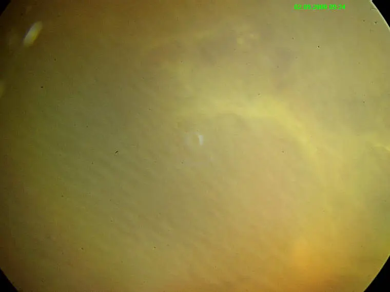
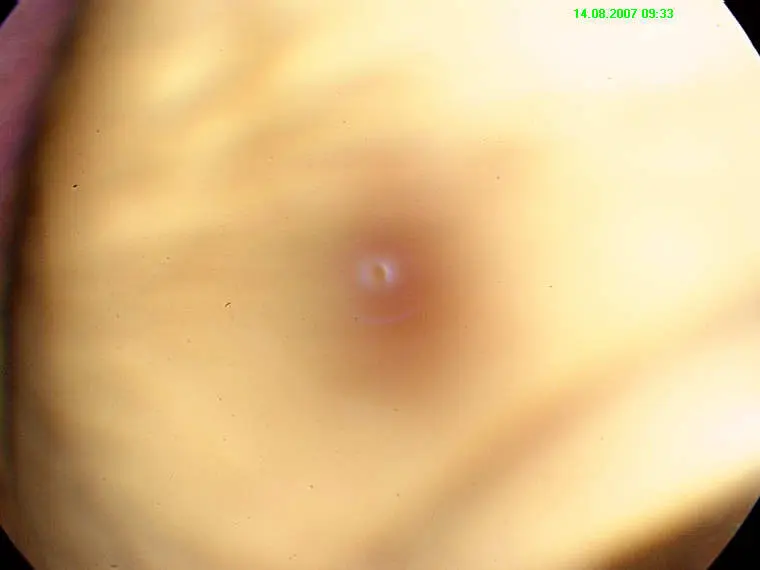

# Retinal image quality assessment dataset

<div align="center">
    <a href="https://github.com/openmedlab/"></a>
</div>
<p style="text-align:center;font-size:10px;"><em></em></p>

## Dataset Information

The Retinal Image Quality Assessment (IQA) dataset encompasses 216 categorically precise retinal images, which are subdivided into three quality categories: 125 images are rated as high quality (good), 69 images as low quality (bad), and 22 images are marked as outliers. IQA plays a crucial role in ensuring that automatic retinal image analysis systems can accurately diagnose diseases. In fact, a precise input image quality assessment mechanism is a core component of any efficient retinal image automatic analysis system. To advance the research and development of retinal image quality assessment algorithms and promote their integration into related applications, the authors have specifically constructed this dataset.

Retinal image quality assessment is not only vital for the efficacy of automatic retinal image analysis systems in accurately diagnosing and monitoring retinal diseases but also has a decisive impact on ensuring the accuracy of diagnoses. High-quality retinal images are key to the precise identification and classification of retinal lesions (such as diabetic retinopathy, glaucoma, and age-related macular degeneration). Insufficient image quality may interfere with the judgment of analysis systems, thereby increasing the risk of misdiagnosis or missed diagnosis. By ensuring image quality, IQA can enhance the effectiveness of early disease detection and treatment, playing a key role in the management of patients' visual health and improving prognosis. Moreover, it provides doctors with more reliable data support, facilitating more accurate diagnostic and treatment decisions, thus playing an indispensable role in the management and research of retinal diseases.

## Dataset Meta Information

| Dimensions | Modality | Task Type      | Anatomical Structures | Anatomical Areas | Number of Categories | Data Volume | File Format |
|------------|----------|----------------|-----------------------|------------------|----------------------|-------------|-------------|
| 2D         | fundus photography   | Classification | Retinal | Eye              | 3                    | 216         | .jpg        |


### Resolution Details

| Dataset Statistics | size        |
|--------------------|-------------|
| min                | [760,570]  |
| median             | [760,570]  |
| max                | [760,570]  |

## Label Information Statistics

| Category | Number |
|----------|--------|
| Good     | 125    |
| Bad      | 69     |
| Outlier  | 22     |

## Visualization

<div align="center">
    <a href="https://github.com/openmedlab/"></a>
</div>
<p style="text-align:center;font-size:10px;"><em> Example image classified as good imaging quality.</em></p>

<div align="center">
    <a href="https://github.com/openmedlab/"></a>
</div>
<p style="text-align:center;font-size:10px;"><em> Example image classified as bad imaging quality.</em></p>

<div align="center">
    <a href="https://github.com/openmedlab/"></a>
</div>
<p style="text-align:center;font-size:10px;"><em> Example image classified as outlier imaging quality.</em></p>

## File Structure

The file structure of the dataset is as follows, containing folders that hold images of 3 categories.

```
DRIMDB dataset
├── Bad
│   ├── drimdb_bad (1).jpg
│   ├── drimdb_bad (2).jpg
│   │    ...
├── Good
│   ├── drimdb_good (1).jpg
│   ├── drimdb_good (2).jpg
│   │    ...
├── Outlier
│   ├── drimdb_outlier (1).jpg
│   ├── drimdb_outlier (2).jpg
│   │    ...
```

## Authors and Institutions

Uğur Şevik（Karadeniz Technical University, Turkey）

Cemal Köse（Karadeniz Technical University, Turkey）

Tolga Berber（Karadeniz Technical University, Turkey）

Hidayet Erdöl（Karadeniz Technical University, Turkey）


## Source Information

Official Website: http://academictorrents.com/details/99811ba62918f8e73791d21be29dcc372d660305

Download Link: http://academictorrents.com/details/99811ba62918f8e73791d21be29dcc372d660305, https://www.heywhale.com/mw/dataset/5e95d871e7ec38002d034efe/file

Article Address: https://pubmed.ncbi.nlm.nih.gov/24718384/

Publication Date: 2014-04-19

## Citation

``` 
@article{2014Identification,
  title={Identification of suitable fundus images using automated quality assessment methods},
  author={ Sevik, Ugur  and  K?Se, Cemal  and  Berber, Tolga  and  Erd?L, Hidayet },
  journal={Journal of Biomedical Optics},
  volume={19},
  number={4},
  pages={46006},
  year={2014},
}
```

Original introduction article is [here](https://zhuanlan.zhihu.com/p/679104506).