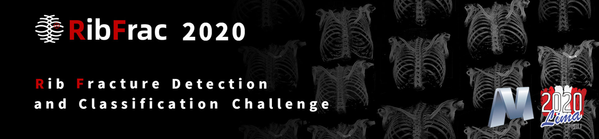
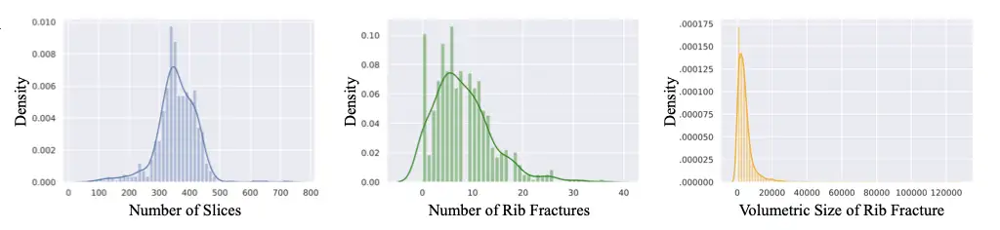
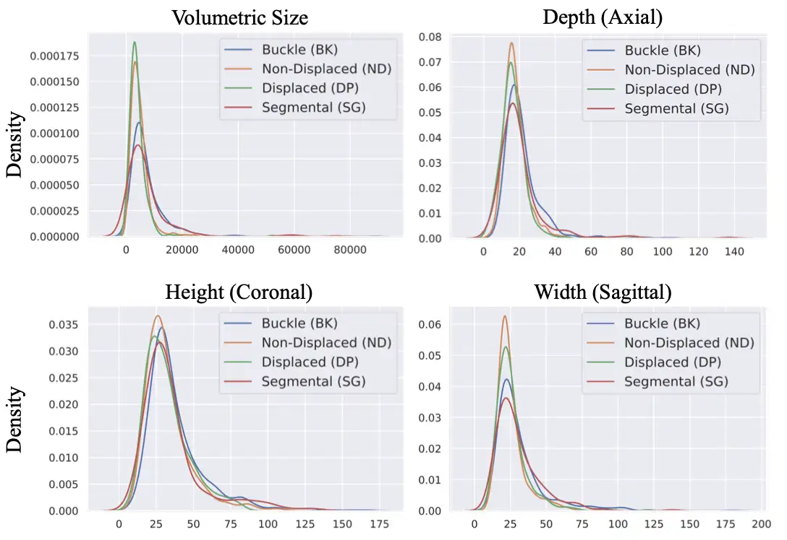
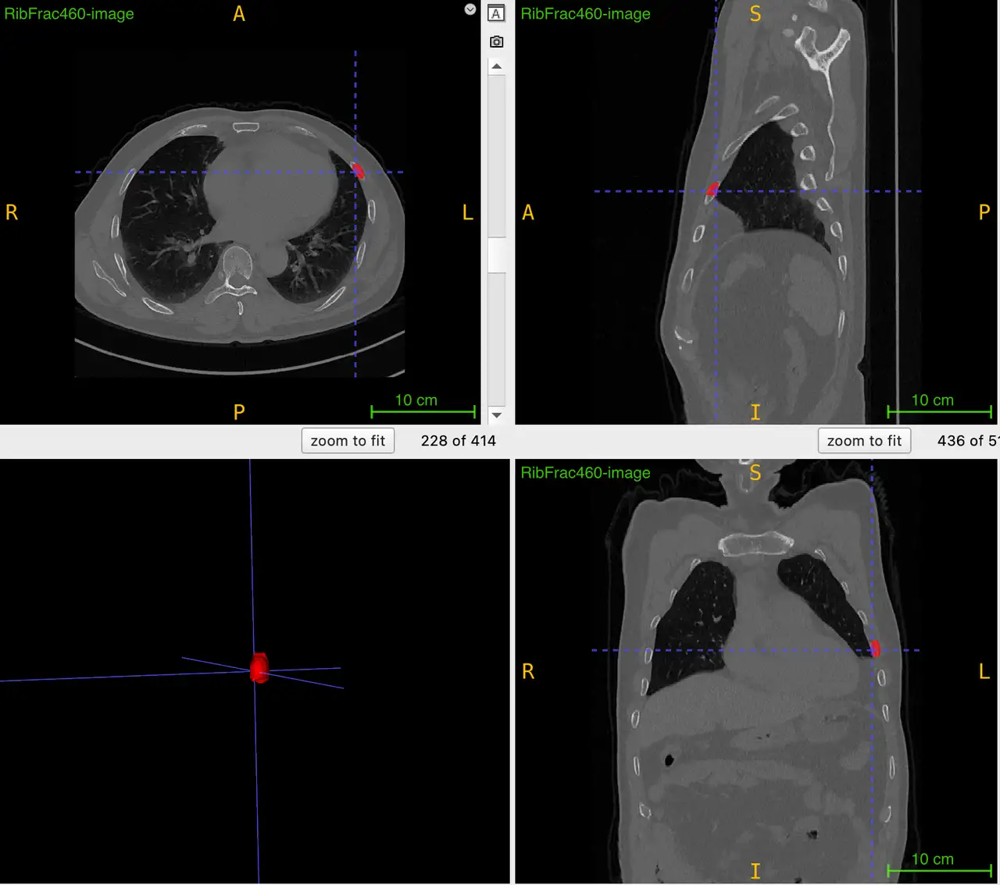
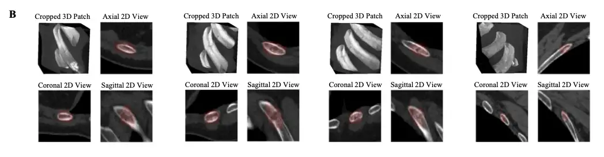

# RibFrac 2020

<div align="center">
    <a href="https://github.com/openmedlab/"></a>
</div>
<p style="text-align:center;font-size:10px;"><em></em></p>

## Dataset Information

The RibFrac 2020 (Rib Fracture Detection and Classification Challenge) dataset is a large-scale CT image dataset for rib fractures. The dataset contains approximately 5000 rib fractures from 660 CT images, including 420 training CTs (all with fractures), 80 validation CTs (20 of which are without fractures), and 160 evaluation CTs. Both the training and validation sets provide images and annotations, while the test set provides only images. Each annotation includes a pixel-level mask of the rib fracture area (for detection) and a classification into one of four types.

The four types of fractures are: Buckle fracture, typically occurring in children, where the bone partially collapses or compresses but does not completely break; Nondisplaced fracture, where the bone is completely fractured but the ends remain aligned without noticeable displacement; Displaced fracture, where the fracture ends are completely separated and misaligned, discontinuing the bone continuity; Segmental fracture, where two or more fractures occur on the same bone with an intact section of bone between them, forming an independent "fracture segment." Diagnosing rib fractures is a crucial and common task in clinical practice, forensic medicine, and several commercial contexts (such as insurance claims).

## Dataset Meta Information

| Dimensions | Modality | Task Type                 | Anatomical Structures          | Anatomical Area | Number of Categories | Data Volume | File Format |
|------------|----------|---------------------------|--------------------------------|-----------------|----------------------|-------------|-------------|
| 3D         | CT       | Detection, Classification | Rib fractures | Chest           | 4                    | 660         | .nii.gz     |


### Resolution Details

| Dataset Statistics | spacing (mm)             | size            |
|--------------------|--------------------------|-----------------|
| min                | (0.56, 0.56, 0.63)       | (512, 512, 74)  |
| median             | (0.74, 0.74, 1.25)       | (512, 512, 357) |
| max                | (0.98, 0.98, 1.5)        | (512, 512, 721) |

Number of two-dimensional slices in the data set: 180,547

<div align="center">
    <a href="https://github.com/openmedlab/"></a>
</div>
<p style="text-align:center;font-size:10px;"><em></em></p>

## Label Information Statistics

| Label id | Type of Fracture                           | Incidence Count | Number of Affected Patients |
|----------|--------------------------------------------|-----------------|-----------------------------|
| 1        | Buckle fracture                            | 687 | 270 |
| 2        | Nondisplaced fracture                      | 630 | 246 |
| 3        | Displaced fracture                         | 321 | 152 |
| 4        | Segmental fracture                         | 209 | 76 |
| -1       | Fracture that cannot be clearly identified | 2575 | 431 |

Note: `-1` is a rib fracture,  but we could not define its type due to ambiguity, diagnosis difficulty, etc. Ignore it in the classification task. 

<div align="center">
    <a href="https://github.com/openmedlab/"></a>
</div>
<p style="text-align:center;font-size:10px;"><em></em></p>

## Visualization

<div align="center">
    <a href="https://github.com/openmedlab/"></a>
</div>
<p style="text-align:center;font-size:10px;"><em>Local Visualization.</em></p>

<div align="center">
    <a href="https://github.com/openmedlab/"></a>
</div>
<p style="text-align:center;font-size:10px;"><em>Paper Visualization. Visualization of four rib fracture specimens. These four rib fracture samples are represented by volume rendering using cropped three-dimensional CT tiles (upper left corner). Axial (upper right), coronal (lower left) and sagittal (lower right) 2D images from the fracture center point are shown, as well as manually annotated voxel-level segmentation of rib fractures.</em></p>

## File Structure

The dataset structure includes a training set and a validation set, each containing image files, label files, and CSV files with related information neatly organized in corresponding directories. The CSV files contain category information corresponding to label values for each case.

``` 
RibFrac 2020
├── ribfrac-train-images
│   ├── RibFrac1-image.nii.gz
│   ├── RibFrac2-image.nii.gz
│   └── ...
│
├── ribfrac-train-info.csv
│
└── ribfrac-train-labels
    ├── RibFrac1-label.nii.gz
    ├── RibFrac2-label.nii.gz
    └── ...
│
├── ribfrac-val-images
│   ├── RibFrac421-image.nii.gz
│   ├── RibFrac422-image.nii.gz
│   └── ...
│
├── ribfrac-val-info.csv
│
└── ribfrac-val-labels
    ├── RibFrac421-label.nii.gz
    ├── RibFrac422-label.nii.gz
    └── ...
```

## Authors and Institutions

- Technical Team

Jiancheng Yang, Shanghai Jiao Tong University

Xiaoyang Huang, Shanghai Jiao Tong University

Kaiming Kuang, Dianei Technology

Jiajun Chen, Dianei Technology

Donglai Wei, Harvard University

Prof. Bingbing Ni, Shanghai Jiao Tong University

- Clinical Team

Liang Jin, Huadong Hospital Affiliated to Fudan University

Prof. Ming Li, Huadong Hospital Affiliated to Fudan University

## Source Information

Official Website: https://ribfrac.grand-challenge.org/

Download Link: https://ribfrac.grand-challenge.org/dataset/

Article Address: https://arxiv.org/pdf/2402.09372.pdf

Publication Date: 2020-06

## Citation

``` 
@article{ribfracchallenge2024,
    title={Deep Rib Fracture Instance Segmentation and Classification from CT on the RibFrac Challenge},
    author={Yang, Jiancheng and Shi, Rui and Jin, Liang and Huang, Xiaoyang and Kuang, Kaiming and Wei, Donglai and Gu, Shixuan and Liu, Jianying and Liu, Pengfei and Chai, Zhizhong and Xiao, Yongjie and Chen, Hao and Xu, Liming and Du, Bang and Yan, Xiangyi and Tang, Hao and Alessio, Adam and Holste, Gregory and Zhang, Jiapeng and Wang, Xiaoming and He, Jianye and Che, Lixuan and Pfister, Hanspeter and Li, Ming and Ni, Bingbing},
    journal={arXiv Preprint},
    year={2024}
} 

@article{ribfracclinical2020,
    title={Deep-Learning-Assisted Detection and Segmentation of Rib Fractures from CT Scans: Development and Validation of FracNet},
    author={Jin, Liang and Yang, Jiancheng and Kuang, Kaiming and Ni, Bingbing and Gao, Yiyi and Sun, Yingli and Gao, Pan and Ma, Weiling and Tan, Mingyu and Kang, Hui and Chen, Jiajun and Li, Ming},
    journal={eBioMedicine},
    year={2020},
    publisher={Elsevier}
}
```

Original introduction article is [here](https://zhuanlan.zhihu.com/p/692971968).