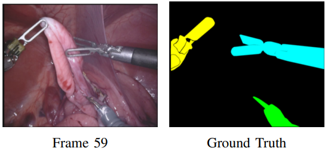
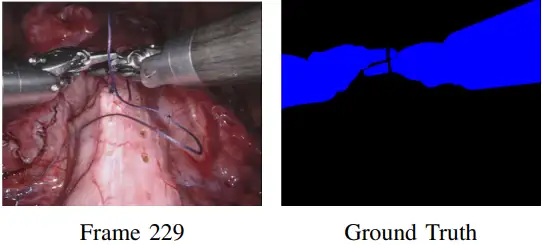

# Robotic Instrument Segmentation

<div align="center">
    <a href="https://github.com/openmedlab/"></a>
</div>
<p style="text-align:center;font-size:10px;"><em></em></p>

## Dataset Information

The Robotic Instrument Segmentation (RIS) dataset is a segmentation dataset for various surgical instruments used in the da Vinci surgical robotic system. The dataset includes structures of four types of surgical instruments to be segmented, including rods and forceps, common in endoscopic surgical scenarios. The training set contains eight segments, each with 225 frames of surgical videos involving robotic intervention, while the test set contains eight segments of 75 frames each and two segments of 300 frames each.

Surgical navigation systems rely on their understanding of complex intraoperative visual scenes, and accurate segmentation of surgical instruments is an important component. The da Vinci surgical robot is widely used in endoscopic surgery, and accurate instrument recognition algorithms can help improve the precision of the surgical system and increase the success rate of surgeries. This dataset supports the further development of more precise surgical robot systems.

## Dataset Meta Information

| Dimensions | Modality  | Task Type    | Anatomical Area   | Number of Categories | Data Volume(Slices) | File Format |
|------------|-----------|--------------|-------------------|----------------------|---------------------|-------------|
| 2D         | Endoscopy | Segmentation | Abdominal cavity  | 4                    | 3000                | .png        |


### Resolution Details

| Dataset Statistics | size      |
|--------------------|-----------|
| min                | 1920x1080 |
| median             | 1920x1080 |
| max                | 1920x1080 |

## Label Information Statistics

The number of occurrences and proportions of each category in the total 1800 frames of the training set were counted:

| Component             | Shaft  | Articulated Wrist  | Clasper  | Others  |
|-----------------------|--------|--------------------|----------|---------|
| Count                 | 1697   | 1721               | 1769     | 450     |
| Percentage            | 94.28% | 95.61%             | 98.28%   | 25.00%  |


## Visualization

The dataset provides annotation results of surgical instrument structures in each frame.

<div align="center">
    <a href="https://github.com/openmedlab/"></a>
</div>
<p style="text-align:center;font-size:10px;"><em></em></p>

<div align="center">
    <a href="https://github.com/openmedlab/"></a>
</div>
<p style="text-align:center;font-size:10px;"><em></em></p>

## File Structure

The file structure of this dataset is as follows, containing the image of each frame, camera correction information and mapping information.

``` 
Robotic_instrument_seg/
│
├── instrument_1_4_testing/
│   └── instrument_dataset_1/
│       └── left_frames/
│           ├── frame225.png
│           ├── frame226.png
│           ├── ...
│       └── right_frames/
│           ├── frame225.png
│           ├── frame226.png
│           ├── ...
│       └── camera_calibration.txt
│    └── ...
│    └── instrument_dataset_4
│  └──  mappings.json
│
├── instrument_1_4_training/
├── ...
```

## Authors and Institutions

M. Allan (Intuitive Surgical Inc., USA)

A. Shvets (Massachusetts Institute of Technology, USA)

T. Kurmann (University of Bern, Switzerland)

Z. Zhang (University of Alberta, Canada)

R. Duggal (Georgia Institute of Technology, USA)

Y.H. Su (University of Washington, USA)

N. Rieke (NVIDIA GmbH, Germany)

I. Laina (Technical University of Munich, Germany)

N. Kalavakonda (University of Alberta, Canada)

S. Bodenstedt (National Center for Tumor Diseases (NCT), Germany)

L.C. Garcia-Peraza-Herrera (Wellcome/EPSRC Centre for Interventional and Surgical Sciences (WEISS) UCL, UK)

W. Li (Lyft Inc., USA)

V. Iglovikov (Shenzhen Institute of Advanced Technology, China)

H. Luo (Beijing Institute of Technology, China)

J. Yang (Beijing Institute of Technology, China)

D. Stoyanov (Wellcome/EPSRC Centre for Interventional and Surgical Sciences (WEISS) UCL, UK)

L. Maier-Hein (German Cancer Research Center, Germany)

S. Speidel (National Center for Tumor Diseases (NCT), Germany)

M. Azizian (Intuitive Surgical Inc., USA)

## Source Information

Official Website: https://endovissub2017-roboticinstrumentsegmentation.grand-challenge.org/

Download Link: https://endovissub2017-roboticinstrumentsegmentation.grand-challenge.org/

Article Address: https://arxiv.org/pdf/1902.06426

Publication Date: 2017-08

## Citation

``` 
@article{allan20192017,
  title={2017 robotic instrument segmentation challenge},
  author={Allan, Max and Shvets, Alex and Kurmann, Thomas and Zhang, Zichen and Duggal, Rahul and Su, Yun-Hsuan and Rieke, Nicola and Laina, Iro and Kalavakonda, Niveditha and Bodenstedt, Sebastian and others},
  journal={arXiv preprint arXiv:1902.06426},
  year={2019}
}
```

Original introduction article is [here](https://zhuanlan.zhihu.com/p/696535440).