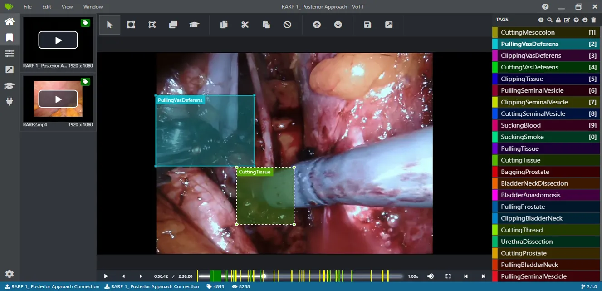
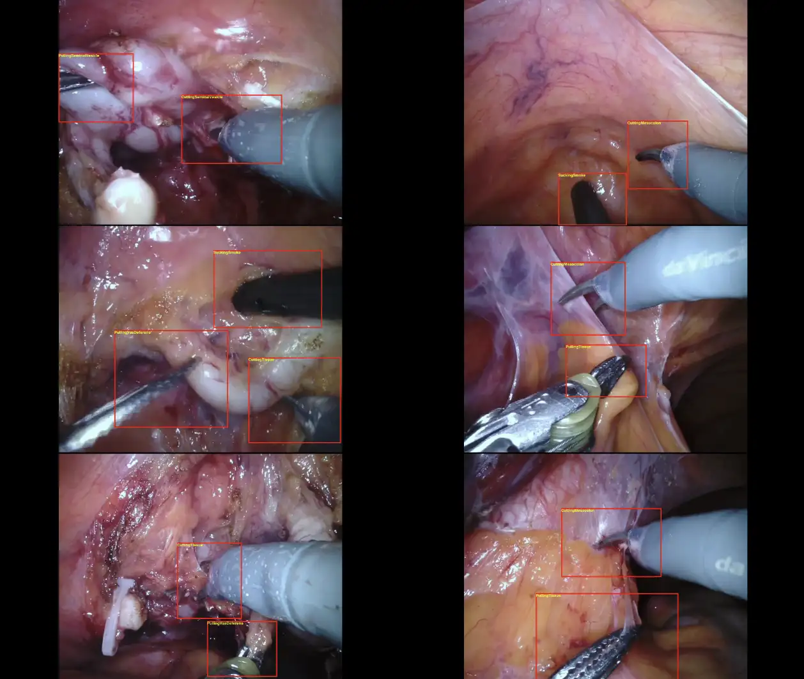

# SARAS-ESAD

<div align="center">
    <a href="https://github.com/openmedlab/"></a>
</div>
<p style="text-align:center;font-size:10px;"><em></em></p>

## Dataset Information

The SARAS-ESAD dataset is a dataset for robotic-assisted endoscopic surgical action recognition. It was a challenge in MIDL 2020. The dataset contains a total of 33,398 cases, with its training set providing 22,601 annotated frames, encompassing 28,055 action instances, and the validation set contains 4,574 frames with 7,133 action instances. The test data includes 6,223 annotated frames and 11,565 action instances.

The SARAS-ESAD data presents a challenge for action recognition and analysis in robotic-assisted surgeries, aiming to advance the automation and assistance technologies in robotic surgeries. With detailed action annotations and a variety of surgical scenarios, this dataset not only helps researchers develop and test new algorithms but also deepens our understanding of human-machine interaction patterns during complex surgical procedures. Moreover, it provides rich training material for machine learning models, aiding in improving the models' generalizability and operational precision. The ultimate goal is to enhance surgical efficiency and patient safety through technological advancements.

## Dataset Meta Information

| Dimensions | Modality | Task Type          | Anatomical Structure | Anatomical Area  | Number of Categories | Data Volume | File Format |
|------------|----------|--------------------|----------------------|------------------|----------------------|------------|-------------|
| 2D         | Endoscopy       | Action Recognition | Intestine            | Abdominal Cavity | 21                   | 33398        | jpg, txt    |


### Resolution Details


| Dataset Statistics | size      |
|--------------------|-----------|
| min                | 1920*1080 |
| median             | 1920*1080 |
| max                | 1920*1080 |

## Label Information Statistics

| Serial Number | Categories             | Number | Proportion |
|---------------|------------------------|--------|------------|
| 0             | CuttingMesocolon       | 555    | 1.87%      |
| 1             | PullingVasDeferens     | 551    | 1.86%      |
| 2             | ClippingVasDeferens    | 90     | 0.30%      |
| 3             | CuttingVasDeferens     | 87     | 0.29%      |
| 4             | ClippingTissue         | 101    | 0.34%      |
| 5             | PullingSeminalVesicle  | 2213   | 7.48%      |
| 6             | ClippingSeminalVesicle | 124    | 0.42%      |
| 7             | CuttingSeminalVesicle  | 1838   | 6.21%      |
| 8             | SuckingBlood           | 3886   | 13.13%     |
| 9             | SuckingSmoke           | 1092   | 3.69%      |
| 10            | PullingTissue          | 5408   | 18.27%     |
| 11            | CuttingTissue          | 4832   | 16.32%     |
| 12            | BaggingProstate        | 54     | 0.18%      |
| 13            | BladderNeckDissection  | 1627   | 5.50%      |
| 14            | BladderAnastomosis     | 3766   | 12.72%     |
| 15            | PullingProstate        | 895    | 3.02%      |
| 16            | ClippingBladderNeck    | 117    | 0.40%      |
| 17            | CuttingThread          | 100    | 0.34%      |
| 18            | UrethraDissection      | 642    | 2.17%      |
| 19            | CuttingProstate        | 1005   | 3.40%      |
| 20            | PullingBladderNeck     | 618    | 2.09%      |


## Visualization

<div align="center">
    <a href="https://github.com/openmedlab/"></a>
</div>
<p style="text-align:center;font-size:10px;"><em></em></p>

<div align="center">
    <a href="https://github.com/openmedlab/"></a>
</div>
<p style="text-align:center;font-size:10px;"><em></em></p>

## File Structure

The dataset file structure is as follows. The `Dataset` directory contains test, training, and validation data along with labels, located in the `test`, `train`, `val` subdirectories, and `test_labels`, which include image files and corresponding label files.

``` 
Dataset
│
├── test
│   ├── RARP3_frame_10.jpg
│   ├── RARP3_frame_100.jpg
│   ...
│   │
├── test_labels
│   ├── RARP3_frame_10.txt
│   ├── RARP3_frame_100.txt
│   ...
│   │
├── train
│   ├── obj.names
│   ├── set2
│   │   ├── RARP4_frame_1.jpg
│   │   ├── RARP4_frame_1.txt
│   │   ...
│   │   │
│   │
├── val
│   ├── obj
│   │   ├── RARP1_frame_1.jpg
│   │   ├── RARP1_frame_1.txt
│   │   ...
│   │   │
│   ├── obj.names
│   │
```

## Authors and Institutions

Vivek Singh Bawa (Oxford Brookes University, Visual Artificial Intelligence Lab)

Gurkirt Singh (ETH Zurich, Computer Vision Lab)

Francis Kaping'A (Oxford Brookes University, Visual Artificial Intelligence Lab)

Inna Skarga-Bandurova (Oxford Brookes University, Visual Artificial Intelligence Lab)

Elettra Oleari (San Raffaele Hospital, Milan, Italy)

Alice Leporini (San Raffaele Hospital, Milan, Italy)

Carmela Lando (San Raffaele Hospital, Milan, Italy)

Pengfei Zhao (Harbin Institute of Technology)

Xi Xiang (Harbin Institute of Technology)

Gongning Luo (Harbin Institute of Technology)

Kuanquan Wang (Harbin Institute of Technology)

Liangzhi Li (Osaka University)

Bowen Wang (Osaka University)

Shang Zhao (George Washington University)

Li Li (George Washington University)

Armando Stabile (San Raffaele Hospital, Milan, Italy)

Francesco Setti (University of Verona)

Riccardo Muradore (University of Verona)

Fabio Cuzzolin (Oxford Brookes University, Visual Artificial Intelligence Lab)


## Source Information

Official Website: https://saras-esad.grand-challenge.org

Download Link: https://saras-esad.grand-challenge.org

Article Address: https://arxiv.org/abs/2104.03178

Publication Date: 2020-01

## Citation

``` 
@misc{bawa2021saras,
      title={The SARAS Endoscopic Surgeon Action Detection (ESAD) dataset: Challenges and methods}, 
      author={Vivek Singh Bawa and Gurkirt Singh and Francis KapingA and Inna Skarga-Bandurova and Elettra Oleari and Alice Leporini and Carmela Landolfo and Pengfei Zhao and Xi Xiang and Gongning Luo and Kuanquan Wang and Liangzhi Li and Bowen Wang and Shang Zhao and Li Li and Armando Stabile and Francesco Setti and Riccardo Muradore and Fabio Cuzzolin},
      year={2021},
      eprint={2104.03178},
      archivePrefix={arXiv},
      primaryClass={cs.CV}
}
```

Original introduction article is [here](https://zhuanlan.zhihu.com/p/689433119).