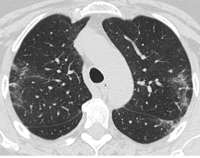
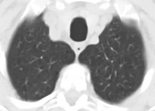

# SARS-COV-2 Ct-Scan

<div align="center">
    <a href="https://github.com/openmedlab/"></a>
</div>
<p style="text-align:center;font-size:10px;"><em></em></p>

## Dataset Information

The SARS-COV-2 Ct-Scan dataset contains 2482 CT lung scan images. There are two categories in this dataset: 1252 CT scan images from COVID-19 positive patients and 1230 CT scan images from individuals not infected with COVID-19. In early 2020, the COVID-19 virus spread widely around the world, prompting researchers from various countries to actively conduct research on the mechanisms of COVID-19 and develop diagnostic and therapeutic technologies. Increasing evidence suggests that lung CT scan images play a crucial role in determining whether an individual is infected with COVID-19 and assessing the degree of infection. Accurate and rapid screening of COVID-19 positive patients is not only beneficial for the swift recovery of patients but also aids in controlling the highly contagious disease and reducing further infections. Therefore, many researchers are actively using deep learning technologies to achieve rapid identification of COVID-19 infections based on CT lung scan images. With the support of the Public Servant Hospital of the Government of São Paulo in Brazil, the authors have prepared and made public this dataset containing lung CT images of COVID-19 positive patients, hoping to promote the research of deep learning-based COVID-19 detection algorithms and the development of related applications.

## Dataset Meta Information

| Dimensions | Modality | Task Type      | Anatomical Structures | Anatomical Area | Number of Categories | Data Volume | File Format |
|------------|----------|----------------|-----------------------|-----------------|----------------------|-------------|-------------|
| 2D         | CT       | Classification | Lung                  | Chest           | 2                    | 2482        | PNG         |


### Resolution Details

| Dataset Statistics | size         |
|--------------------|--------------|
| min                | [182,129]   |
| median             | [390,240]   |
| max                | [484,416]   |

## Label Information Statistics

| Class | Number |
|-------------------|--------|
| COVID-Positive          | 1252   |
| COVID-Negative          | 1230   |

## Visualization

<div align="center">
    <a href="https://github.com/openmedlab/"></a>
</div>
<p style="text-align:center;font-size:10px;"><em> COVID-Positive Example Images.</em></p>

<div align="center">
    <a href="https://github.com/openmedlab/"></a>
</div>
<p style="text-align:center;font-size:10px;"><em> COVID-Negative Example Images.</em></p>

## File Structure

The file structure of the dataset is as follows, containing folders with images of two categories.

``` 
SARS-COV-2 Ct-Scan Dataset
├── COVID
│   ├── Covid (1).png
│   ├── Covid (2).png
│   │    ...
├── non-COVID
│   ├── Non-Covid (1).png
│   ├── Non-Covid (2).png
│   │    ...
```

## Authors and Institutions

Eduardo Soares (Lancaster University, UK)

Plamen Angelov (Lancaster University, UK)

Sarah Biaso (Public Servant Hospital of the State of São Paulo, Brazil)

Michele Higa Froes (Public Servant Hospital of the State of São Paulo, Brazil)

Daniel Kanda Abe (Public Servant Hospital of the State of São Paulo, Brazil)


## Source Information

Official Website: https://www.kaggle.com/datasets/plameneduardo/sarscov2-ctscan-dataset

Download Link: https://www.kaggle.com/datasets/plameneduardo/sarscov2-ctscan-dataset

Article Address: https://www.medrxiv.org/content/10.1101/2020.04.24.20078584v3.full.pdf

Publication Date: 2020-05-14

## Citation

``` 
@article{2020SARS,
  title={SARS-CoV-2 CT-scan dataset:A large dataset of real patients CT scans for SARS-CoV-2 identification},
  author={ Soares, Eduardo  and  Angelov, Plamen  and  Biaso, Sarah  and  Froes, Michele Higa  and  Abe, Daniel Kanda },
  journal={Cold Spring Harbor Laboratory Press},
  year={2020},
}
```

Original introduction article is [here](https://zhuanlan.zhihu.com/p/676188359).