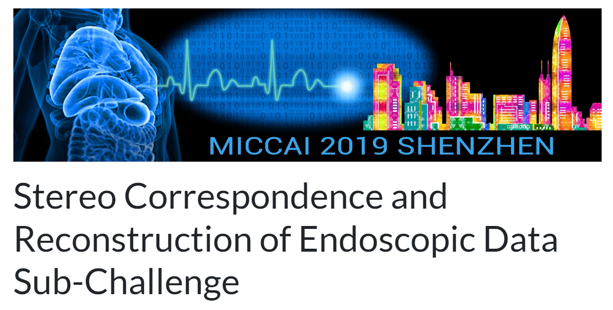
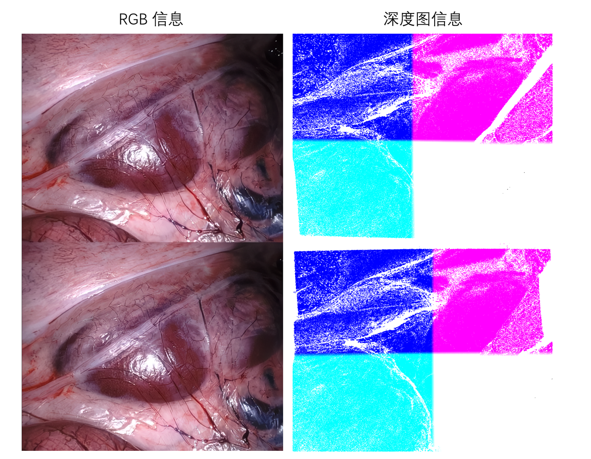

# SCARED

<div align="center">
    <a href="https://github.com/openmedlab/"></a>
</div>
<p style="text-align:center;font-size:10px;"><em></em></p>

## Dataset Information

The **SCARED dataset** originates from the Endoscopic Monocular Depth Estimation Challenge at the 2019 MICCAI conference and was released by Intuitive Surgical. It has become the most widely used benchmark and training dataset in the field of endoscopic depth estimation. Compared to the EndoSlam dataset, the SCARED dataset offers the following advantages:

- Higher image resolution  
- Precise ground truth depth information  
- Includes stereo camera data  
- Provides accurate camera calibration parameters and pose information  
- More stable camera motion with minimal motion blur  

Due to these characteristics, the SCARED dataset is highly regarded in research on endoscopic depth estimation. The dataset, available via an official download link, is already divided into training and testing sets for ease of use by researchers.

Although the dataset is not publicly accessible at the moment, researchers can apply for access by sending a request via an institutional email to **max.allan@intusurg.com**. Access is typically granted within one week (verified as of October 2024).

The primary significance of the SCARED dataset lies in its provision of a high-quality, standardized benchmark for endoscopic depth estimation research. By offering high-resolution images, precise depth information, and camera parameters, the dataset provides researchers with a reliable platform for developing and evaluating endoscopic depth estimation algorithms. This not only facilitates progress and comparison of algorithms in the field but also lays an essential foundation for improving the precision and safety of minimally invasive surgeries, contributing to advancements in medical imaging technologies and robot-assisted surgery.

## Dataset Meta Information

| Dimensions | Modality  | Task Type        | Sensor Type                  | Data Volume | File Format     |
|------------|-----------|------------------|------------------------------|-------------|-----------------|
| 2D         | Endoscopy | Depth Estimation | Structured light + Binocular | 280G        | tiff, png, mp4  |

The dataset is composed of data from 5 different video sequences, which are divided into **keyframe1** to **keyframe5**. Each video frame is accompanied by individual **camera intrinsic parameters**, **pose information**, and **depth maps**.

The depth maps are in **TIFF format**, with units in **millimeters (mm)**. The depth value is stored in the **third channel** of the image. For detailed processing, you can refer to the following repository:

**GitHub** - [EikoLoki/MICCAI_challenge_preprocess: MICCAI SCARED 2019 data challenge preprocessor](https://github.com/EikoLoki/MICCAI_challenge_preprocess)

### Resolution Details

| Dataset Statistics | size       |
|--------------------|------------|
| min                | 1280x1024  |
| median             | 1280x1024  |
| max                | 1280x1024  |

### File Information

The depth information in this dataset was obtained using a **da Vinci Xi endoscope** during anatomical dissection of a fresh pig abdomen. By encoding structured light images, each projector pixel was uniquely encoded to establish ground truth depth maps.

Each keyframe includes the following files:

1. **camera_calibration.yaml**:  
   - Contains approximate calibration data for the endoscope, but it is not highly accurate.  
   - The data is in **OpenCV format** and can be loaded directly using OpenCV's **FileStorage** class.

2. **Left_Image.png**:  
   - The view from the left camera of the stereo camera system.

3. **Right_Image.png**:  
   - The view from the right camera of the stereo camera system.

4. **left_depth_map.tiff**:  
   - A point cloud as seen by the left camera.  
   - Each pixel in the **.tiff** file contains an **(X, Y, Z)** coordinate, representing the vertex position in the left camera space.

5. **right_depth_map.tiff**:  
   - A point cloud as seen by the right camera.

6. **point_cloud.obj**:  
   - A 3D point cloud model.  
   - Can be loaded into 3D visualization software (e.g., **Blender** or **Meshlab**) to view the coordinates.

7. **data/rgb.mp4**:  
   - A video sequence of frames (left view on top, right view on bottom).  
   - Can be opened and decoded using **OpenCV** or **ffmpeg**.  
   - Video players like **VLC**, **QuickTime**, or **Windows Media Player** may not function properly with this file.

8. **data/frame_data.tar.gz**:  
   - A compressed archive containing frame data files named in the format **frame_data%06d.json**.  
   - Each `frame_data` file corresponds to a video frame, with the numeric part in the filename matching the frame index.  
   - Frame data includes:  
     - Camera transformation relative to the keyframe illumination images (**Left_Image.png/Right_Image.png**)  
     - Calibration data for the respective frame.

9. **data/scene_points.tar.gz**:  
   - A compressed archive containing **.tiff** files named in the format **scene_points%06d.tiff**.  
   - Similar to the frame data, each `scene_points` file corresponds to a video frame, with the numeric part in the filename matching the frame index.  
   - These **.tiff** files include vertex coordinates derived from the keyframe illumination images.  
   - Note: Due to camera motion introducing new pixels, some pixels may not be illuminated or encoded by structured light, and therefore lack ground truth depth. These pixels will have a value of **(0, 0, 0)** in the **.tiff** files.

## Visualization

<div align="center">
    <a href="https://github.com/openmedlab/"></a>
</div>
<p style="text-align:center;font-size:10px;"><em>The left side shows RGB information, and the right side shows depth map information. Invalid depth pixels in some areas have been removed.</em></p>

## File Structure

There are multiple data packets with the same structure in the file, only one of them is taken as an example.

``` 
SCARED/
├── dataset_1/
│   ├── keyframe_1/
│   │   ├── data/
│   │   │   ├── scene_points.tar.gz
│   │   │   ├── rgb.mp4
│   │   │   └── frame_data.tar.gz
│   │   ├── right_depth_map.tiff
│   │   ├── left_depth_map.tiff
│   │   ├── point_cloud.obj
│   │   ├── Left_Image.png
│   │   ├── Right_Image.png
│   │   └── endoscope_calibration.yaml
│   ├── keyframe_2/
│   │   └── [similar structure as keyframe_1]
│   ├── keyframe_3/
│   │   └── [similar structure as keyframe_1]
│   ├── keyframe_4/
│   │   └── [similar structure as keyframe_1]
│   └── keyframe_5/
│       └── [similar structure as keyframe_1]
```

## Authors and Institutions

- Max Allan (Intuitive Inc.)  

- Jonathan Mcleod (Intuitive Inc.)  

- Congcong Wang (Norwegian University of Science and Technology)  

- Jean Claude Rosenthal (Fraunhofer Heinrich Hertz Institute)  

- Zhenglei Hu (Fraunhofer Heinrich Hertz Institute)  

- Niklas Gard (Fraunhofer Heinrich Hertz Institute)  

- Peter Eisert (Fraunhofer Heinrich Hertz Institute)  

- Ke Xue Fu (No Affiliation)  

- Trevor Zeffiro (Redminds Inc.)  

- Wenyao Xia (Western University)  

- Zhanshi Zhu (Harbin Institute of Technology)  

- Huoling Luo (Shenzhen Institutes of Advanced Technology)  

- Xiran Zhang (Shenzhen Institutes of Advanced Technology)  

- Xiaohong Li (Johns Hopkins University)  

- Fucang Jia (Johns Hopkins University)  

- Lalith Sharan (Heidelberg University)  

- Tom Kurmann (German Cancer Research Center)  

- Sebastian Schmid (University of Bern)  

- Raphael Sznitman (University of Bern)  

- Dimitris Psychogios (Wellcome/EPSRC Centre for Interventional and Surgical Sciences, University College London)  

- Mahdi Azizian (Intuitive Inc.)  

- Danail Stoyanov (Wellcome/EPSRC Centre for Interventional and Surgical Sciences, University College London)  

- Lena Maier-Hein (German Cancer Research Center)  

- Stefanie Speidel (National Center for Tumor Diseases)  

## Source Information

Official Website: https://endovissub2019-scared.grand-challenge.org/Home/

Download Link: No download link, please email max.allan@intusurg.com

Article Address: https://arxiv.org/abs/2101.01133

Publication Date: 2019-06

## Citation

``` 
@article{allan2021stereo,
  title={Stereo correspondence and reconstruction of endoscopic data challenge},
  author={Allan, Max and Mcleod, Jonathan and Wang, Congcong and Rosenthal, Jean Claude and Hu, Zhenglei and Gard, Niklas and Eisert, Peter and Fu, Ke Xue and Zeffiro, Trevor and Xia, Wenyao and others},
  journal={arXiv preprint arXiv:2101.01133},
  year={2021}
}
```

Original introduction article is [here](https://zhuanlan.zhihu.com/p/2167155586).