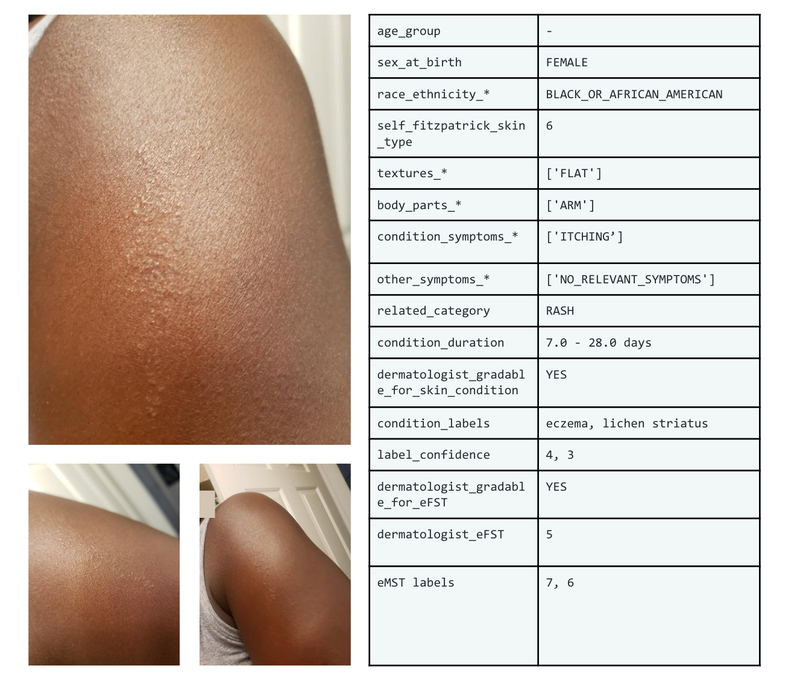
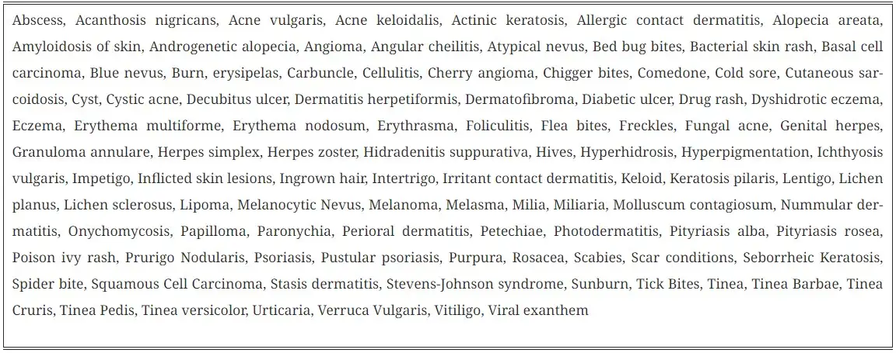
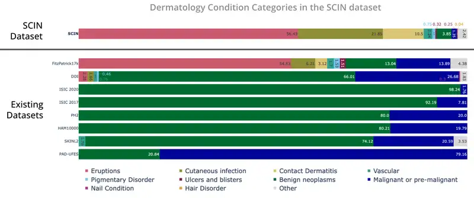
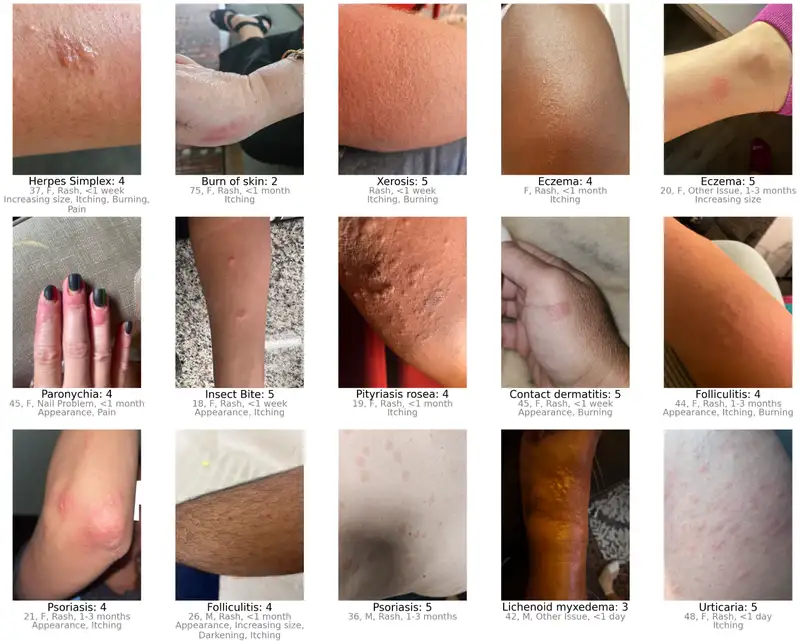

# SCIN Skin Condition Dataset

## Dataset Information

Health datasets play a critical role in research and medical education, but creating a dataset that represents the real world can be challenging. For example, skin pathological conditions vary in appearance and severity and manifest differently across skin tones. However, existing dermatology image datasets often lack representation of everyday conditions, such as rashes, allergies, and infections, and tend to skew toward lighter skin tones. Additionally, racial and ethnic information is often missing, which hinders our ability to assess disparities or create solutions.

To address these limitations, the authors collaborated with physicians at Stanford Medicine to release the Skin Condition Image Network (SCIN) dataset. The authors designed SCIN to reflect the broad range of questions people search for online, complementing the types of conditions commonly found in clinical datasets. It includes images of a wide range of skin tones and body parts, helping to ensure that future AI tools work for everyone. The authors have made the SCIN dataset freely available as an open access resource for researchers, educators, and developers to use, and have taken careful steps to protect the privacy of contributors.

<div align="center">
    <a href="https://github.com/openmedlab/"></a>
</div>
<p style="text-align:center;font-size:10px;"><em>Figure 1. Example images and metadata from the SCIN dataset.</em></p>

## Dataset Meta Information

| Dimensions | Modality          | Task Type            | Anatomical Area   | Data Volume | File Format |
|------------|-------------------|----------------------|-------------------|-------------|-------------|
| 2D         | Dermatology Image | Classification/VQA   | Skin              | 10408       | PNG         |

<div align="center">
    <a href="https://github.com/openmedlab/"></a>
</div>
<p style="text-align:center;font-size:10px;"><em>Figure 3. The SCIN dataset primarily encompasses allergic, inflammatory, and infectious conditions, whereas datasets from clinical sources focus on benign and malignant tumors.</em></p>

## Dataset Information Statistics

The SCIN dataset currently contains over 10,000 images directly contributed by individuals who have personally experienced these skin, nail, or hair conditions. All contributions were made voluntarily and with informed consent from individuals in the United States and were completed under Institutional Review Board-approved research. To provide context for the retrospective dermatologists’ labels, contributors were asked to take images from both close-up and slightly further away. They had the option to self-report demographic information and tanning tendencies (self-reported Fitzpatrick skin type, or sFST), and describe the texture, duration, and symptoms associated with their concerns.

Each contributor’s contributions were labeled by one to three dermatologists, each labeling up to five dermatologic conditions, and each labeling was assigned a confidence score. The SCIN dataset contains these individual labels, as well as the aggregated and weighted differential diagnoses derived from them, which may be useful for model testing or training. These labels are retrospectively assigned and are not equivalent to clinical diagnoses, but they allow us to compare the distribution of dermatologic conditions in the SCIN dataset with existing datasets.

<div align="center">
    <a href="https://github.com/openmedlab/"></a>
</div>
<p style="text-align:center;font-size:10px;"><em>Figure 2. List of keywords for skin conditions.</em></p>

While many existing dermatology datasets focus on malignant and benign tumors and are intended to assist in skin cancer diagnosis, the SCIN dataset consists primarily of common allergic, inflammatory, and infectious conditions. Most images in the SCIN dataset show problems in early stages—more than half presented less than a week before the image was taken, and 30% presented less than a day before the image was taken. Conditions in this time window are rarely seen in health systems and are therefore underrepresented in existing dermatology datasets.

We also obtained dermatologists' estimates of Fitzpatrick skin type (estimated FST or eFST) and estimates of Monk skin color (eMST) from laypeople. This allowed us to compare the distribution of skin conditions and skin types with those in existing dermatology datasets. Although we did not selectively target any skin type or skin color, the SCIN dataset is more balanced in the distribution of Fitzpatrick skin types (more types 3, 4, 5, and 6) than similar datasets of clinical origin.

<div align="center">
    <a href="https://github.com/openmedlab/"></a>
</div>
<p style="text-align:center;font-size:10px;"><em>Figure 4. Distribution of self-reported and dermatologist-estimated Fitzpatrick skin types in the SCIN dataset, compared to existing unenriched dermatology datasets (Fitzpatrick17k, PH², SKINL2, and PAD-UFES-20).</em></p>

The Fitzpatrick Skin Type Scale was originally developed as a phototype scale to measure skin type's response to UV light and is widely used in dermatology research. The Munch Skin Tone Scale is a newer 10-color scale that measures skin tone rather than skin phototype, capturing more subtle differences between darker skin tones. While neither scale was retrospectively estimated for use with images, the inclusion of these labels is intended to facilitate future research on the representation of skin types and tones in dermatology research. For example, the SCIN dataset provides an initial benchmark for the distribution of these skin types and tones in the U.S. population.

The SCIN dataset has a high representation of women and younger people, which may reflect a combination of factors. These factors may include differences in the prevalence of skin conditions, the tendency to seek health information online, and differences in willingness to contribute to research across populations.

## Crowdsourcing Approach

To create the SCIN dataset, the authors used a novel crowdsourcing approach, which they describe in a companion research paper co-authored with researchers from Stanford Medicine. This approach enables individuals to play an active role in healthcare research. It allows us to reach people at an early stage of their health concerns, potentially before they seek formal care. Crucially, this approach uses ads on web search results pages—the starting point of many people’s health journeys—to connect with participants.

The authors’ results show that crowdsourcing can produce a high-quality dataset with low spam rates. More than 97.5% of contributions were authentic images of skin conditions. After performing further filtering steps to exclude images outside the scope of the SCIN dataset and remove duplicates, the authors were able to publish nearly 90% of contributions received during the 8-month study period. Most images were clear and well-exposed. About half of the contributions included self-reported demographic information, and 80% contained self-reported information related to the skin condition, such as texture, duration, or other symptoms. The authors found that the ability of dermatologists to retrospectively assign differential diagnoses depended more on the availability of self-reported information than on image quality.

While perfect image anonymization can never be guaranteed, protecting the privacy of individuals who contributed images was a top priority when creating the SCIN dataset. Through informed consent, contributors were informed of potential re-identification risks and were advised to avoid uploading images with identifying features. Post-submission privacy protections included manual editing or cropping to exclude potentially identifiable areas, reverse image searches to exclude publicly available copies, and removal or aggregation of metadata. The SCIN data use license prohibits attempts to re-identify contributors.

The authors hope that the SCIN dataset will serve as a helpful resource for those working to advance inclusive dermatology research, education, and artificial intelligence tool development efforts. By demonstrating alternatives to traditional dataset creation methods, SCIN paves the way for the creation of more representative datasets in fields where self-reported data or retrospective labeling is feasible.\

<div align="center">
    <a href="https://github.com/openmedlab/"></a>
</div>
<p style="text-align:center;font-size:10px;"><em>Figure 5. Dermatologists' confidence in their labeling (on a scale of 1 to 5) depending on the availability of self-reported demographic and symptom information.</em></p>


## File Structure

``` 
SCIN
└── dataset/      
    ├── images
    ├── scin_app_questions.csv
    ├── scin_cases.csv
    ├── scin_label_questions.csv
    ├── scin_labels.csv
```

## Authors and Institutions

Abbi Ward ∗1 , Jimmy Li ∗1 , Julie Wang1 , Sriram Lakshminarasimhan1 , Ashley Carrick1 , Bilson Campana1 , Jay Hartford1 , Pradeep Kumar S1 , Tiya Tiyasirichokchai1 , Renee Wong1 , Sunny Virmani1 , Yossi Matias1 , Greg Corrado1 , Dale Webster1 , Dawn Siegel2 , Steven Lin2 , Justin Ko2 , Alan Karthikesalingam1 , Christopher Semturs1 , and Pooja Rao1

1: Google Research, 2: Stanford University School of Medicine.

## Source Information

Official Website: https://research.google/blog/scin-a-new-resource-for-representative-dermatology-images/

Download Link: https://github.com/google-research-datasets/scin

Article Address: https://arxiv.org/pdf/2402.18545

Publication Date: 2023-02

## Citation

``` 
@misc{ward2024crowdsourcing,
      title={Crowdsourcing Dermatology Images with Google Search Ads: Creating a Real-World Skin Condition Dataset},
      author={Abbi Ward and Jimmy Li and Julie Wang and Sriram Lakshminarasimhan and Ashley Carrick and Bilson Campana and Jay Hartford and Pradeep Kumar S and Tiya Tiyasirichokchai and Sunny Virmani and Renee Wong and Yossi Matias and Greg S. Corrado and Dale R. Webster and Dawn Siegel and Steven Lin and Justin Ko and Alan Karthikesalingam and Christopher Semturs and Pooja Rao},
      year={2024},
      eprint={2402.18545},
      archivePrefix={arXiv},
      primaryClass={cs.CY}
}
```

Original introduction article is [here](https://zhuanlan.zhihu.com/p/715168260).