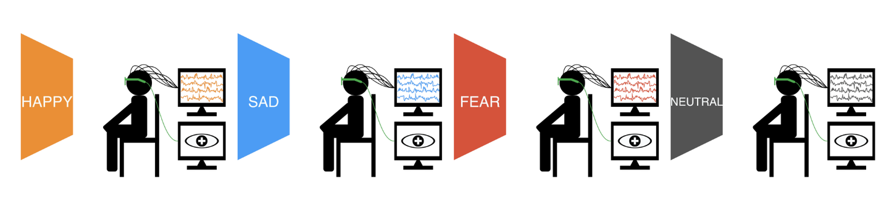
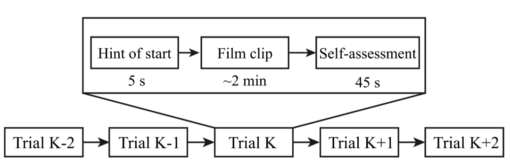
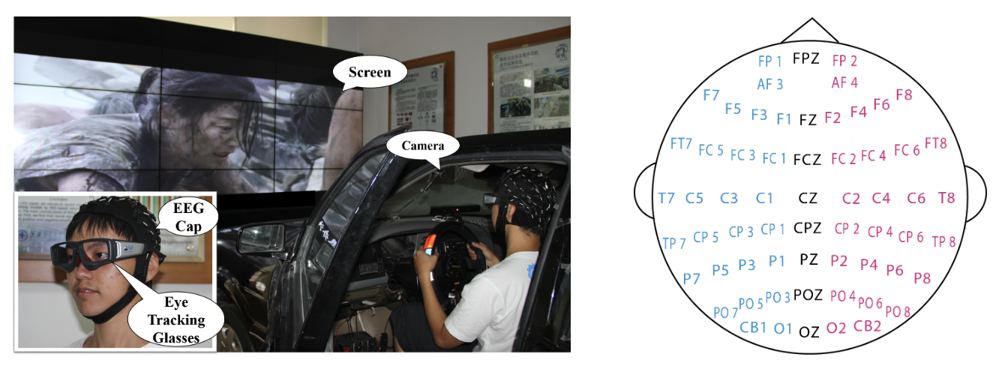
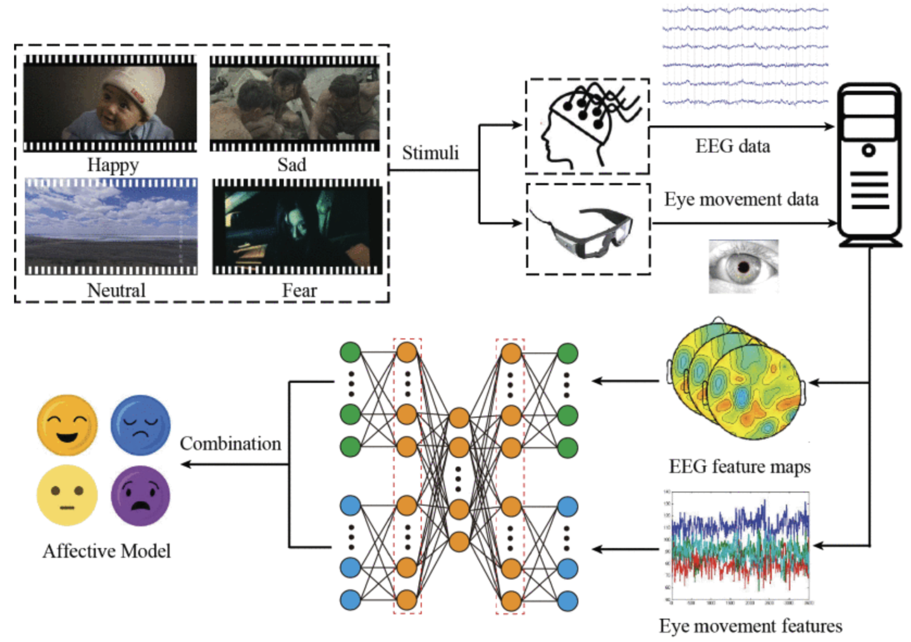

# SEED-IV

<div align="center">
    <a href="https://github.com/openmedlab/"></a>
</div>
<p style="text-align:center;font-size:10px;"><em></em></p>

## Dataset Information

SEED-IV (SJTU Emotion EEG Dataset for Emotion Recognition with Four Emotions) is an emotional dataset developed by the Brain and Cognitive Science Lab (BCMI) at Shanghai Jiao Tong University. Compared to the original SEED dataset, SEED-IV introduces several enhancements:

- **Expanded Emotion Categories**: SEED-IV extends the original three emotions (positive, neutral, negative) to four categories: happy, sad, fear, and neutral, providing richer emotional information for emotion recognition.
- **Multimodal Data**: In addition to EEG (electroencephalography) data, SEED-IV also includes eye movement data, supporting research on multimodal emotion recognition.
- **Refined Feature Extraction**: SEED-IV details the processing methods for EEG and eye movement signals, including feature smoothing and denoising techniques such as Linear Dynamic System (LDS) and smoothing filters.

This dataset aims to provide high-quality multimodal data for researchers in affective computing and brain-computer interface (BCI) fields, supporting the development of more accurate emotion recognition models and enhancing the emotional intelligence of human-computer interaction systems.


## Experimental Design

**Experimental Stimuli**:  
- **Film Selection**: A total of 72 film clips were carefully chosen through preliminary research to evoke four emotions: happy, sad, fear, and neutral. Each clip was rigorously screened to ensure it effectively elicited the target emotion.

**Experimental Procedure**:  
- **Participants**: 15 healthy Chinese participants (7 males and 8 females, aged 18–30 years).  
- **Number of Experiments**: Each participant performed 3 experiments, with at least a 3-day interval between experiments to avoid emotional carryover effects.  

**Each Experiment Includes**:  
- **24 Trials**: Corresponding to 24 film clips, with 6 clips for each emotion.  

**Trial Steps**:  
1. **Cue Phase (2 seconds)**: A prompt appears on the screen, informing participants of the upcoming clip.  
2. **Viewing Phase (approximately 4 minutes)**: Participants watch the film clip while EEG and eye movement data are collected.  
3. **Evaluation Phase (9 seconds)**: Participants fill out a self-assessment questionnaire based on their emotional state.  
4. **Rest Phase (5 seconds)**: A short break to prepare for the next trial.

<div align="center">
    <a href="https://github.com/openmedlab/"></a>
</div>
<p style="text-align:center;font-size:10px;"><em></em></p>

**Signal Acquisition**:  
- **EEG Data**: Collected using a 62-channel ESI NeuroScan system with a sampling rate of 1000 Hz.  
- **Eye Movement Data**: Recorded using SMI eye-tracking glasses, capturing participants' eye movement information.

<div align="center">
    <a href="https://github.com/openmedlab/"></a>
</div>
<p style="text-align:center;font-size:10px;"><em></em></p>

## Dataset Meta Information

| Task Type         | Number of EEG Channels | EEG Sampling Rate              | Number of Categories | Data Format |
|-------------------|------------------------|---------------------------------|----------------------|-------------|
| Emotion Recognition | 62                     | 1000 Hz (original), 200 Hz (preprocessed) | 4                    | .mat        |

## Dataset Statistics  

- **Number of Participants**: 15  
- **Number of Experiments**: 3 experiments per participant, totaling 45 experiments  
- **Film Clips**: 24 clips per experiment, resulting in 1080 emotion samples (15 participants × 3 experiments × 24 clips)  
- **Emotion Categories**: Four (Happy, Sad, Fear, Neutral)

## Dataset Example

<div align="center">
    <a href="https://github.com/openmedlab/"></a>
</div>
<p style="text-align:center;font-size:10px;"><em> ITK-SNAP Visualization.</em></p>

## File Structure

``` 
SEED-IV_Dataset
├── eeg_raw_data/
│   ├── 1/
│   │   ├── sub1_20200101.mat
│   │   └── ...
│   ├── 2/
│   ├── 3/
├── eeg_feature_smooth/
│   ├── 1/
│   ├── 2/
│   ├── 3/
├── eye_raw_data/
│   ├── sub1_20200101_blink.mat
│   ├── sub1_20200101_event.mat
│   └── ...
├── eye_feature_smooth/
│   ├── sub1_20200101.mat
│   └── ...
├── Channel Order.xlsx
├── ReadMe.txt
└── README.md
    └── Dataset Description and Usage Guide
```

#### Data Folder Descriptions

**`eeg_raw_data` Folder**  
- **File Naming Format**: Each participant’s data for each experiment is stored in a `.mat` file with the format `{SubjectName}_{Date}.mat`.  
- **File Content**:  
  - Each file contains 24 fields, corresponding to 24 trials (movie clips).  
  - Field names are `cz_eeg1` to `cz_eeg24`.  
  - Each field contains the raw EEG signal data for the respective trial.  

**`eeg_feature_smooth` Folder**
- **File Naming**: Matches the raw EEG data files.  
- **File Content**:  
  - Contains feature data processed using different smoothing methods.  
  - Each field has dimensions: **Channels × Time Windows × Frequency Bands**, i.e., **62 × W × 5**.  

**`eye_raw_data` Folder**
- **File Naming**: Each type of eye movement data is stored in separate files:  
  - `{SubjectName}_{Date}_blink.mat`: Blink data.  
  - `{SubjectName}_{Date}_event.mat`: Event data.  
  - `{SubjectName}_{Date}_fixation.mat`: Fixation data.  
  - `{SubjectName}_{Date}_pupil.mat`: Pupil data.  
  - `{SubjectName}_{Date}_saccade.mat`: Saccade data.  
- **File Content**:  
  - Each file contains 24 matrices, corresponding to 24 movie clips.  
  - Each matrix contains detailed information about the respective feature, such as counts, durations, etc.  

**`eye_feature_smooth` Folder**
- **File Naming**: Each `.mat` file corresponds to one participant’s data for one experiment.  
- **File Content**:  
  - Contains 24 fields, corresponding to 24 trials.  
  - Each field contains a feature matrix where rows represent feature types, and columns represent time windows.  
- **Feature Type Index**:  
  - **1-12**: Pupil diameter (X and Y directions).  
  - **13-16**: Dispersion (X and Y directions).  
  - **17-18**: Fixation duration.  
  - **19-22**: Saccade features.  
  - **23-31**: Event statistics.

### **Authors and Affiliations**

Baoliang Lu (Shanghai Jiao Tong University)

Weilong Zheng (Shanghai Jiao Tong University)

Wei Liu (Shanghai Jiao Tong University)

Yifei Lu (Shanghai Jiao Tong University)

Andrzej Cichocki (RIKEN, Japan)


## Source Information

Official Website: https://bcmi.sjtu.edu.cn/home/seed/seed.html

Download Link: https://bcmi.sjtu.edu.cn/home/seed/downloads.html#seed-access-anchor

Article Address: https://ieeexplore.ieee.org/document/7104132

Publication Date: 2015

## Citation

``` 
@article{zheng2019emotionmeter,
  title={EmotionMeter: A Multimodal Framework for Recognizing Human Emotions},
  author={Zheng, Wei-Long and Liu, Wei and Lu, Yifei and Lu, Bao-Liang and Cichocki, Andrzej},
  journal={IEEE Transactions on Cybernetics},
  volume={49},
  number={3},
  pages={1110--1122},
  year={2019},
  publisher={IEEE}
}
```

Original introduction article is [here](https://zhuanlan.zhihu.com/p/989509591).