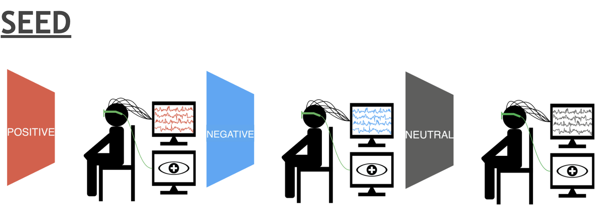
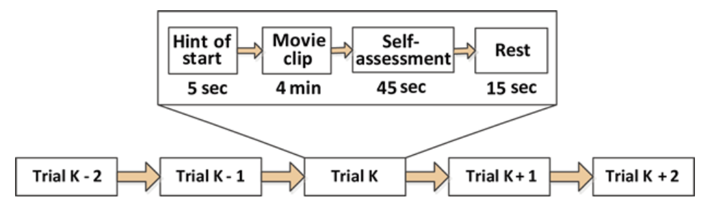
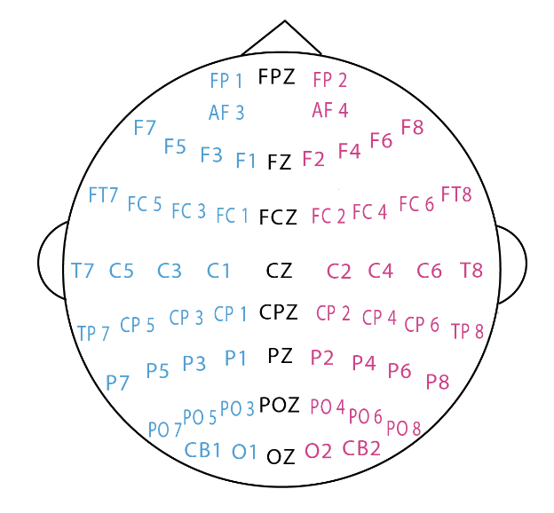

# SEED

<div align="center">
    <a href="https://github.com/openmedlab/"></a>
</div>
<p style="text-align:center;font-size:10px;"><em></em></p>

## Dataset Information 
The SEED (SJTU Emotion EEG Dataset) is an open emotional dataset constructed by the Brain and Cognitive Science Lab (BCMI) of Shanghai Jiao Tong University, primarily aimed at research in affective computing and brain-computer interface (BCI) fields. The dataset includes EEG (electroencephalography) and eye-tracking data from 15 Chinese participants while watching emotionally evocative film clips, providing high-quality multimodal data for emotion recognition research.

This dataset aims to address challenges related to emotion recognition based on EEG signals, providing data support for the development of more intelligent and emotionally aware human-computer interaction systems.

## Experimental Design

**Experimental Stimuli**: Fifteen clips from Chinese movies (including positive, neutral, and negative emotions) were selected, each lasting around four minutes. These clips were carefully edited to ensure effective elicitation of the target emotions.

**Selection Criteria**:
1. **Moderate Experimental Duration**: Ensure the entire experiment is not too long to avoid participant fatigue.
2. **Ease of Understanding**: The content of the clips requires no additional explanation, allowing participants to understand directly.
3. **Clear Emotion**: Each clip elicits only a single target emotion.

**Experimental Procedure**:
- Each experiment includes 15 trials.
- There is a 5-second cue before each clip begins.
- After watching each clip, participants have 45 seconds for self-assessment, during which they fill out a questionnaire reporting their emotional response.
- There is a 15-second rest period between each trial.
- The sequence of clips is carefully arranged to avoid presenting clips with the same emotion consecutively.

<div align="center">
    <a href="https://github.com/openmedlab/"></a>
</div>
<p style="text-align:center;font-size:10px;"><em></em></p>

**Signal Acquisition**:  
- EEG signals were collected using a 62-channel ESI NeuroScan system.
- Eye movement data were collected using SMI eye-tracking glasses.
- The experimental setup and specific locations of the EEG electrodes are shown in the figure below (insert relevant image here).

<div align="center">
    <a href="https://github.com/openmedlab/"></a>
</div>
<p style="text-align:center;font-size:10px;"><em></em></p>

**Participants**:  
- A total of 15 Chinese participants took part in the experiment (7 males and 8 females, with an average age of 23.27 years and a standard deviation of 2.37).
- To protect privacy, participants are identified by numbers from 1 to 15.
- Participants numbered 1 to 5 and 8 to 14 (total 12 participants) provided both EEG and eye movement data.
- Participants numbered 6, 7, and 15 provided only EEG data.

## Dataset Meta Information

| Task Type             | Number of EEG Channels | EEG Sampling Rate                             | Data Format | EEG Format |
|-----------------------|------------------------|-----------------------------------------------|-------------|------------|
| Emotion Recognition   | 62                     | 1000 Hz (original), 200 Hz (post-processed)   | .mat        | .mat       |


## Dataset Statistics Information

| No. | Emotion Label | Film Clip Source                |
|-----|---------------|---------------------------------|
| 1   | Negative      | Tangshan Earthquake             |
| 2   | Negative      | Back to 1942                    |
| 3   | Positive      | Lost in Thailand                |
| 4   | Positive      | Flirting Scholar                |
| 5   | Positive      | Just Another Pandora's Box      |
| 6   | Neutral       | World Heritage in China         |


## Dataset Example

<div align="center">
    <a href="https://github.com/openmedlab/"></a>
</div>
<p style="text-align:center;font-size:10px;"><em>The subjects recorded EEG information while watching the film, and then saved the original data and pre-processed data into the dataset.</em></p>

## File Structure

``` 
SEED_Dataset
├── Preprocessed_EEG/
│   ├── sub1_session1.mat
│   ├── sub1_session2.mat
│   └── ...
├── Extracted_Features/
│   ├── sub1_session1_DE.mat
│   ├── sub1_session2_DE.mat
│   └── ...
├── EEG_raw/
│   ├── sub1_session1.cnt
│   ├── sub1_session2.cnt
│   └── ...
├── Eye_Movement/
│   ├── sub1_session1_eye.mat
│   └── ...
└── README.md
    └── Dataset Description and Usage Guide
```

**Raw EEG Data**: Stored in the "EEG_raw" folder, in .cnt format, with a sampling rate of 1000 Hz.  
**Preprocessed EEG Data**: Stored in the "Preprocessed_EEG" folder, downsampled to 200 Hz, band-pass filtered between 0-75 Hz, and segmented into EEG fragments corresponding to each film clip.

**Feature Extraction**:  
- Differential entropy (DE) features, differential asymmetry (DASM), and ratio asymmetry (RASM) features were extracted.
- Features were smoothed using moving average and Linear Dynamic System (LDS) techniques.

**Eye Movement Data**: Stored in the "Eye_Movement" folder, containing feature data from eye-tracking.

## Authors and Institutions

Baoliang Lu (Shanghai Jiao Tong University)

Weilong Zheng (Shanghai Jiao Tong University)

Jiayi Zhu (Shanghai Jiao Tong University)

## Source Information

Official Website: https://bcmi.sjtu.edu.cn/home/seed/seed.html

Download Link: https://bcmi.sjtu.edu.cn/home/seed/downloads.html#seed-access-anchor

Article Address: https://ieeexplore.ieee.org/document/7104132

Publication Date: 2015

## Citation

``` 
@article{zheng2015investigating, 
title={Investigating Critical Frequency Bands and Channels for {EEG}-based Emotion Recognition with Deep Neural Networks}, 
author={Zheng, Wei-Long and Lu, Bao-Liang}, 
journal={IEEE Transactions on Autonomous Mental Development}, 
doi={10.1109/TAMD.2015.2431497}, 
year={2015}, volume={7}, number={3}, pages={162-175}, publisher={IEEE} }

@inproceedings{duan2013differential, 
title={Differential entropy feature for {EEG}-based emotion classification}, 
author={Duan, Ruo-Nan and Zhu, Jia-Yi and Lu, Bao-Liang}, 
booktitle={6th International IEEE/EMBS Conference on Neural Engineering (NER)}, pages={81--84}, 
year={2013}, organization={IEEE} }
```

Original introduction article is [here](https://zhuanlan.zhihu.com/p/944132346).