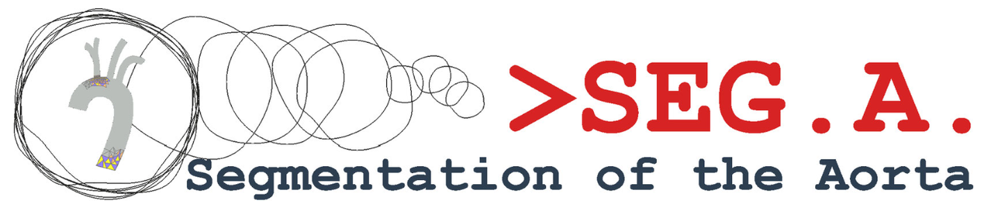
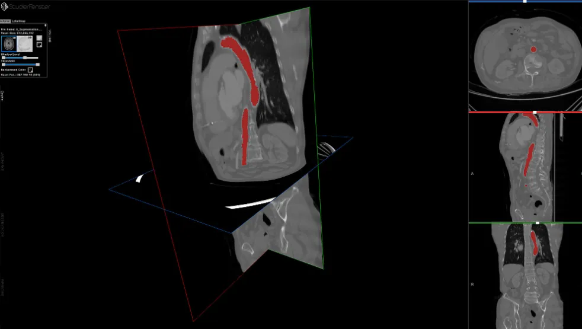

# SEG.A.

<div align="center">
    <a href="https://github.com/openmedlab/"></a>
</div>
<p style="text-align:center;font-size:10px;"><em></em></p>

## Dataset Information

The aorta is the main artery of the human body, and together with its branches, it forms the aortic vascular tree (AVT), which supplies blood to the whole body. Monitoring patients with aortic diseases requires regular vascular screenings for disease progression. The standard imaging modality for clinical assessments is Computed Tomography Angiography (CTA), which provides a detailed view of the AVT. Therefore, segmentation of the vascular tree from CTA has always been a classic task in medical image segmentation. SEG.A. is one of this year's MICCAI 2023 Challenge datasets, providing a new benchmark for this classic task. It is noteworthy that the largest case in this dataset has more than 1000 slices. Manual annotation of the vascular tree in such cases is extremely time-consuming and labor-intensive, thus highlighting the importance of 3D segmentation models in such scenarios. The image data mainly comes from partial data of three datasets: KiTS, RIDER, and Dongyang Hospital.

## Dataset Meta Information

| Dimensions | Modality | Task Type | Anatomical Structures | Anatomical Area | Number of Categories | Data Volume | File Format |
|------------|----------|-----------|-----------------------|-----------------|--------------------|-------------|-------------|
| 3D         | CTA      | Segmentation | Vascular tree     | Entire body       | 1                  | 56          | .nrrd       |


### Resolution Details

| Dataset Statistics | spacing (mm)     | size            |
|--------------------|------------------|-----------------|
| min                | (0.44, 0.44, 0.50)              | (512, 512, 94)     |
| median             | (0.73, 0.73, 2.99)           | (512, 512, 189) |
| max                | (1.37, 1.37, 5.00)              | (512, 666, 1140) |

Number of two-dimensional slices in the dataset: 22,753.

## Label Information Statistics

| Anatomical Structure | Vascular Tree |
|----------------------|---------------|
| Cases                | 56            |
| Coverage             | 100%          |
| Mean Volume (cm³)    | 14            |
| Median Volume (cm³)  | 300           |
| Max Volume (cm³)     | 614           |


## Visualization

<div align="center">
    <a href="https://github.com/openmedlab/"></a>
</div>
<p style="text-align:center;font-size:10px;"><em> Official Visualization.</em></p>

<div align="center">
    <a href="https://github.com/openmedlab/"></a>
</div>
<p style="text-align:center;font-size:10px;"><em> ITK-SNAP Visualization.</em></p>

## File Structure

The official file structure provided is organized according to three data sources:

``` 
AVT
├── KITS
│   ├── K1
│   │   ├── K1.nrrd
│   │   └── K1.seg.nrrd
│   ├── K2
│   │   ├── K2.nrrd
│   │   └── K2.seg.nrrd
│   ...
│   └── K20
│       ├── K20.nrrd
│       └── K20.seg.nrrd
├── Rider
│   ├── R1
│   │   ├── R1.nrrd
│   │   └── R1.seg.nrrd
│   ├── R2
│   │   ├── R2.nrrd
│   │   └── R2.seg.nrrd
│   ...
│   └── R18
│       ├── R18.nrrd
│       └── R18.seg.nrrd
└── Dongyang
    ├── D1
    │   ├── D1.nrrd
    │   └── D1.seg.nrrd
    ├── D2
    │   ├── D2.nrrd
    │   └── D2.seg.nrrd
    ...
    └── D18
        ├── D18.nrrd
        └── D18.seg.nrrd
```

## Authors and Institutions

Antonio Pepe - (Graz University of Technology, Austria)

Dr. Gian Marco Melito (Graz University of Technology, Austria)

Prof. Jan Egger (University of Duisburg-Essen, Faculty of Medicine, Germany)


## Source Information

Official Website: https://multicenteraorta.grand-challenge.org/

Download Link: https://multicenteraorta.grand-challenge.org/data/

Article Address: https://doi.org/10.1016/j.dib.2022.107801

Publication Date: May, 2023.

## Citation

``` 
@article{radl2022avt,
  title={AVT: Multicenter aortic vessel tree CTA dataset collection with ground truth segmentation masks},
  author={Radl, Lukas and Jin, Yuan and Pepe, Antonio and Li, Jianning and Gsaxner, Christina and Zhao, Fen-hua and Egger, Jan},
  journal={Data in brief},
  volume={40},
  pages={107801},
  year={2022},
  publisher={Elsevier}
}
```

Original introduction article is [here](https://zhuanlan.zhihu.com/p/660170803).