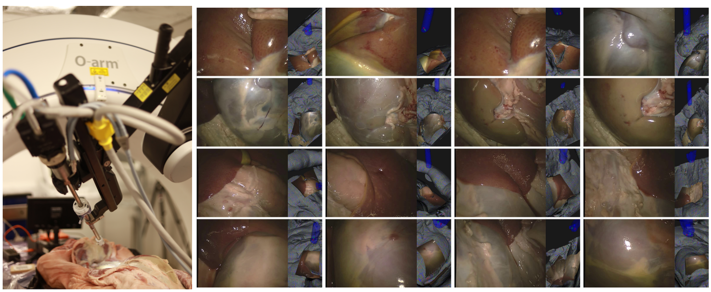
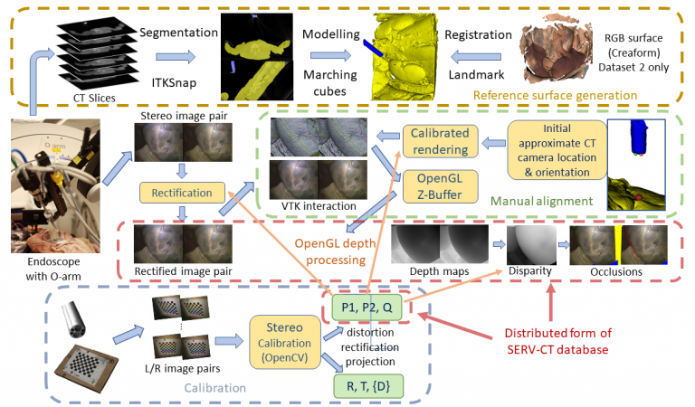
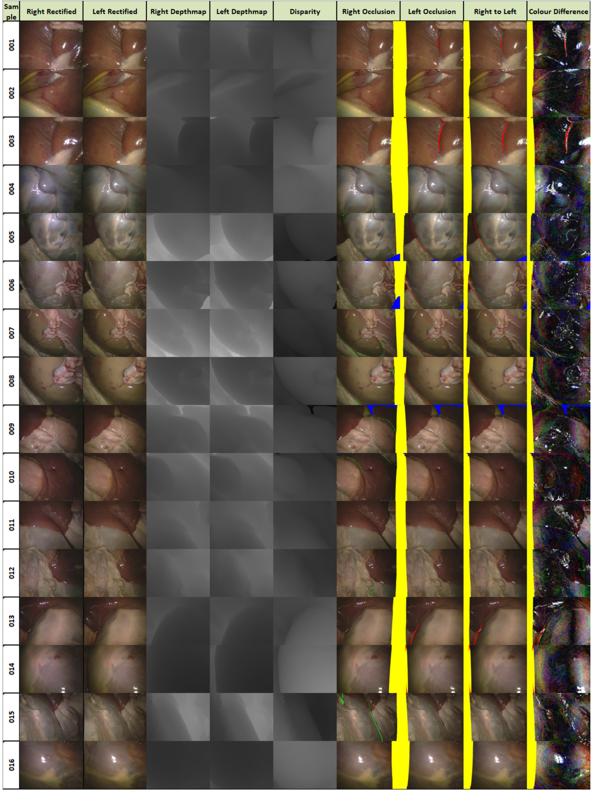

# SERV-CT

<div align="center">
    <a href="https://github.com/openmedlab/"></a>
</div>
<p style="text-align:center;font-size:10px;"><em></em></p>

## Dataset Information

The SERV-CT dataset is a surgical endoscopic 3D reconstruction validation dataset developed by the Surgical and Interventional Sciences Center (WEISS) at University College London (UCL). It consists of two sets of porcine samples, comprising a total of 16 stereo image pairs. Each sample provides complete camera intrinsic and extrinsic calibration parameters, depth maps, disparity maps, and annotations of occluded regions. The dataset addresses challenges in validating 3D reconstruction algorithms for surgical endoscopic scenes, particularly in scenarios with minimal corner features, highly reflective surfaces, and the presence of blood and smoke.

The significance of the SERV-CT dataset lies in its provision of a comprehensive validation set covering over 80% of the endoscopic field of view. It includes diverse depth variations and various tissue types while incorporating the most challenging surgical scenarios, such as smooth, featureless surfaces, regions with strong specular reflections, and complex anatomical boundaries. With stringent registration accuracy control (RMS disparity accuracy within 2 pixels and depth accuracy around 2 millimeters), the dataset provides a reliable benchmark for evaluating and validating 3D reconstruction algorithms in surgical contexts. This makes it a valuable resource for advancing clinical applications like surgical navigation and augmented reality.

## Dataset Meta Information

| Dimensions | Modality  | Task Type            | Anatomical Area   | Data Volume  | File Format |
|------------|-----------|----------------------|-------------------|--------------|-------------|
| 2D         | Endoscopy | Disparity Estimation | Abdominal cavity  | 16           | JPG         |


### Resolution Details

| Dataset Statistics | size        |
|--------------------|-------------|
| min                | (720, 576)  |
| median             | (720, 576)  |
| max                | (720, 576)  |

## Dataset Construction Process

The construction of the SERV-CT dataset involves the following steps:

1. **CT Scanning and Segmentation**:
   - The O-arm™ surgical imaging system is used to simultaneously scan the endoscope and porcine anatomical structures, obtaining CT data.
   - CT images are processed using ITK-Snap software to segment and generate 3D models of the endoscope and anatomical structures.

2. **Camera Calibration**:
   - The endoscope of the da Vinci surgical system is calibrated using the standard OpenCV chessboard calibration protocol to obtain intrinsic and extrinsic camera parameters.

3. **Registration Phase**:
   - The approximate positions of the left and right cameras of the endoscope are determined by manually marking them in the CT images. A point along the direction of the endoscope is selected to define the initial viewing angle.
   - Through manual interaction, the 3D anatomical structure models segmented from the CT images are precisely aligned with the stereo endoscopic images. The adjustments are restricted to three rotational angles around the left camera and minor translations along the axial direction of the endoscope to ensure the accuracy of the viewing angle.

4. **Alignment Accuracy Evaluation**:
   - Two operators each perform three manual alignments to assess alignment accuracy. 
   - Results from multiple stereo matching algorithms are used as references, and outliers are removed before averaging.
   - For the second sample, the Creaform Go SCAN 20 handheld scanner is used to obtain RGB surface information, aiding the alignment of smooth regions that lack geometric features.

5. **Final Dataset**:
   - The final dataset, generated through this series of processes, includes calibration parameters, depth maps, disparity maps, and occlusion region annotations.

**The overall workflow is illustrated in the diagram below (referred to but not shown here):**

<div align="center">
    <a href="https://github.com/openmedlab/"></a>
</div>
<p style="text-align:center;font-size:10px;"><em>The process of building a dataset.</em></p>


## Dataset Features

1. **Data Information**:
   - The SERV-CT dataset provides stereo image pairs for each sample along with corresponding calibration parameters, disparity maps, depth maps, and occlusion region annotations.
   - It not only covers the majority of the endoscopic field of view but also includes multiple types of tissues, such as liver and kidney, with varying depths.
   - The dataset features challenging surgical scenarios, such as smooth surfaces without distinguishable features and highly reflective regions.

2. **Data Precision**:
   - The alignment accuracy of the dataset is evaluated through multiple manual alignment experiments. Two operators each performed three alignments, and the results were assessed using two of the best-performing networks, **DeepPruner** and **HSM (Level 1)**.
   - The results indicate that the RMS disparity error is within **2 pixels** in most cases, with depth accuracy around **2 millimeters**.
   - However, higher errors were observed in samples with greater depth (e.g., Sample 7) or in images with smooth, highly reflective surfaces (e.g., Samples 14 and 16).

3. **Field of View Characteristics**:
   - The SERV-CT dataset covers over **80% of the endoscopic field of view**, features wide depth variation, and provides complete occlusion region annotations.
   - These characteristics enable a comprehensive evaluation of reconstruction algorithms' performance under varying depths and occlusion conditions.

4. **Challenging Scenarios**:
   - The dataset includes some of the most challenging surgical scenarios, such as:
     - Smooth and uniform tissue surfaces lacking distinguishable features.
     - Areas with strong specular reflections.
     - Complex anatomical boundaries.
     - Regions with sparse texture features.
   - These attributes make it an ideal benchmark for evaluating the robustness of stereo matching algorithms.

## Visualization

<div align="center">
    <a href="https://github.com/openmedlab/"></a>
</div>
<p style="text-align:center;font-size:10px;"><em>16 endoscope RGB, depth map, disparity map, occlusion, and color difference visualization.</em></p>

## File Structure

``` 
└── SERV-CT
    ├── Experiment_1               - frames 001-008
    │   ├── Ground_truth_CT        - The reference data using an O-arm CT scan
    │   │   ├── DepthL             - Left image depth maps (mm depth for each pixel scaled by 256 and stored as 16 bit PNG)
    │   │   ├── DepthR             - Right image depth maps (mm depth for each pixel scaled by 256 and stored as 16 bit PNG)
    │   │   ├── Disparity          - left-to-right disparity (pixel disparity scaled by 256 for subpixel accuracy and stored as 16 bit PNG)
    │   │   ├── OcclusionL         - Colour coded occlusion images
    │   │   └── OcclusionR           (Yellow - non overlap, blue - outside the reference surface, red - not visible in the right image) 
    │   ├── Left_rectified         - left rectified images (720x576 24-bit colour PNG)
    │   ├── Rectified_calibration  - JSON calibration files containing P1, P2 and Q, (units are in pixels and mm)
    │   └── Right_rectified        - right rectified images (720x576 24-bit colour PNG)
    └── Experiment_2               - frames 009-016
        ├── Ground_truth_CT
        │   ├── DepthL
        │   ├── DepthR   
        │   ├── Disparity
        │   ├── OcclusionL
        │   └── OcclusionR
        ├── Ground_truth_RGB       - The reference data using a Creaform RGB scan 
        │   ├── DepthL
        │   ├── DepthR
        │   ├── Disparity
        │   ├── OcclusionL
        │   └── OcclusionR
        ├── Left_rectified
        ├── Rectified_calibration
        └── Right_rectified
```

## Authors and Institutions

- P.J. "Eddie" Edwards (University College London, Centre for Surgical and Interventional Sciences)  

- Dimitris Psychogyios (University College London, Centre for Surgical and Interventional Sciences)  

- Stefanie Speidel (National Center for Tumor Diseases Dresden, Division of Translational Surgical Oncology)  

- Lena Maier-Hein (German Cancer Research Center, Division of Medical and Biological Informatics)  

- Danail Stoyanov (University College London, Centre for Surgical and Interventional Sciences)  

## Source Information

Official Website: https://www.ucl.ac.uk/interventional-surgical-sciences/weiss-open-research/weiss-open-data-server/serv-ct

Download Link: https://rdr.ucl.ac.uk/articles/dataset/SERV-CT_A_disparity_dataset_from_cone-beam_CT_for_validation_of_endoscopic_3D_reconstruction/26352199

Article Address: https://www.sciencedirect.com/science/article/pii/S1361841521003479

Publication Date: 2020-12

## Citation

``` 
@article{edwards2020serv,
  title={SERV-CT: A disparity dataset from CT for validation of endoscopic 3D reconstruction},
  author={Edwards, PJ and Psychogyios, Dimitris and Speidel, Stefanie and Maier-Hein, Lena and Stoyanov, Danail},
  journal={arXiv preprint arXiv:2012.11779},
  year={2020}
}
```

Original introduction article is [here](https://zhuanlan.zhihu.com/p/6100010319).