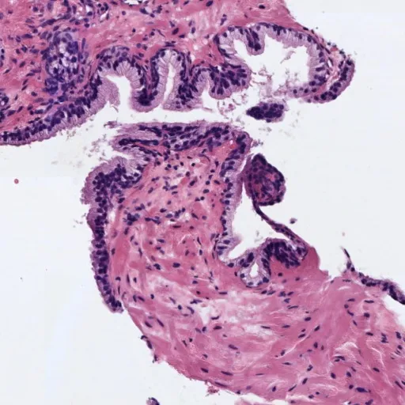
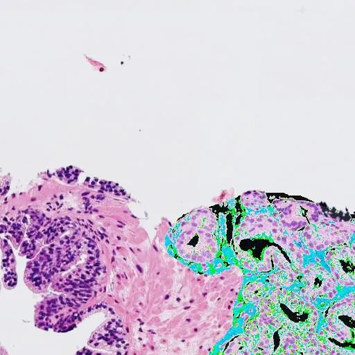
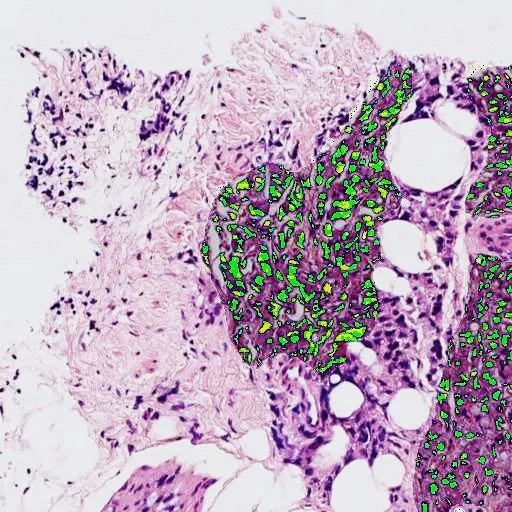
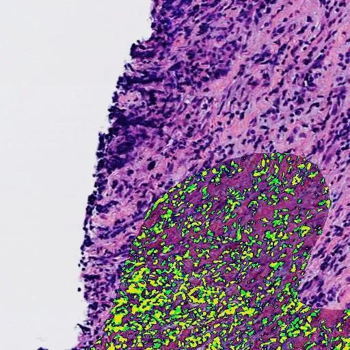

# SICAPv2

<div align="center">
    <a href="https://github.com/openmedlab/"></a>
</div>
<p style="text-align:center;font-size:10px;"><em></em></p>

## Dataset Information

The SICAPv2 dataset consists of 18,783 magnified 10x histological images of the prostate, taken from 155 patients. Each image in the dataset provides a per-pixel corresponding mask annotation for Gleason grading (GG), which is the main diagnostic and evaluative tool for prostate cancer in clinical practice. The dataset encompasses 4 grades: 0 - no cancer, 1 - GG3 (characterized by atrophic, highly differentiated, dense gland areas), 2 - GG4 (characterized by cribriform, pathological, large confluent, papillary glands), and 3 - GG5 (characterized by individual cells, no light cavity forming, pseudorosette cell nests).

Prostate cancer is one of the most common cancers among men worldwide. As mentioned, the Gleason grading system is a primary means for doctors to diagnose and prognosticate prostate disease, but this process is often time-consuming and somewhat subjective. The authors observed that there is no research on automated segmentation algorithms for prostate pathological images based on Gleason grading. Therefore, they hope that the SICAPv2 dataset will help researchers develop automated segmentation and classification models and software for prostate pathological images based on Gleason grading, to assist doctors in quickly and accurately diagnosing and analyzing the effectiveness of prostate cancer treatment.

## Dataset Meta Information

| Dimensions | Modality  | Task Type    | Anatomical Structures | Anatomical Area | Number of Categories | Data Volume | File Format |
|------------|-----------|--------------|-----------------------|-----------------|----------------------|-------------|-------------|
| 2D         | Pathology | Segmentation | Cell                  | Prostate        | 4                    | 18783         | JPG         |


### Resolution Details

| Dataset Statistics | size         |
|--------------------|--------------|
| min                | [512,512]   |
| median             | [512,512]   |
| max                | [512,512]   |

## Label Information Statistics

| Class       | Number |
|-------------|--------|
| 0-No cancer | 4417   |
| 1-GG3       | 4111   |
| 2-GG4       | 8180   |
| 3-GG5       | 2075   |

## Visualization

<div align="center">
    <a href="https://github.com/openmedlab/"></a>
</div>
<p style="text-align:center;font-size:10px;"><em>0 - No cancer example images (according to primary Gleason classification).</em></p>

<div align="center">
    <a href="https://github.com/openmedlab/"></a>
</div>
<p style="text-align:center;font-size:10px;"><em>1 - GG3 example images (according to primary Gleason classification).</em></p>

<div align="center">
    <a href="https://github.com/openmedlab/"></a>
</div>
<p style="text-align:center;font-size:10px;"><em>2 - GG4 example images (according to primary Gleason classification).</em></p>

<div align="center">
    <a href="https://github.com/openmedlab/"></a>
</div>
<p style="text-align:center;font-size:10px;"><em>3 - GG5 example images (according to primary Gleason classification).</em></p>

## File Structure

The dataset file structure is as follows, including a readme.txt file, an .xlsx file providing GG labels for images, an images folder containing the original images, a masks folder containing the corresponding mask images, and a partition folder containing default files for train/val/test splits.

``` 
SICAPv2 Dataset
├── images
│   ├── 16B0001851_Block_Region_1_0_0_xini_6803_yini_59786.jpg
│   ├── 16B0001851_Block_Region_1_0_1_xini_7827_yini_59786.jpg
│   ├── ...
├── masks
│   ├── 16B0001851_Block_Region_1_0_0_xini_6803_yini_59786.jpg
│   ├── 16B0001851_Block_Region_1_0_1_xini_7827_yini_59786.jpg
│   ├── ...
├── partition
│   ├── Test
│   │   ├── Test.xlsx
│   │   ├── TestCribfriform.xlsx
│   │   ├── Train.xlsx
│   │   ├── TrainCribfriform.xlsx
│   ├── Validation
│   │   ├── Val1
│   │   │   ├── Test.xlsx
│   │   │   ├── TestCribfriform.xlsx
│   │   │   ├── Train.xlsx
│   │   │   ├── TrainCribfriform.xlsx
│   │   ├── Val2
│   │   │   ├── Test.xlsx
│   │   │   ├── TestCribfriform.xlsx
│   │   │   ├── Train.xlsx
│   │   │   ├── TrainCribfriform.xlsx
│   │   ├── Val3
│   │   │   ├── Test.xlsx
│   │   │   ├── TestCribfriform.xlsx
│   │   │   ├── Train.xlsx
│   │   │   ├── TrainCribfriform.xlsx
│   │   ├── Val4
│   │   │   ├── Test.xlsx
│   │   │   ├── TestCribfriform.xlsx
│   │   │   ├── Train.xlsx
│   │   │   ├── TrainCribfriform.xlsx
├── readme.txt
├── wsi_labels.xlsx
```

## Authors and Institutions

Julio Silva-Rodríguez (Universitat Politecnica de Valencia, Spain)

Adrián Colomer (Universitat Politecnica de Valencia, Spain)

María A. Sales (University Clinical Hospital of Valencia, Spain)

Rafael Molina (University of Granada, Spain)

Valery Naranjo (Universitat Politecnica de Valencia, Spain)


## Source Information

Official Website: https://data.mendeley.com/datasets/9xxm58dvs3/1

Download Link: https://prod-dcd-datasets-cache-zipfiles.s3.eu-west-1.amazonaws.com/9xxm58dvs3-1.zip, https://opendatalab.com/OpenDataLab/SICAPv2

Article Address: https://arxiv.org/pdf/2105.10490v1.pdf

Publication Date: 2020-07-21

## Citation

``` 
@article{silva2020going,
title={Going deeper through the Gleason scoring scale: An automatic end-to-end system for histology prostate grading and cribriform pattern detection},
author={Silva-Rodr{\'\i}guez, Julio and Colomer, Adri{\'a}n and Sales, Mar{\'\i}a A and Molina, Rafael and Naranjo, Valery},
journal={Computer Methods and Programs in Biomedicine},
volume={195},
pages={105637},
year={2020},
publisher={Elsevier}
}
```

Original introduction article is [here](https://zhuanlan.zhihu.com/p/686314573).