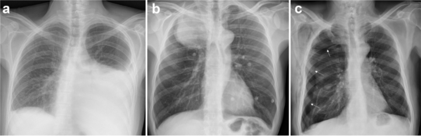
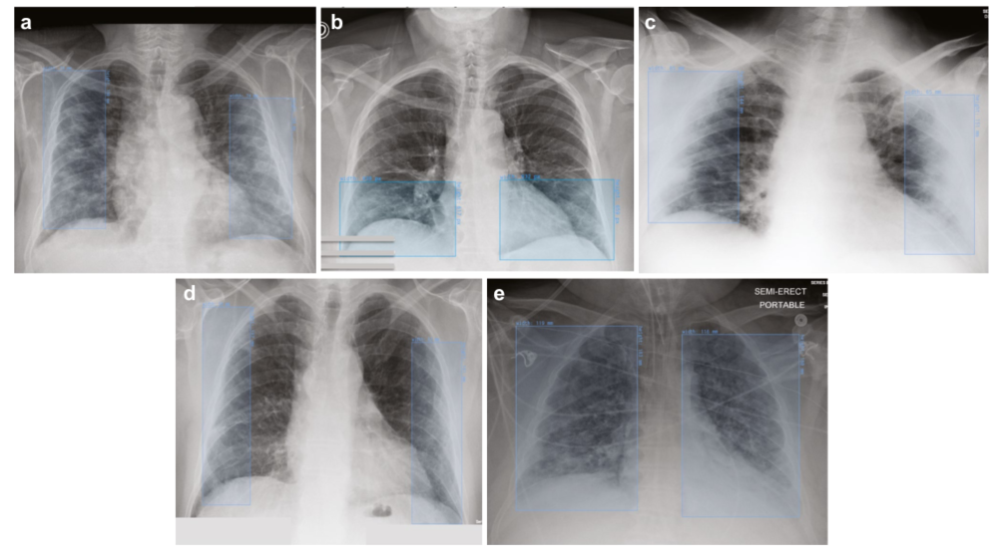

# SIIM-FISABIO-RSNA COVID-19

<div align="center">
    <a href="https://github.com/openmedlab/"></a>
</div>
<p style="text-align:center;font-size:10px;"><em></em></p>

## Dataset Information

The SIIM-FISABIO-RSNA COVID-19 dataset focuses on using advanced machine learning techniques for the accurate identification and localization of COVID-19-related features in chest radiographs. This dataset includes 6,334 high-quality DICOM chest X-ray scans, all of which have been thoroughly de-identified prior to inclusion to ensure the protection of patient privacy, adhering to the highest ethical standards and privacy regulations. During the annotation process, each chest radiograph underwent a detailed analysis and marking. The marking not only covers the basic assessment of whether pneumonia is present (i.e., "Negative for Pneumonia"), but also delineates various manifestations of COVID-19 on the radiographs, including "Typical Appearance," which typically shows the unique radiographic features of COVID-19; "Indeterminate Appearance," which poses some ambiguity in diagnosis and may require further evaluation or follow-up; and "Atypical Appearance," which does not conform to the usual imaging appearances of COVID-19 but may still be related to the disease progression.

## Dataset Meta Information

| Dimensions | Modality | Task Type      | Anatomical Structures | Anatomical Area | Number of Categories | Data Volume | File Format |
|------------|----------|----------------|-----------------------|-----------------|----------------------|-------------|-------------|
| 2D         | X-Ray    | Classification | Lung                  | Chest           | 4                    | 7597        | .jpg        |


### Resolution Details

| Dataset Statistics | size         |
|--------------------|--------------|
| min                | [1115, 1228] |
| median             | [2754, 3186] |
| max                | [3480, 4248] |

## Label Information Statistics


| Label                    | Number |
|--------------------------|--------|
| Negative for Pneumonia   | 1737   |
| Typical Appearance       | 3006   |
| Indeterminate Appearance | 1108   |
| Atypical Appearance      | 483    |

## Visualization

<div align="center">
    <a href="https://github.com/openmedlab/"></a>
</div>
<p style="text-align:center;font-size:10px;"><em>Visualization of paper results: Atypical manifestations of COVID-19.</em></p>

<div align="center">
    <a href="https://github.com/openmedlab/"></a>
</div>
<p style="text-align:center;font-size:10px;"><em>Visualization of the paper's results: Typical manifestations of COVID-19. Four sample chest X-ray images (a, b, c, d) show typical manifestations of COVID-19, showing decreased air content in the peripheral bilateral lung parenchyma, marked by blue bounding boxes. Figure e shows decreased air content in the bilateral lung parenchyma, both centrally and peripherally, marked by blue bounding boxes.</em></p>

## File Structure

``` 
SIIM-FISABIO-RSNA COVID-19
├── images
├──—— train
│          ├── xxx.jpg
│          ├── xxx.jpg
│          │    ...
├──—— test
│          ├── xxx.jpg
│          ├── xxx.jpg
│          │    ...
├── train.txt
├── val.txt
```

## Authors and Institutions

Paras Lakhani (Department of Radiology, Thomas Jefferson University)

J. Mongan (University of California San Francisco)

C. Singhal (MD.AI, New York, NY, USA)

K. P. Andriole (Mass General Brigham and Harvard Medical School, Boston, MA, USA)

## Source Information

Official Website: https://www.kaggle.com/competitions/siim-covid19-detection/data

Download Link: https://www.kaggle.com/competitions/siim-covid19-detection/data

Article Address: https://link.springer.com/article/10.1007/s10278-022-00706-8

Publication Date: 2021

## Citation

``` 
@article{lakhani20232021,
  title={The 2021 SIIM-FISABIO-RSNA machine learning COVID-19 challenge: Annotation and standard exam classification of COVID-19 chest radiographs},
  author={Lakhani, Paras and Mongan, John and Singhal, Chinmay and Zhou, Quan and Andriole, Katherine P and Auffermann, William F and Prasanna, PM and Pham, Theresa X and Peterson, Michael and Bergquist, Peter J and others},
  journal={Journal of Digital Imaging},
  volume={36},
  number={1},
  pages={365--372},
  year={2023},
  publisher={Springer}
}
```

Original introduction article is [here](https://zhuanlan.zhihu.com/p/720127915).