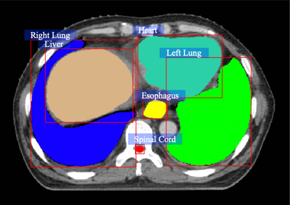
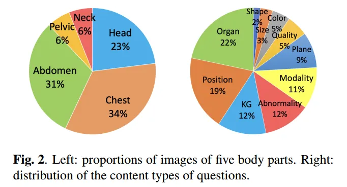
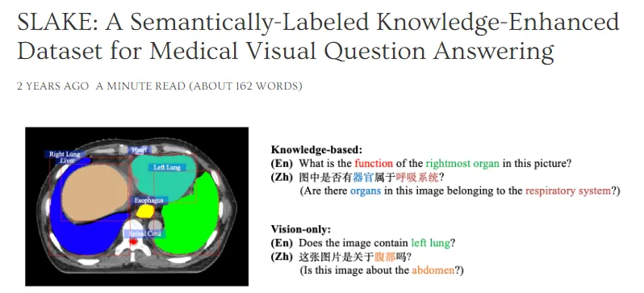

# SLAKE

<div align="center">
    <a href="https://github.com/openmedlab/"></a>
</div>
<p style="text-align:center;font-size:10px;"><em></em></p>

## Dataset Information

SLAKE is a bilingual English-Chinese dataset designed specifically for Medical Visual Question Answering (Med-VQA) systems, comprising 642 images and 14,028 question-answer pairs. This dataset not only promotes the automatic interpretation of medical images but also enhances machine understanding and reasoning of medical image content through a question-answer format. It is crucial for medical professionals to rapidly and accurately extract information when dealing with a large volume of medical imagery. For instance, the system can analyze X-rays, MRI, or CT scan images, answering questions regarding diagnosis, anatomical structures, and lesion locations. The diverse Q&A pairs in SLAKE cover a variety of medical images and cases, aiding in the construction of robust Med-VQA systems applicable to different medical scenarios. Its high quality stems from images sourced from influential medical image datasets such as MSD, CHAOS, ChestX-ray8, and questions crafted by clinical physicians. Additionally, its bilingual nature makes it suitable not only for English-language environments but also significantly important for the development of Chinese models.

The SLAKE dataset was initially released by PolyU at ISBI 2021. With the rapid development of Large Language Models (LLM) and the growing interest in medical multimodal LLMs, it has become an important benchmark for visual question-answering tasks in the medical field. It is frequently used to test the downstream VQA capabilities in some important works on medical multimodal large language models (e.g., LLaVA-Med, Med PaLM, PMC-VQA). The bilingual and high-quality characteristics of SLAKE make it a significant resource in the medical field, substantially impacting global healthcare collaboration and communication. Moreover, its presence also motivates the medical community's interest in constructing more comprehensive and reliable medical evaluation datasets, which will play a key role in future medical AI research.

## Dataset Meta Information

| Dataset | Type        | Train | Val  | Test | File Format        | Size  |
|---------|-------------|-------|------|------|--------------------|-------|
| VQA     | Medical, Chinese | 9834  | 2098 | 2094 | .txt, .json, .png, .jpg | 203M  |

Note: train/val/test counts the data volume of QA pairs

## Dataset Information Statistics

Comparison of SLAKE with VQA-RAD:

| Dataset  | # Images | # QA Pairs | Question Type         | Language       | Knowledge Graph |
|----------|----------|------------|-----------------------|----------------|-----------------|
| VQA-RAD  | 315      | 3.5K       | Vision-only           | EN             | ✘               |
| SLAKE    | 642      | 14K        | Knowledge & Vision-only | Bilingual (EN & ZH) | ✔           |

<div align="center">
    <a href="https://github.com/openmedlab/"></a>
</div>
<p style="text-align:center;font-size:10px;"><em></em></p>

The original paper of the dataset provides pie charts related to the proportion of anatomical regions and types of questions. From the charts, it can be seen that thoracic and abdominal data account for 65% of the Slake dataset, with head and neck data following at a proportion of 29%. This is consistent with the sources of data used, for example, CHAOS mainly includes abdominal data, and Chestx-ray8 is primarily chest data, which is influenced by the clinical use of the modalities. In the second pie chart, the two most common types of questions in Slake are related to the identification of organs and positions; followed by modality, knowledge graph (KG), and questions related to abnormalities; with Color, Shape, and others making up the remainder.

## Dataset Example

<div align="center">
    <a href="https://github.com/openmedlab/"></a>
</div>
<p style="text-align:center;font-size:10px;"><em>The homepage gives a very specific example. For a picture, it will include answers in Chinese and English, as well as knowledge-based questions and visual-only questions.</em></p>

``` 
    {
        "img_id": 1,
        "img_name": "xmlab1/source.jpg",
        "question": "What modality is used to take this image?",
        "answer": "MRI",
        "q_lang": "en",
        "location": "Abdomen",
        "modality": "MRI",
        "answer_type": "OPEN",
        "base_type": "vqa",
        "content_type": "Modality",
        "triple": [
            "vhead",
            "_",
            "_"
        ],
        "qid": 0
    }
```

For the examples of the training set, the most important information is "img_name", "question", "q_lang", "location", "modality" and other information.

## File Structure

After unzipping the folder, it is divided into two folders named `imgs` and `KG`, as well as files such as `mask.txt`, `train.json`, `validation.json`, and `test.json`. `mask.txt` is the ID mapping dictionary for masks. `train.json`, `validation.json`, and `test.json` contain the QA pairs for the training, validation, and test sets, respectively. The `imgs` folder includes each image's detection boxes, mask information, question pairs, and the original images. The `KG` folder contains information about diseases and organs in both English and Chinese.

``` 
.                                               
├── imgs                                      
│   ├── xmlab0   
│   │   ├── detection.json
│   │   ├── mask.png
│   │   ├── question.json
│   │   └── source.jpg                                                                              
│   ├── xmlab1                                     
│   ├── xmlab10   
│   └── ...
├── KG
│   ├── disease.csv
│   ├── en_disease.csv
│   ├── en_organ.csv
│   ├── en_organ_rel.csv
│   ├── organ.csv
│   └── organ_rel.csv
├── mask.txt
├── test.json
├── train.json
└── validate.json
```

## Authors and Institutions

Bo Liu (Department of Computing, The Hong Kong Polytechnic University)

Li-Ming Zhan (Department of Computing, The Hong Kong Polytechnic University)

Li Xu (Department of Computing, The Hong Kong Polytechnic University)

Lin Ma (Department of Ultrasound, West China Hospital, Sichuan University)

Yan Yang (Sichuan Provincial People's Hospital, Sichuan Academy of Medical Sciences)

Xiao-Ming Wu (Department of Computing, The Hong Kong Polytechnic University; Department of Ultrasound, West China Hospital, Sichuan University)


## Source Information

Official Website: https://www.med-vqa.com/slake/

Download Link: https://drive.google.com/file/d/1EZ0WpO5Z6BJUqC3iPBQJJS1INWSMsh7U/view?pli=1

Article Address: https://ieeexplore.ieee.org/abstract/document/9434010

Publication Date: 2021-2

## Citation

``` 
@inproceedings{liu2021slake,
  title={Slake: A semantically-labeled knowledge-enhanced dataset for medical visual question answering},
  author={Liu, Bo and Zhan, Li-Ming and Xu, Li and Ma, Lin and Yang, Yan and Wu, Xiao-Ming},
  booktitle={2021 IEEE 18th International Symposium on Biomedical Imaging (ISBI)},
  pages={1650--1654},
  year={2021},
  organization={IEEE}
}
```

Original introduction article is [here](https://zhuanlan.zhihu.com/p/677560794).